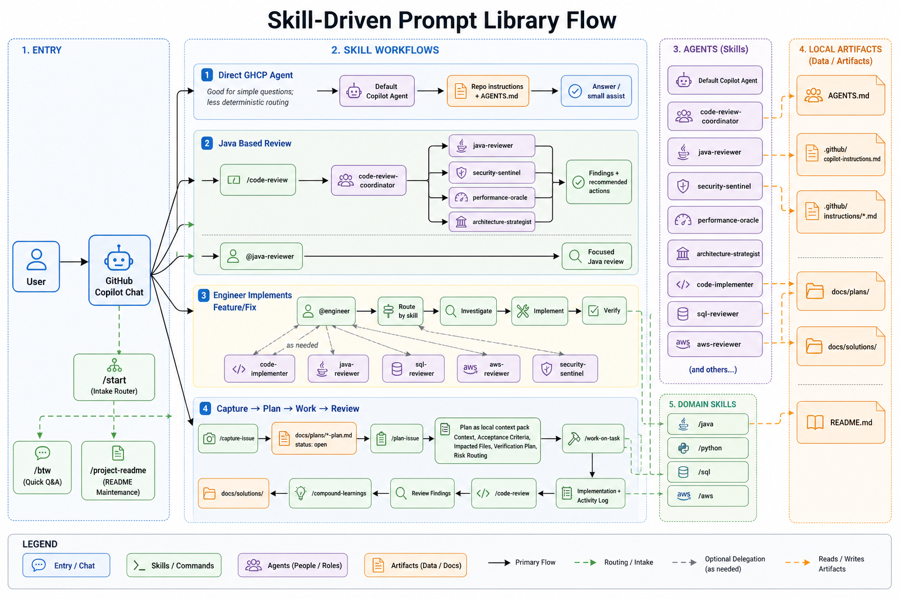

# Prompt Library

Skill-driven software engineering prompt library with 23 skills, 24 agents, scoped instructions, review checks, and local-first plan/solution artifacts. The primary consumption platforms are GitHub Copilot in VS Code and IntelliJ IDEA. No plugin packaging or extension installation is required.

## Quick Start

1. Clone this repository
2. Open this prompt-library repo in VS Code 1.109+ with GitHub Copilot Chat enabled
3. Run `Tasks: Run Task` -> `Prompt Library: Hydrate Global Copilot Customizations`
4. Open the product repository in VS Code or IntelliJ IDEA
5. Type `/` in Copilot Chat to see skills, or start with `/start` when you are unsure which workflow applies
6. Type `@` only when you intentionally need a specific agent or coordinator

## Architecture

The system is skill-first. Skills are the reusable workflow contracts; agents, instructions, prompt wrappers, checks, plans, and solution docs support those workflows.

**Skills** — User-invocable workflows that compose local context, scoped instructions, tools, and agents. Defined in `.github/skills/*/SKILL.md`.

**Agents** — Isolated roles for separate judgment, tool authority, runtime profile, or accountability: 19 stateless domain experts, 1 engineer, 1 code-implementer, and 3 coordinators. Defined in `.github/agents/*.agent.md`.

**Instructions** — Scoped context loaded based on file patterns. Defined in `.github/instructions/*.instructions.md`.

**Prompt wrappers** — Thin host-facing adapters in `.github/prompts/*.prompt.md` that route to skills and declare host tools.

**References and checks** — Skill references/assets provide dense examples, templates, schemas, and bundled review checks loaded only when needed. `.github/checks/` is reserved for product-specific review criteria; checks are not a native Copilot primitive.

**Plans and solutions** — `docs/plans/` stores local specs/context packs, and `docs/solutions/` stores verified learnings.

See [Skill-Driven Prompt Library Standard](docs/architecture/skill-driven-prompt-library.md) for primitive boundaries and team adoption guidance. See [Adaptive Engineer Harness](docs/architecture/adaptive-engineer-harness.md) for `@engineer` capability expansion, subagent delegation, human approval, and eval runtime policy.



## Connected Pipeline

The core engineering loop:

```
/brainstorming (optional) → /capture-issue → /plan-issue → /deepen-plan (optional) → /work-on-task → /code-review → /compound-learnings
                                  open      →   planned   →                          in-progress   →    review    →      done
```

Each step produces or updates a plan file in `docs/plans/` with state tracking (`status`, `plan_lock`, `phase`), timestamped activity logs, and inter-step memory sections. A plan file is the local context pack: it carries `## Context`, `## Acceptance Criteria`, `## Research Notes`, `## Impacted Files`, `## Verification Plan`, `## Risk & Review Routing`, `## Implementation Notes`, and `## Review Findings` between sessions and hosts.

## Specialist Agents (19)

| Agent | Purpose |
|-------|---------|
| `@architecture-strategist` | Architectural compliance and design patterns |
| `@best-practices-researcher` | Industry best practices for any topic |
| `@bug-reproduction-validator` | Systematic bug reproduction and classification |
| `@code-simplicity-reviewer` | YAGNI, over-engineering, premature abstraction |
| `@compounding-typescript-reviewer` | Type safety, modern patterns, strict mode |
| `@data-integrity-guardian` | Migration safety, constraints, transactions |
| `@java-reviewer` | Java correctness, API design, concurrency, and testing |
| `@python-reviewer` | Pythonic patterns, type safety, async correctness, and testing |
| `@sql-reviewer` | SQL, schema, migration, data integrity, and query safety |
| `@aws-reviewer` | AWS SDK, IAM, messaging, resilience, and observability |
| `@feedback-codifier` | Turn review feedback into standards |
| `@framework-docs-researcher` | Framework docs and API reference |
| `@git-history-analyzer` | Git archaeology and code evolution |
| `@pattern-recognition-specialist` | Patterns, anti-patterns, consistency |
| `@performance-oracle` | Bottlenecks, queries, memory, scalability |
| `@pr-comment-resolver` | Resolve PR review comments with code |
| `@repo-research-analyst` | Codebase structure and conventions |
| `@security-sentinel` | Vulnerabilities, OWASP, auth boundaries |
| `@spec-flow-analyzer` | Spec completeness, edge cases, gap identification |

## Engineer Agent (1 + 1 implementer)

The engineer is the accountable full-cycle actor that understands requirements, chooses the right skill/flow, debugs, plans, implements, and verifies. It delegates implementation to `@code-implementer` for bounded coding tasks and delegates to specialists only when separate judgment, authority, or isolation improves the result. Follows a skill-driven cycle: Understand → Route → Investigate → Plan → Implement → Verify.

| Agent | Purpose |
|-------|---------|
| `@engineer` | Full-cycle engineering — plans, investigates, delegates, consults user |
| `@code-implementer` | Executes coding tasks with TDD (engineer's implementation subagent) |

## Coordinator Agents (3)

Planning and code-review coordinators use `tools: ['agent']` to delegate work to specialists as subagents in parallel batches, each running in isolated context. Pipeline navigator uses handoff buttons to guide users between workflow steps.

| Agent | Purpose |
|-------|---------|
| `@code-review-coordinator` | Orchestrate multi-specialist code reviews with isolated analysis per domain |
| `@plan-coordinator` | Orchestrate research agents for codebase analysis and plan generation |
| `@pipeline-navigator` | Guide pipeline transitions via handoff buttons |

## Skills (23)

| Skill | Type | Purpose |
|-------|------|---------|
| `/capture-issue` | Pipeline | Create initial plan file under `docs/plans/` from description |
| `/plan-issue` | Pipeline | Generate phased plan with research |
| `/work-on-task` | Pipeline | Execute phase with TDD and session logging |
| `/code-review` | Pipeline | Confidence-scored persona review with action routing |
| `/compound-learnings` | Pipeline | Document solution with tagged templates |
| `/brainstorming` | Extension | Collaborative requirements exploration |
| `/deepen-plan` | Extension | Interactive plan deepening with user-steered research |
| `/document-review` | Extension | Multi-persona quality gate (design, scope, coherence, feasibility) |
| `/create-primitive` | Extension | Decide and create the right primitive: skill, agent, instruction, check, wrapper, reference, or solution doc |
| `/import-conventions` | Extension | Generate instructions from external repos and frameworks |
| `/project-readme` | Documentation | Create or update project README.md |
| `/java` | Domain | Java and Spring Boot engineering workflow |
| `/python` | Domain | Python engineering workflow with typing, tests, and async checks |
| `/sql` | Domain | SQL/PostgreSQL query, schema, migration, and data workflow |
| `/aws` | Domain | AWS SDK, IAM, messaging, reliability, and observability workflow |
| `/engineer` | Engineering | Full-cycle engineering with user steering |
| `/start` | Intake | Classify work and route to the right pipeline entry point |
| `/btw` | Q&A | Quick repository or general questions without edits or plans |
| `/analyze-and-plan` | Utility | Quick planning without external research |
| `/codebase-context` | Utility | Generate codebase snapshot with architecture diagrams |
| `/review-guardrails` | Utility | Read-only plan compliance audit |
| `/tdd-fix` | Utility | Test-driven bug fixing |
| `/triage-issues` | Utility | Prioritize backlog |

## Primary Platforms

- **GitHub Copilot in VS Code**: Global discovery through hydrated `%USERPROFILE%\.copilot` customizations
- **GitHub Copilot in IntelliJ IDEA**: Global discovery through hydrated `%LOCALAPPDATA%\github-copilot\intellij` customizations plus the documented global instructions file

This repo intentionally does not compile to host plugins and does not hydrate product repositories. Teams clone this repo once, run the global Hydrate task, and keep product repositories clean of prompt-library source artifacts. Agent files avoid provider-specific model pinning so the active GitHub Copilot host controls model selection.

## Knowledge Compounding

The system gets smarter over time:

- `.github/agent-context.md` — Accumulated knowledge for this prompt-library repo only
- `docs/plans/` — Active product work context and execution history
- `docs/solutions/` — Documented learnings from solved problems
- `docs/codebase-snapshot.md`, `docs/agent-context.md`, and `README.md` — Product-owned overview and convention artifacts when generated or updated by skills

`agent-context.md` is not a VS Code global customization file. Global reusable behavior belongs in hydrated instructions, skills, agents, and prompts. Product-specific context stays in the product repo as product-owned docs.

## Directory Structure

```
.github/
  agents/              24 agent files (19 specialists + 1 engineer + 1 implementer + 3 coordinators)
  skills/              23 skill directories
  instructions/        Scoped instructions (TypeScript, Python, Java, Spring Boot, PostgreSQL, AWS SDK)
  prompts/             Thin host-facing skill wrappers
  checks/              Optional product-specific review check examples
  copilot-instructions.md
  agent-context.md
.vscode/mcp.json       MCP server config
docs/architecture/      Skill-driven standard and architecture notes
docs/plans/            Issue and plan files
docs/solutions/        Documented learnings
docs/codebase-snapshot.md  Generated codebase snapshot with architecture diagrams
AGENTS.md              Cross-tool standard
CLAUDE.md              Optional compatibility guidance
```

## Requirements

- GitHub Copilot Chat in VS Code 1.109+
- Current GitHub Copilot plugin for IntelliJ IDEA with global customizations enabled
- Windows developer machines are the primary target environment for setup guidance

## Installation

See [Install and Sync Guide](docs/install.md) for Windows-first global setup across VS Code and IntelliJ IDEA. The recommended update path is to open this repo in VS Code, pull the latest version, and run `Tasks: Run Task` -> `Prompt Library: Hydrate Global Copilot Customizations`.
