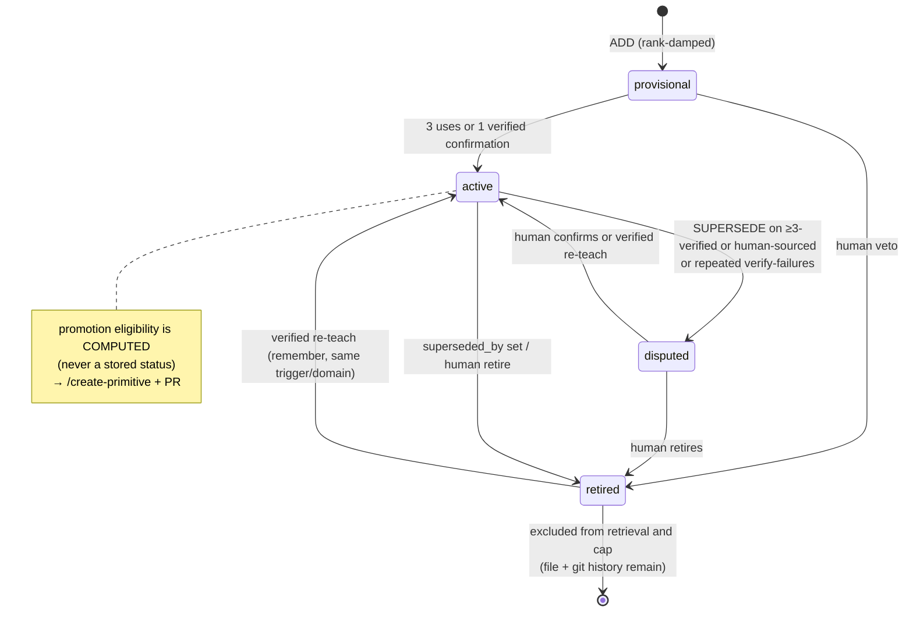

# Memory Model

Canonical short form for the Adaptive Engineer Harness memory system and its threat model.
Implementation details live in `packages/harness/lib/knowledge/`. Full historical prose is in git history.

## Three tiers

| Tier | Name | Location | Written by | Role |
|------|------|----------|-----------|------|
| T1 | Episodic | `docs/solutions/` (+ global solutions), plans, activity | `/auto-compound`, `compound --insight`, `harness remember` | Immutable ground truth; episode schema is the stability contract |
| T2 | Semantic (learnings) | `~/.harness/knowledge/<repo-id>/` — local git, never pushed | `harness consolidate --apply` only | Condensed one-claim-per-file view of T1; regenerable |
| T3 | Behavioral | `.github/` instructions / skills / checks | `/create-primitive` + human PR | Knowledge become behavior |

T2 is `f(T1, model, governance ledger)` — not T1 alone. Rebuild regenerates learnings from episodes, then reapplies governance.

### Store identity

`repo-id` comes from the origin remote, else `local-<hash>`. Adding a remote can strand a path-keyed store; `harness doctor` **K4** detects it; `harness knowledge migrate-store` renames when the target is empty.

## Trust gradient

Episodes stay on the machine or in the product repo's own history. Learnings are local and never pushed by default. Shared knowledge only ships via a human PR (or explicit learnings commit mode with secret screening).

## Learning lifecycle

### Human register

Humans can confirm, retire, dispute, or **promote** learnings. Promote is terminal for that id in the governance replay (later non-promote actions cannot strip `promoted_to`).

## Governance ledger

File: `governance.jsonl` in the knowledge store. Append-only records of retire / dispute / confirm / **promote**.

- Latest-per-id replay drives status on rebuild
- Promote is sticky in replay
- Hand edits are admitted with shape checks; corrupt lines are skipped with doctor hints

## Caps, quarantine, rejection

- Cap counts prevent runaway consolidation
- Quarantine holds unsafe or rejected claims
- Rejection classes are explicit (shape, secret, scope, duplicate)

## Threat model (summary)

| Risk | Mitigation |
|------|------------|
| Secret in episode/learning | Redaction at write/list boundaries; secret scan on compound |
| Hostile project config | Trust gate before project config applies |
| Poisoned T2 | Governance + rebuild from T1; promote requires human |
| Stranded store after remote add | Doctor K4 + migrate-store |
| Agent over-writing memory | Only consolidate/apply and remember write T2/T1 paths under policy |

Residual risks (operator still responsible): hand-edited governance, exporting learnings outside the machine, model quality on consolidate.

## Layered store (branch-local)

Golden `learnings/` plus per-branch `branches/<branch-key>/`. Branch overlays do not promote to golden without explicit promote. See knowledge layer code for merge/read order.

## Related

- `docs/architecture/engineer-harness.md` — harness lifecycle
- `packages/harness/lib/knowledge/` — store, consolidate, promote, governance
- `knowledge/proposals/harness-evolution-blueprint.md` — evolution blueprint
