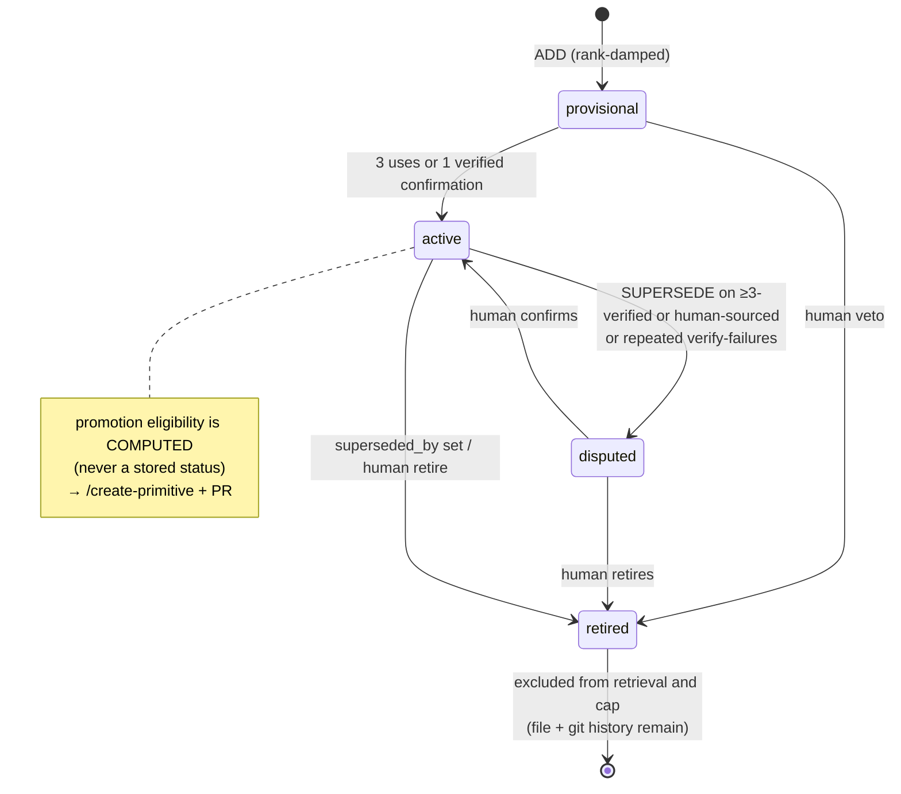

# Memory Model

The Adaptive Engineer Harness's memory is three tiers, each with a single writer and a
narrower role than the one before it. Every change — including forgetting — is a git
commit. This page is the human-facing summary; the full design lives in
[`docs/brainstorms/2026-07-26-knowledge-layer-design.md`](brainstorms/2026-07-26-knowledge-layer-design.md)
and the threat model in [`docs/architecture/knowledge-threat-model.md`](architecture/knowledge-threat-model.md).
Scope: Phase 1, local-only. Team sync is a future phase, deferred by design.

## Three tiers

| Tier | Name | Location | Written by | Role |
|------|------|----------|-----------|------|
| T1 | Episodic | `docs/solutions/` (+ global solutions), plans, activity logs | `/auto-compound` (verified `kind: fix`), `compound --insight` (`kind: insight`), `harness remember` (`kind: human-teaching`) | Immutable ground truth. The episode schema is the public stability contract. |
| T2 | Semantic ("learnings") | `~/.harness/knowledge/<repo-id>/` — CLI-managed local git repo, outside the working tree, never pushed | `harness consolidate --apply` only | Condensed, one-claim-per-file knowledge. A regenerable view of T1 — never the asset. |
| T3 | Behavioral | `.github/` instructions / skills / checks | `/create-primitive` + human PR | Knowledge become behavior. |

T2 is a pure function of (T1, current model): every learning is backed by episodes, so
`harness consolidate --rebuild` can regenerate the entire T2 corpus from raw episodes with
a stronger model — the upgrade path, not a threat.

That purity has a real edge: rebuild regenerates learnings strictly from episodes — it
re-derives the CLAIM, never the human governance decisions layered onto it afterward.
`retire`/`dispute`/`confirm`/`promote` mutate only a learning's frontmatter (see Human
register below); they never touch its backing episodes. So a learning a human retired still
has live episodes in T1, and `consolidate --rebuild --yes` can regenerate it fresh and
active, silently undoing the human's veto. This differs from `harness knowledge purge`,
which deletes the episodes and their ledger entries outright and so is not resurrected by a
rebuild. For a decision that must survive a rebuild, use `purge`, not `retire` — a governance
overlay that outlives rebuild is a future direction, not implemented here.

## Learning lifecycle

This diagram is the design's target state, not the current implementation: today
`provisional → active` happens only via a verified fix episode (STRENGTHEN) or
`harness learning confirm`, not usage counting. A separate quarantine writer does ship:
three recorded content-failure strikes against the same episode (`path@sha256`) —
schema, secret, imperative-lint, byte-cap, dedup, or target rejections at
`consolidate --apply` — quarantine it, surfaced by `harness consolidate --status` and
`harness learnings`. Auto-dispute of an *existing* learning still does not exist:
repeated verify-failures against a published learning surface only as a `failures`
annotation in `learnings` output; a human reads that signal and retires or disputes it.

## Derived, never stored

A learning's frontmatter holds only source facts. Everything else is computed at read
time, never persisted as a field:

- **id** = the filename (`<domain>/<slug>.md`, no separate id field).
- **domain** = the containing directory.
- **evidence counts** = episode links × episode kind (fix-kind links count toward
  verification; insight-kind and human-teaching links do not).
- **promotion eligibility** = ≥3 verified (`kind: fix`) evidence links across ≥2 distinct
  plans — computed and displayed by `harness learnings --why` / `consolidate --status`,
  never written as a status field.

## Caps

- **Injection**: top-3 learnings in the orient pack (token safety).
- **Storage**: 25 active learnings per domain (`DOMAIN_ACTIVE_CAP`). Superseded, retired,
  disputed, and **promoted** learnings are excluded from both the cap count and retrieval.
  An `ADD` (or a `SUPERSEDE`/`MERGE` introducing a new id) into a domain already at cap is
  rejected (`E_DOMAIN_CAP`) — cap pressure is a run-level resource limit, not a defect in
  the episodes behind it, so it never records a quarantine strike. The model must instead
  `MERGE` two or more existing learnings that genuinely restate one claim — re-deriving the
  merged body from their raw episodes and recording `merged_from` on the new learning while
  every target is tombstoned (`superseded_by`) — or a human retires one first. When no
  legitimate merge exists, the consolidation skill degrades to warn-and-review (a `NOOP` plus
  a report of the cap pressure to the human) rather than forcing a lossy merge.

## Trust gradient

Episodes are never transmitted by the harness — repo-private `docs/solutions/` travels
only inside the product repo's own git history, and global episodes stay on the machine;
learnings live in a local, never-pushed store; the only knowledge that reaches a shared
repository through the harness is a primitive that passed a human PR — unless a team
explicitly opts into learnings commit mode, which is documented as an exception with
best-effort secret screening.

## Human register

Every human authority over memory is one command, and every one of them is a git commit
in the knowledge store:

| Action | Command |
|--------|---------|
| Teach | `harness remember "<claim>" --trigger "<applicability>" [--domain <d>]` |
| Inspect | `harness learnings [domain] [--why <id>]` |
| Veto (retire / dispute / confirm) | `harness learning <retire\|dispute\|confirm> <id> --reason "<r>"` |
| Promote (record behavior → primitive) | `harness learning promote <id> --to <path>` |
| Approve-before-write | `harness knowledge suggest` (see mode matrix below) |
| Kill switch | `harness knowledge <off\|freeze\|capture-only>` |
| Opt-in product-repo mirror | `harness knowledge commit <none\|repo>` |
| Delete | `harness knowledge purge <file\|--all>` |
| Reset (model-upgrade regeneration) | `harness consolidate --rebuild --yes` |

A direct human statement always outranks statistics: `source: human` learnings are never
auto-retired, and enter as `status: active` immediately — no provisional damping.
`harness remember` and a hand-edited learning absorbed from the store (see
[Hand-editability](#hand-editability) below) are the two paths that create that provenance:
each writes (or reuses) a `kind: human-teaching` episode as evidence — `remember`'s own
capture, or a verbatim snapshot of the edit — and the learning it produces or updates carries
`source: human`.
`harness learning retire|dispute|confirm` is a separate authority — it mutates an existing
learning's frontmatter only (`status`, and `last_confirmed` on confirm). It never creates an
episode and never changes `source`. `harness learning promote --to <path>` is narrower still:
it only records that a learning's behavior now lives in a primitive (after that primitive's
own PR merges) and retires the learning from ranking; insight-only learnings (no `fix` or
`human-teaching` episode) can never promote.

### Knowledge modes

| Mode | Orient injects + debt hint | `compound --insight` | `remember` | `consolidate --apply` |
|------|-----------------------------|-----------------------|------------|------------------------|
| `on` | yes | yes | yes | yes |
| `suggest` | yes | yes | yes | only with `--yes`, after a human reviews the ops JSON |
| `freeze` | yes | yes | no | no |
| `capture-only` | no | yes | no | no |
| `off` | no | no | no | no |

`suggest` is the one approve-before-write control: `consolidate --apply` still validates
the ops file the same way, but stops at `E_MODE` unless the human re-runs it with `--yes`
after reading `.harness/consolidate-ops.json`. Every other mode transition is a plain kill
switch — `harness knowledge purge` still runs in every mode, including `off`, because human
deletion always wins.

## Hand-editability

A direct, non-CLI edit to a file under `~/.harness/knowledge/<repo-id>/learnings/` is
absorbed automatically — every mutation entry point (`consolidate --apply`, `remember`,
`learning retire|dispute|confirm|promote`, `knowledge purge`, `consolidate --rebuild --yes`)
runs `git status --porcelain` in the store first and commits any dirty edit as its own
`human edit: <id>` commit, landing before that entry point's own commit.

- **A modified learning file** is snapshotted verbatim as a `kind: human-teaching` episode
  at `docs/solutions/teachings/<date>-hand-edit-<slug>.md` (secret-scanned; a hit skips the
  snapshot but still absorbs the edit), linked into the learning's `episodes`, and given
  `source: human` — so `consolidate --rebuild` re-derives the hand-taught claim from disk
  instead of discarding it.
- **A hand-deleted learning file** is absorbed as a deletion: human deletion always wins,
  exactly like `harness knowledge purge`, and (under `knowledge commit repo`) the mirrored
  product-repo copy is removed too.
- The absorbed content may exceed the 1,200-byte learning cap — human authority overrides
  the cap for hand edits (logged, not rejected; the cap binds only the sole writer's own
  ops).

Use `harness remember` to add a new claim and `harness learning retire|dispute|confirm` to
change a learning's status when a CLI command is more convenient than a direct edit — both
remain first-class paths; hand-editing is no longer a discouraged shortcut, it is absorbed
with full provenance either way.
