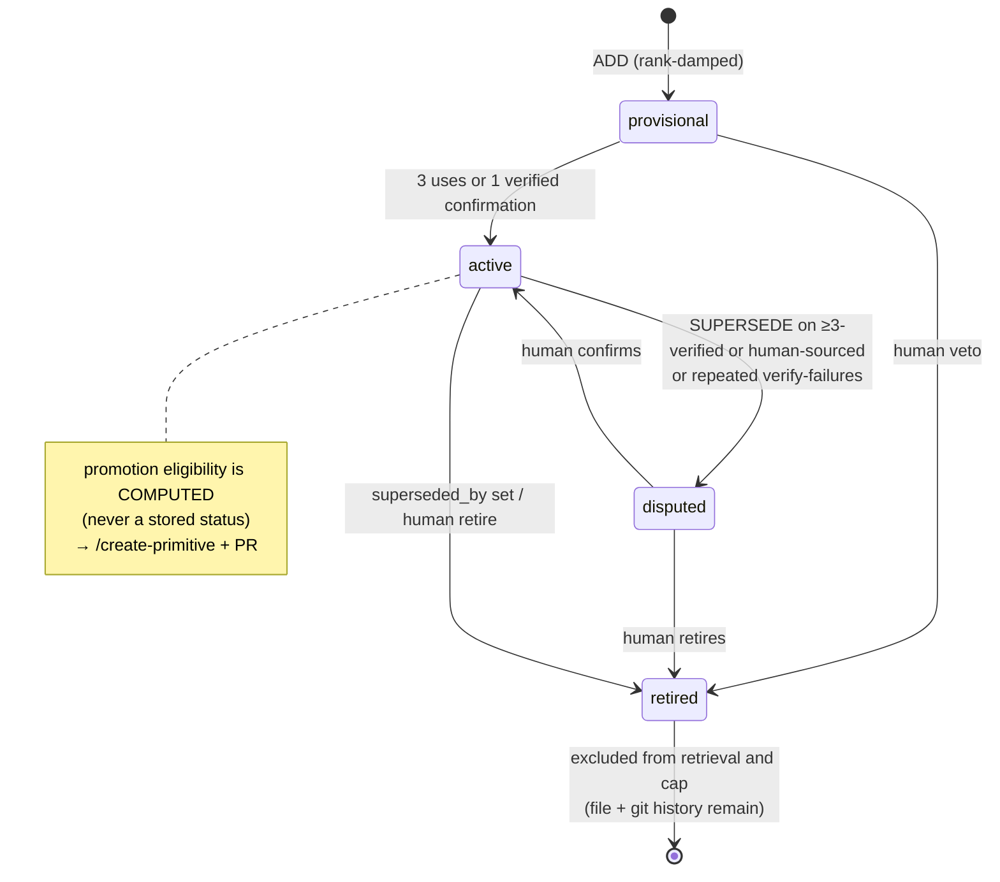

# Memory Model

The Adaptive Engineer Harness's memory is three tiers, each with a single writer and a
narrower role than the one before it. Every change — including forgetting — is a git
commit. This page is the human-facing summary; the full design lives in
[`docs/brainstorms/2026-07-26-knowledge-layer-design.md`](brainstorms/2026-07-26-knowledge-layer-design.md)
and the threat model in [`docs/architecture/knowledge-threat-model.md`](architecture/knowledge-threat-model.md).
Scope: Phase 1, local-only. Team sync is a future phase, deferred by design.

## Three tiers

| Tier | Name | Location | Written by | Role |
|------|------|----------|-----------|------|
| T1 | Episodic | `docs/solutions/` (+ global solutions), plans, activity logs | `/auto-compound` (verified `kind: fix`), `compound --insight` (`kind: insight`), `harness remember` (`kind: human-teaching`) | Immutable ground truth. The episode schema is the public stability contract. |
| T2 | Semantic ("learnings") | `~/.harness/knowledge/<repo-id>/` — CLI-managed local git repo, outside the working tree, never pushed | `harness consolidate --apply` only | Condensed, one-claim-per-file knowledge. A regenerable view of T1 — never the asset. |
| T3 | Behavioral | `.github/` instructions / skills / checks | `/create-primitive` + human PR | Knowledge become behavior. |

T2 is a pure function of (T1, current model): every learning is backed by episodes, so
`harness consolidate --rebuild` can regenerate the entire T2 corpus from raw episodes with
a stronger model — the upgrade path, not a threat.

## Learning lifecycle

This diagram is the design's target state, not the current implementation: today
`provisional → active` happens only via a verified fix episode (STRENGTHEN) or
`harness learning confirm`, not usage counting — and repeated verify-failures surface
as a `failures` annotation in `learnings` output rather than auto-disputing (the
quarantine/auto-dispute writer is Milestone 3).

## Derived, never stored

A learning's frontmatter holds only source facts. Everything else is computed at read
time, never persisted as a field:

- **id** = the filename (`<domain>/<slug>.md`, no separate id field).
- **domain** = the containing directory.
- **evidence counts** = episode links × episode kind (fix-kind links count toward
  verification; insight-kind and human-teaching links do not).
- **promotion eligibility** = ≥3 verified (`kind: fix`) evidence links across ≥2 distinct
  plans — computed and displayed by `harness learnings --why` / `consolidate --status`,
  never written as a status field.

## Trust gradient

Episodes are never transmitted by the harness — repo-private `docs/solutions/` travels
only inside the product repo's own git history, and global episodes stay on the machine;
learnings live in a local, never-pushed store; the only knowledge that reaches a shared
repository through the harness is a primitive that passed a human PR — unless a team
explicitly opts into learnings commit mode, which is documented as an exception with
best-effort secret screening.

## Human register

Every human authority over memory is one command, and every one of them is a git commit
in the knowledge store:

| Action | Command |
|--------|---------|
| Teach | `harness remember "<claim>" --trigger "<applicability>" [--domain <d>]` |
| Inspect | `harness learnings [domain] [--why <id>]` |
| Veto (retire / dispute / confirm) | `harness learning <retire\|dispute\|confirm> <id> --reason "<r>"` |
| Kill switch | `harness knowledge <off\|freeze\|capture-only>` |
| Delete | `harness knowledge purge <file\|--all>` |
| Reset (model-upgrade regeneration) | `harness consolidate --rebuild --yes` |

A direct human statement always outranks statistics: `source: human` learnings are never
auto-retired, and enter as `status: active` immediately — no provisional damping. Only
`harness remember` creates that provenance: it writes a `kind: human-teaching` episode and
the learning it produces is the only lane that sets `source: human`.
`harness learning retire|dispute|confirm` is a separate authority — it mutates an existing
learning's frontmatter only (`status`, and `last_confirmed` on confirm). It never creates an
episode and never changes `source`.

## Hand-editability (current position)

**Hand-edit auto-commit semantics are Milestone 3, not shipped yet.** The design's target
behavior — detecting a non-CLI edit to a learning file via `git status`/`diff`, committing
it as a human edit, and snapshotting it as a `kind: human-teaching` episode so
`consolidate --rebuild` preserves it — does not exist today. Until it ships, do not
hand-edit files under `~/.harness/knowledge/<repo-id>/learnings/`: such edits are not
detected, not snapshotted as an episode, and will be silently discarded by the next
`consolidate --rebuild`. Use `harness remember` to add or correct a claim, and
`harness learning retire|dispute|confirm` to change a learning's status.
