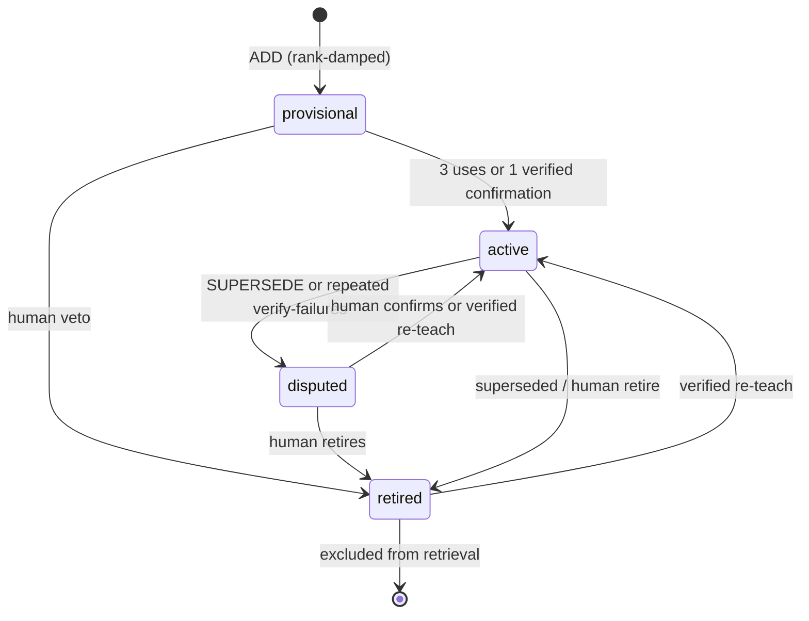

# Adaptive Engineer Harness

**One idea:** treat AI coding like a real engineer — mode before action, a locked plan before mutation, verification before “done,” and memory that compounds — not a chat that types until the budget dies.

This is the shared practice model. Implementation lives in code and skills.

## Product model

| Layer | Role | LLM? |
|-------|------|------|
| **Host-first** — `@engineer` | Modes, lifecycle, judgment | Host-owned |
| **Kernel-always** — `harness` | Orient, gate, edit/exec, verify, compound, knowledge, report | **Never** on the host path |
| **Agent-optional** — `harness agent` | Headless loop on the **same** registry (`agent.enabled`, default off) | Opt-in only |
| **Benchmark-test-only** | `--profile benchmark` / `BENCHMARK_PROFILE` | Test-only |

**Invariant:** the kernel never initiates LLM calls. Full Adaptive Engineering is **host `@engineer` + gate → verify → compound → consolidate/promote**.

### Dual tracks, one kernel

| Track | When | Outer loop |
|-------|------|------------|
| **Deliver** | Real product work | Orient → plan → **gate** → work → **verify** → review → **compound** → growth |
| **Autonomous** (`bench`) | Evals, long-horizon unattended | Short card → tools → **task verifier** → stop |

Shared tools: `edit` / `write` / `apply` / `get` / `search` / `bash` / `exec` / `todo` (registry only).  
Not shared: plan lock, product `verify --plan`, compound, full persona ceremony.

**Invariants over liturgy.** Deliver *must* keep: mode before mutation, locked plan before recognized edits, passed verify before done, compound after proof. The nine-step sequence is the **product** lifecycle for accountable teams — **not** a claim it is the only agent architecture (ReAct, plan-and-execute, SWE-agent ACI, etc. all ship elsewhere).

### Growth loop (after Deliver verify)

```text
harness verify --plan <path> [--learnings id1,id2]
harness compound --plan <path>
harness report --growth
```

**AE scoreboard:** verify→compound rate, recall→cite, promote yield, quarantine health.  
**Autonomous scoreboard (separate):** pass, steps, tokens, duration — not mixed into growth as primary success.

### Session Ledger (`harness tui`)

Interactive projection of the kernel — not a second Engineer.

| Input | Meaning |
|-------|---------|
| bare line | Kernel command (or agent when mode is assist/plan) |
| `/` | Palette over the same registry |
| `!` | Governed shell |
| Shift+Tab | Mode: commands → assist → plan |
| `agent on` / `off` | → `config set agent.enabled` (user scope default) |

Usage mistakes (exit 2) show as ledger **usage**, not a failed verify. Details: [packages/harness/README.md](../packages/harness/README.md).

---

## Why it exists

| Style | Optimizes | Fails by |
|-------|-----------|----------|
| Model-first chat | Fluency | Drift, no proof |
| Spec-driven | Spec completeness | Spec without enforcement |
| Loop-driven | Tool cycles | Explore without act |
| **This practice** | Accountable delivery under gates | (designed to block the above) |

---

## Shape

```text
Developer intent → @engineer (Answer | Investigate | Deliver | Review)
                         │
            skills · locked plan · specialists
                         │
                  gate → work → verify → compound
```

1. **One owner** — `@engineer` owns the outcome.  
2. **Read is light; write is gated** — Answer/Investigate stay read-only.  
3. **Proof before claim** — “Done” means fresh passed verification.

### Task modes

| Mode | Contract |
|------|----------|
| **Answer** | Ceremony-free; no plan |
| **Investigate** | Evidence only; may offer Capture / Plan-and-Fix / Leave-in-chat |
| **Deliver** | Full lifecycle with plan, gate, verify, compound |
| **Review** | Independent `/code-review`; no implementation ownership |

Any requested mutation enters **Deliver** before the first edit.

### Deliver lifecycle

1. Orient · 2. Establish intent (locked plan) · 3. Investigate · 4. Work (after gate) ·  
5. Handle gaps · 6. Verify · 7. Review · 8. Compound · 9. Report  

Hooks/CI enforce plan lock and evidence independently of prompt compliance.

Plans use `plan_schema: 1` with `plan_lock`, named checks, and review state. Commands live in trusted `.github/harness/checks.yaml` — not shell strings in the plan. Policy uses **exemptions** and **waivers** as arrays, not free-form narrative exceptions.

```yaml
plan_schema: 1
status: planned
plan_lock: true
phase: 1
verification:
  required:
    - unit-tests
  criteria:
    AC1: unit-tests
reviews:
  required: []
  completed: []
  critical_open: []
```

---

## Skill-first primitives

Hydrated globally into Copilot — not dumped into every product repo.

| Primitive | Create when |
|-----------|-------------|
| **Skill** | The team repeats a workflow |
| **Agent** | Separate judgment, isolation, or authority is real |
| **Instruction** | File-pattern conventions should auto-apply |
| **Check** | A rule must be enforceable or reviewable |
| **Plan** | Work needs continuity across sessions |
| **Solution / learning** | A fix reveals a reusable pattern |

**Default to a skill.** Prompt wrappers are retired.

---

## Memory (three tiers)

| Tier | What | Writer |
|------|------|--------|
| T1 Episodic | Solutions, plans, activity | compound / remember |
| T2 Semantic | Condensed learnings (`~/.harness/knowledge/<repo-id>/`) | `consolidate --apply` only |
| T3 Behavioral | Skills / instructions / checks | human PR |



**Promote** is human authority (learning → primitive). Governance (`governance.jsonl`) survives rebuild. Learnings are not pushed by default.

---

## Optional headless agent

Prefer `@engineer` for real delivery. When opted in:

| Profile | Ceremony | Stop |
|---------|----------|------|
| `autonomous` (default) | No plan/gate/compound | `--verify-cmd` green |
| `deliver` | Product-minded prompt | Host/hooks still own gates |
| `benchmark` | Test fixture only | Model-done for efficiency tests |

```bash
harness config set agent.enabled true --scope user   # default remains false
harness agent "fix the test" --profile autonomous --verify-cmd "node ./verify.mjs"
```

Tools are registry commands only; `undo` is operator-only. Full reference: [agent-loop.md](./agent-loop.md). Internal eval skeleton: `packages/harness/eval/`.

---

## Runtime modes

| Mode | Meaning |
|------|---------|
| **Standalone** | Global hydrate; product repo uses `@engineer` |
| **Degraded** | Missing index/knowledge — still works, reports limits |
| **Governed** | Locked plan + hooks/CI + passed verify for completion claims |

Missing capability → proposal (`/ensure-capability` → `/create-primitive`), never silent invention. Promotion requires **trigger eval**, **outcome eval**, and recorded promotion evidence. Capability states: `candidate` → `experimental` → `active` → `deprecated` → `retired` (tombstones prevent overlap from resurrecting a second runtime).

**Bounded delegation:** specialists and coordinators run in isolated context; the Engineer reconciles evidence and residual risk.

---

## Install

```bash
npm install -g @dev-kit/harness@latest   # or: npm install -g ./packages/harness
harness install
```

In a **product** repo: select `@engineer`; expect plans under `docs/plans/` for Deliver work; optional `harness doctor` / `orient` / `gate` / `verify`.

---

## Related practices

| Practice | Difference here |
|----------|-----------------|
| Spec-driven | Spec enforced by gate/verify, not prose alone |
| Loop-driven | Loop is governed and secondary to accountability |
| Memory engineering | Explicit writers, governance, promote path |

> **Accountable AI coding: mode before action, plan before mutation, verify before done, compound after proof.**

---

## Where things live

| Need | Location |
|------|----------|
| This model | `docs/adaptive-engineer-harness.md` |
| Optional agent | `docs/agent-loop.md` |
| Repo install | `README.md` |
| CLI / TUI | `packages/harness/README.md` |
| Engineer checklist | `.github/agents/engineer.agent.md` |
| Tool contract | `.github/skills/references/harness-tool-contract.md` |
| Skills / agents | `.github/` |
| Team knowledge | `knowledge/` |
| Product plans | `docs/plans/` in **product** repos |
