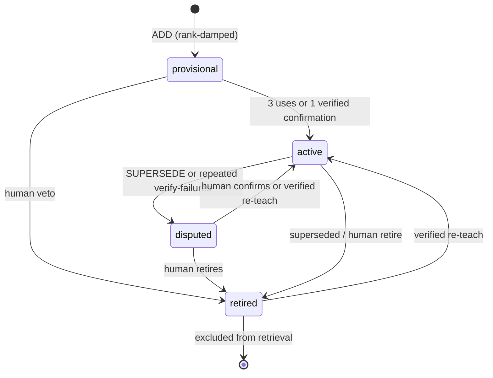

# Adaptive Engineer Harness

**One idea:** treat AI coding like a real engineer — modes of work, a locked plan before mutation, verification before “done,” and memory that compounds — not like a chat that keeps typing until the budget dies.

This is the only conceptual document for the system. Implementation lives in code and skills; this page is for shared understanding.

## Product model (canonical)

| Layer | Role | LLM calls from harness? |
|-------|------|-------------------------|
| **Host-first** — `@engineer` | Canonical Adaptive Engineer (modes, lifecycle, judgment) | Host-owned; not the harness kernel |
| **Kernel-always** — `harness` CLI | Deterministic control plane (orient, gate, edit/exec, verify, compound, knowledge, report) | **Never** on the host path |
| **Agent-optional** — `harness agent` | Opt-in headless loop on the **same kernel** (`agent.enabled`, default off); profiles: deliver \| autonomous | Yes, opt-in only |
| **Benchmark-test-only** | Efficiency/regression fixture (`BENCHMARK_PROFILE` / `--profile benchmark`) | Test-only — **not** product lifecycle |

Correct invariant: **the kernel never initiates LLM calls.** The optional agent process may, only when enabled. Full Adaptive Engineering is **host `@engineer` + kernel gate → verify → compound → consolidate/promote** — not the headless add-on loop alone.

### Dual tracks, one kernel

| Track | Name | When | Outer loop |
|---|---|---|---|
| **A — Trusted Deliver** | `deliver` | Real product work | Orient → intent/plan → **gate** → work → **verify** → review → **compound** → report/growth |
| **B — Autonomous solve** | `autonomous` (alias `bench`) | Internal evals, SWE-style tasks, unattended long-horizon | Short system card → ACI tools → **task verifier** → stop |

Shared: `edit` / `write` / `apply` / `get` / `search` / `bash` / `exec` / `todo` — registry commands only; no second mutation stack.  
Not shared: plan lock, product `harness verify --plan`, compound, full engineer persona, human mid-loop requirements.

**Invariants vs flexible steps.** Deliver *invariants* are: mode before mutation, locked plan before recognized edits, passed verify before done, compound after proof. The **nine-step Deliver sequence** (orient → intent → investigate → work → gaps → verify → review → compound → report) is the **product lifecycle** for accountable team delivery — **not** a claim that it is the only agent architecture in the industry (ReAct, plan-and-execute, SWE-agent ACI, and verifier stacks all ship elsewhere).

### Host growth loop (after every Deliver verify)

```text
harness verify --plan <path> [--learnings id1,id2]
harness compound --plan <path>     # no title/body: uses passed evidence + plan
harness report --growth            # session-end growth report
```

Verified `compound` does not re-ask for structure the evidence already implies. If compound cannot run (no plan, stale evidence, knowledge mode off on insight path), the event carries `blockedReason` / `compoundStatus: skipped` for the growth report — never silent success.

Primary effectiveness metrics for Adaptive Engineering (not turn counts): verify-pass→compound rate, recall→cite linkage, verify→compound latency when timestamps exist, promotion-eligible yield, quarantine health. Turn/search caps are **secondary** on the optional agent. **Autonomous / leaderboard** scoreboards are separate: pass@1, steps, tokens, duration — do not mix into the AE growth report as primary success.

### Session Ledger TUX (`harness tui`)

The interactive surface is a **Session Ledger** (blocks-as-records), not a second Engineer. Inspired by Grok Build gates, Claude/Codex slash discovery, Amp palettes, and Cursor Ask/Plan modes — adapted to host-first AE.

| Input | Meaning |
|-------|---------|
| bare line | Kernel command; or optional agent when mode is **assist** / **plan** |
| `/` | Command palette over the **same registry** (preview shows full argv) |
| `!` | Governed shell |
| `?` | Keymap / grammar |
| Shift+Tab | Cycle host mode: **commands** → **assist** → **plan** |
| `agent on` / `off` | Product verbs → `config set agent.enabled …` (user scope by default) |
| `config set key=value` | Sugar; scope defaults to **user**; use `--scope project` for the repo |
| `gate menu` | Approve / comment / quit for the active plan |
| `inspect config` | Effective values + provenance (no LLM) |
| `runs` / `resume <id>` | List / judge prior runs from the journal |
| `question …\|a\|b` | Structured multi-choice checkpoint (unanswered → inconclusive) |

Usage mistakes (exit 2) project as ledger **`usage`**, not a failed verify. Kernel contracts stay nonzero for scripts. Official xAI terminal product is **Grok Build** (`grok`); community `grok-cli` packages are not the same trust domain.

---

## Why it exists

Most AI coding tools are **model-first**: a strong model, a big prompt, and tools. They fail the same ways humans fail under pressure: they wander, they rewrite large files from a partial view, they skip the failing test, and they leave no durable learning.

The Adaptive Engineer Harness is **workflow-first**:

| Style | What it optimizes | Failure mode |
|--------|-------------------|--------------|
| Model-first chat | Fluency and speed | Drift, ceremony, no proof |
| Spec-driven | Spec completeness | Spec without enforcement |
| Loop-driven | Tool call cycles | Infinite explore without act |
| **Adaptive Engineer Harness** | Accountable delivery under gates | (designed to make the above hard) |

It sits beside Spec Driven Development, Loop-driven agents, and Memory Engineering as a **named practice**: *how a team wants AI to ship software*, not which model to buy.

---

## The shape of the system

```text
                    Developer intent
                           │
                           ▼
                    ┌──────────────┐
                    │  @engineer   │  sole accountable entry
                    └──────┬───────┘
           Answer │ Investigate │ Deliver │ Review
                           │
              ┌────────────┼────────────┐
              ▼            ▼            ▼
         skills       locked plan    specialists
       (on demand)   + harness CLI   (bounded)
                           │
                     gate → work → verify
                           │
                     compound learning
```

Three rules:

1. **One owner** — `@engineer` owns the outcome. Skills and subagents help; they do not become alternate runtimes.
2. **Read is light; write is gated** — Answer and Investigate stay read-only. Deliver crosses an explicit plan gate and verification boundary.
3. **Proof before claim** — “Done” means fresh passed verification, not a confident paragraph.

---

## Task modes

Before acting, the Engineer classifies the request:

| Mode | When | Contract |
|------|------|----------|
| **Answer** | Quick question | Ceremony-free reply; minimum reads; no plan |
| **Investigate** | Diagnose / research | Evidence only; no edits; may offer Capture / Plan-and-Fix / Leave-in-chat |
| **Deliver** | Any requested change | Full lifecycle: plan → gate → work → verify → review → compound → report |
| **Review** | Assess completed work | Independent `/code-review`; no implementation ownership |

Answer and Investigate must **transition to Deliver** before the first requested mutation.

---

## Delivery lifecycle (Deliver mode)

Normative steps live on the Engineer agent. Conceptually:

1. **Orient** — repo map, recall, context pack  
2. **Establish intent** — locked plan (`plan_lock`) with acceptance criteria and named checks  
3. **Investigate** — enough evidence to act  
4. **Work** — bounded edits and tools under policy  
5. **Handle gaps** — capability proposals only with human approval  
6. **Verify** — `harness verify` with named checks  
7. **Review** — confidence-scored review when risk warrants  
8. **Compound** — durable learning after *passed* verify  
9. **Report** — outcome, evidence, residual risk  

Low-risk work still uses the plan schema, often as a short one-phase plan. There is no “just ship it” side door that skips gates.

### Plan as contract (schema v1)

A plan is a **local context pack**, not a shell script dump. Locked plans carry:

```yaml
plan_schema: 1
status: planned
plan_lock: true
phase: 1
verification:
  required:
    - unit-tests
  criteria:
    AC1: unit-tests
reviews:
  required: []
  completed: []
  critical_open: []
```

Enforcement is independent of prompt compliance: hooks and CI can refuse mutation without a locked plan and refuse “complete” without passed evidence. Policy uses **exemptions** and **waivers** as arrays, not free-form narrative exceptions.

---

## Skill-first primitives

This library is a **source of truth for how the team works**, hydrated globally into Copilot — not a plugin and not files dumped into every product repo.

| Primitive | Role | Create when |
|-----------|------|-------------|
| **Skill** | Reusable procedure (primary contract) | The team repeats a workflow |
| **Agent** | Isolated judgment / tools / accountability | Separate review or research role is real |
| **Instruction** | File-pattern conventions | Language/framework standards should auto-apply |
| **Check** | Named verification or review criterion | A rule must be enforceable or reviewable |
| **Plan** | Per-issue state + evidence ledger | Work needs continuity across sessions |
| **Solution / learning** | Durable team memory | A fix reveals a reusable pattern |

**Default to a skill.** Create an agent only when judgment, isolation, or evaluation standards truly differ. Prompt wrappers are retired: select `@engineer` from the agent menu.

Progressive disclosure: frontmatter (discover) → body (activate) → references (execute).

---

## Memory engineering (three tiers)

Memory is tiered so *what happened*, *what we believe*, and *how we behave* never collapse into one editable blob.

| Tier | Name | Where | Who writes | Role |
|------|------|-------|------------|------|
| T1 | Episodic | `knowledge/solutions/`, plans, activity | compound / remember | Immutable ground truth |
| T2 | Semantic (learnings) | `~/.harness/knowledge/<repo-id>/` | `harness consolidate --apply` only | Condensed claims; regenerable from T1 + governance |
| T3 | Behavioral | `.github/` skills / instructions / checks | create-primitive + human PR | Knowledge become default behavior |



**Promote** is a human authority step (learning → primitive candidate). Governance (`governance.jsonl`) records retire / dispute / confirm / **promote** and is reapplied on rebuild so human decisions survive regeneration.

Trust gradient: episodes stay local or in the product repo; learnings are not pushed by default; shared behavior only ships through human review.

---

## The agent loop (headless CLI)

`harness agent` is an optional headless turn loop on the **same kernel**. Prefer host **`@engineer`** for real Deliver work.

| Profile | Flag | Stop / ceremony |
|---------|------|-----------------|
| **deliver** | `--profile deliver` | Product-minded prompt; gate/verify/compound remain host+hooks responsibilities |
| **autonomous** | `--profile autonomous` (default for opt-in agent) | Short system card; **no** plan/gate/compound; success = **task verifier green** (`--verify-cmd`) |
| **benchmark** | `--profile benchmark` | Test/efficiency fixture only (`BENCHMARK_PROFILE`) |

```bash
harness config set agent.enabled true --scope user   # default remains false
harness agent "fix the failing test" --profile autonomous --verify-cmd "node ./task/verify.mjs"
harness agent "work a locked plan" --profile deliver --max-turns 20
```

Benchmark lesson: **tool incentives beat text nudges.**

| Pressure | Design |
|----------|--------|
| Reproduce first | Prefer `bash`/`exec` when the task names a test |
| Search attractor | Search is last resort; hard caps per run and explore streak |
| Context blow-up | Bounded tool results, compaction, short autonomous card |
| Multi-file | `apply` all-or-nothing CAS on the single write path |
| Long-horizon | `todo` worklist under `.harness/todo.json` |
| Destructive rewrite | Write refuses large→small replacement; prefer `edit` |
| Truncation | Token-limited completions never run partial tool args |

Master switch: `agent.enabled` (default off). Provider allowlist: `agent.providers`. Credentials are **guide-only** (env / editor login) — the harness does not store API keys. Details: [agent-loop.md](./agent-loop.md).

---

## Runtime modes

| Mode | Meaning |
|------|---------|
| **Standalone** | Global hydrate; product repo uses `@engineer` without forking the library |
| **Degraded** | Missing index, knowledge, or persona — still works, reports limits |
| **Governed** | Locked plan + hooks/CI + passed verify required for completion claims |

Capability grows from **verified reuse**, not from loading every skill up front. Missing capability becomes a proposal (`/ensure-capability` → `/create-primitive`), never silent invention.

Promotion requires **trigger eval**, **outcome eval**, and recorded **promotion evidence**. Lifecycle states for capabilities:

`candidate` → `experimental` → `active` → `deprecated` → `retired`

Retired capability names stay as tombstones so overlap cannot resurrect a second runtime.

**Bounded delegation:** specialists and coordinators run in isolated context; the Engineer reconciles evidence and residual risk.

---

## What you install

```bash
# from published package (org registry) or local monorepo
npm install -g @dev-kit/harness@latest   # or: npm install -g ./packages/harness
harness install                          # hydrate agents/skills/knowledge for Copilot
```

In a **product** repo (not this library):

1. Open Copilot Chat → select **`@engineer`**
2. For delivery work, expect a plan under `docs/plans/` and verification evidence
3. Optional CLI: `harness doctor`, `harness orient`, `harness gate`, `harness verify`

Primary hosts: GitHub Copilot in VS Code and IntelliJ. Product repos do **not** receive prompt-library source trees; they receive global hydration plus optional local plans and private solutions.

---

## How this relates to other named practices

| Practice | Overlap | Difference |
|----------|---------|------------|
| **Spec-driven** | Plans and acceptance criteria | Spec is enforced by gate/verify, not only prose |
| **Loop-driven** | Tool turns | Loop is governed, context-capped, and not the whole product |
| **Memory engineering** | Episodic → semantic → behavioral | Explicit writers, governance, promote path |
| **Graph / codebase maps** | Orientation and retrieval | Map feeds the Engineer; it does not replace accountability |

If you only remember one sentence:

> **The Adaptive Engineer Harness makes AI coding accountable: mode before action, plan before mutation, verify before done, compound after proof.**

---

## Where the rest lives

| Need | Location |
|------|----------|
| This concept | `docs/adaptive-engineer-harness.md` (this file) |
| Repo entry + install | `README.md` |
| Engineer runtime checklist | `.github/agents/engineer.agent.md` |
| CLI semantics | `.github/skills/references/harness-tool-contract.md` |
| Skills / agents / knowledge | `.github/`, `knowledge/` |
| Product issue plans | `docs/plans/` in **product** repos |
| Harness package usage | `packages/harness/README.md` |

Older architecture essays, install novels, and phase drafts were removed so this practice can be shared the same way other engineering concepts are shared: **one clear model, then the code.**
