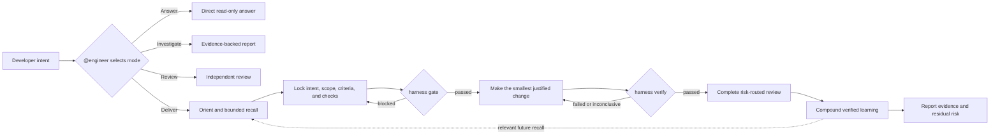
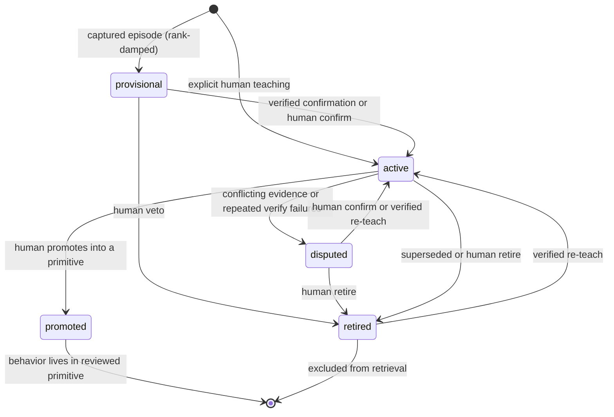

# Adaptive Engineer Harness

Primer (concept, delivery, token bounds, Spec Kit / BMAD): [adaptive-engineering-primer.md](./adaptive-engineering-primer.md).

Adaptive Engineering is an evidence-governed way to deliver AI-assisted software changes. It lets the process expand or contract with the task, while keeping the acceptance bar fixed:

> **Mode before action. Intent before mutation. Evidence before done. Learning after proof.**

The model may be stochastic; the delivery contract is not. “Predictable” means every change has an explicit scope, known checks, and an unambiguous `passed`, `failed`, or `inconclusive` outcome. “Surgical” means the smallest evidence-justified change is made, and any expansion of scope becomes visible and must be re-authorized.

Read-only investigations may retain attributed advisory insights, but those insights do not authorize delivery, satisfy verification, or promote themselves into shared behavior.

## What makes it adaptive

The method adapts the amount of reasoning and ceremony, not the safety invariants.

| Signal | What adapts | What stays fixed |
|--------|-------------|------------------|
| User intent | Answer, Investigate, Deliver, or Review mode | Read-only work cannot silently become mutation |
| Size and risk | Plan depth, required reviews, specialist involvement, and human approval | Mutation requires an authorized intent contract |
| Available context | Bounded repo map, targeted recall, and on-demand skills | Retrieved context is advisory, attributed, and size-limited |
| Capability gap | Consult documentation, load a skill, involve a specialist, or propose a new primitive | The Engineer cannot silently invent reusable authority |
| Evidence | Retry, revise the plan, or report an honest limitation | Only fresh passed verification permits “done” |

A one-line question therefore stays light. A risky cross-cutting change gains a plan, reviews, and stronger checks. Both enter through the same accountable owner.

## System model

| Layer | Role | Boundary |
|-------|------|----------|
| **Host-first** — `@engineer` | Selects the task mode, applies judgment, owns the outcome | The active IDE/model owns reasoning |
| **Kernel-always** — `harness` | Orients, gates, verifies, records evidence, compounds, and reports | Deterministic; it never starts an LLM on the normal host path |
| **Skill-first** workflows and bounded specialists | Supply reusable procedures and independent expertise on demand | Loaded only when relevant; the Engineer reconciles their output |
| **Agent-optional** — `harness agent` | Runs an opt-in headless loop on the same tool registry | Separate from the normal product delivery path; default off |
| **Benchmark-test-only** | Removes product ceremony for controlled evaluations | Never presented as the Adaptive Engineering delivery runtime |

The separation matters: `@engineer` can exercise judgment, but it cannot redefine what the deterministic kernel accepts as authorization or proof. Prompt instructions guide the model; gates, hooks, checks, and CI remain independently executable when the model is wrong or forgetful.



## Task modes

Mode selection prevents a harmless request from accidentally inheriting change authority.

| Mode | Contract | Exit condition |
|------|----------|----------------|
| **Answer** | Concise, read-only explanation | The question is answered |
| **Investigate** | Read-only, evidence-backed diagnosis | Findings, impact, confidence, and options are reported |
| **Deliver** | Accountable mutation through the complete delivery lifecycle | Fresh verification passes, required review closes, and evidence is reported |
| **Review** | Independent assessment of an existing change | Findings are returned without assuming implementation ownership |

Any requested mutation enters Deliver before the first edit. Answer and Investigate avoid delivery overhead because they cannot modify the product.

## Deliver lifecycle

The nine stages are a responsibility model, not a demand for nine documents or nine agents. Simple changes use the same contract with proportionally less detail.

Larger or less-defined initiatives can enter through a longer discovery chain: brainstorming (optional) → issue capture → planning → plan deepening (optional) → Deliver → review → compounding. `@engineer` routes to those workflows only when the work needs them.

| Stage | Purpose | Durable result |
|-------|---------|----------------|
| 1. **Orient** | Refresh repository shape and retrieve only relevant prior knowledge | Bounded context pack |
| 2. **Establish intent** | Define the goal, constraints, acceptance criteria, impacted files, checks, and risk | Locked plan or intent contract |
| 3. **Investigate** | Verify assumptions against code, tests, history, and current documentation | Evidence and implementation decision |
| 4. **Work** | Pass the mutation gate, then make the smallest scoped change | Reviewable diff |
| 5. **Handle gaps** | Acquire a fact, workflow, expert judgment, tool, or approval without silently expanding authority | Resolved gap or explicit blocker |
| 6. **Verify** | Run trusted named checks and bind their result to the actual workspace | Fresh evidence artifact |
| 7. **Review** | Apply only the independent perspectives required by risk | Closed critical findings or explicit residual risk |
| 8. **Compound** | Capture what is reusable only after the change is proven | Attributed episode and growth telemetry |
| 9. **Report** | State outcome, evidence, decisions, and limitations | Auditable handoff |

### The change contract

A Deliver plan is executable governance metadata, not a long-form wish list. Its frontmatter names the expected outputs and trusted checks; its body records scope, reasoning, risks, and activity.

```yaml
plan_schema: 1
status: planned
plan_lock: true
phase: 1
verification:
  required:
    - unit-tests
  criteria:
    AC1:
      - unit-tests
reviews:
  required: []
  completed: []
  critical_open: []
```

Executable commands do not live in the plan. Check IDs resolve through the repository-owned `.github/harness/checks.yaml`, where teams can review and trust argument arrays. Policy exceptions use structured `exemptions` and `waivers` arrays rather than narrative loopholes.

The gate verifies that the plan exists, is locked, maps every acceptance criterion to a relevant check, and is in the right state. VS Code hooks can then:

- deny a recognized mutation without a fresh implement gate;
- invalidate authorization when the plan digest changes;
- record successful mutations; and
- block a completion claim until verification evidence is newer than the last mutation.

Verification runs the named checks and binds the result to the plan digest, base revision, changed-file set, and workspace digest. A prior green run no longer applies after the plan or files change. CI can repeat the same contract independently of the chat session.

## Why delivery becomes predictable and surgical

| Desired property | Harness mechanism | Failure it constrains |
|------------------|-------------------|-----------------------|
| Stable intent | Locked goal, acceptance criteria, constraints, and plan digest | Goal drift during a long conversation |
| Bounded context | Current repo map plus top-matching, attributed recall | Context flooding and unrelated historical advice |
| Explicit authority | Pre-mutation gate and host hooks | Editing before scope and checks are agreed |
| Small diff | Exact impacted-file list, project patterns, TDD, and optional structural expectations | Drive-by refactors and speculative abstractions |
| Honest scope changes | Plan edits invalidate the gate and require re-authorization | Quiet expansion after implementation begins |
| Reproducible proof | Repository-owned named checks with stable exit semantics | Model-selected or invented validation |
| Fresh completion | Evidence bound to the current plan and workspace | “Tests passed earlier” or “looks done” claims |
| Independent scrutiny | Risk-routed review and explicit critical findings | The implementer silently self-approving risky work |
| Safe improvement | Deliver compounding only after passed verification; advisory insight capture; human-controlled promotion | Unverified mistakes becoming team behavior |

This does not guarantee identical code from two model runs. It makes the permitted change envelope, proof requirements, and failure states consistent—and makes deviations observable.

## Skills, specialists, and capability growth

The system uses the smallest primitive that matches the responsibility.

| Primitive | Use it when |
|-----------|-------------|
| **Skill** | A workflow or checklist is reusable |
| **Agent** | Independent judgment, isolation, authority, or evaluation standards are real |
| **Instruction** | A convention should activate for matching files |
| **Check** | A rule must be enforced or independently evaluated |
| **Plan** | A change needs a durable intent and continuity across sessions |
| **Solution / learning** | A verified outcome—or a clearly marked advisory insight—contains reusable context |

**Bounded delegation** means specialists receive a narrow question, acceptance criterion, evidence, and constraints. They do not inherit ownership of the whole delivery, and the Engineer remains accountable for synthesis.

When a capability is missing, the system first uses existing documentation, skills, experts, or tools. A potentially reusable gap becomes a proposal. Creating or changing team behavior remains a separate, human-reviewed action; a plan label alone never grants that authority.

Reusable capabilities follow an explicit lifecycle: `candidate` → `experimental` → `active` → `deprecated` → `retired`. Promotion requires a trigger eval, an outcome eval, and recorded promotion evidence. Retirement leaves a tombstone so an overlapping primitive cannot quietly resurrect a second runtime for the same responsibility.

## Memory that earns trust

Memory is an input to judgment, never proof of the current change.

| Tier | Content | Trust and writer |
|------|---------|------------------|
| **T1 — Episodic** | Verified solution episodes, attributed investigation insights, plan activity, and explicit human teachings | Provenance-bearing source material; unverified insights remain advisory |
| **T2 — Semantic** | Condensed, triggerable learnings in `~/.harness/knowledge/<repo-id>/` | Local and bounded; `consolidate --apply` is the sole content writer |
| **T3 — Behavioral** | Skills, instructions, agents, and checks | Shared behavior; promoted only through a human-reviewed repository change |



Provisional learnings are rank-damped. Ordinary retrieval excludes disputed, retired, superseded, and promoted entries. The governance ledger preserves human retire, dispute, confirm, and promote decisions across rebuilds. Recall records what it surfaced; verification records which learning materially affected the work, so usefulness can be measured without pretending that retrieval itself improved the code.

The growth scoreboard measures verified delivery behavior—verify→compound rate, recall→cite, promotion yield, and quarantine health. It does not use lines of generated code or model activity as a proxy for quality.

## Tracks, surfaces, and runtime modes

### Two tracks, one kernel

| Track | Use for | Success contract |
|-------|---------|------------------|
| **Deliver** | Real product changes | Locked plan, passed product verification, required review, compounding, and growth evidence |
| **Autonomous** | Evals or deliberately unattended tasks | A task-specific `--verify-cmd` passes within the configured budget |

The optional `harness agent` is not a second Engineer and is off by default. It reuses the command registry but does not silently inherit the Deliver plan, gate, review, or compound contract. Its metrics—pass, steps, tokens, and duration—remain separate from the Adaptive Engineering growth loop.

`harness tui` is the **Session Ledger**, a human-facing projection of the same kernel. It exposes the command palette, current mode, plan/gate state, governed shell, learnings, prior runs, and repository initialization; it does not create another source of workflow truth.

| Runtime mode | Meaning |
|--------------|---------|
| **Standalone** | Global assets are hydrated and a product repo uses host `@engineer` |
| **Degraded** | A hook, index, or knowledge layer is unavailable; work can continue only with the limitation disclosed |
| **Governed** | A locked plan, host hooks or CI, named checks, and fresh passed evidence enforce completion |

## How this relates to other AI development approaches

These approaches solve different layers of the problem and can be composed. GitHub Spec Kit includes checklist, analysis, and convergence steps; BMAD includes readiness and review workflows. Adaptive Engineering differs not because it is the only approach with quality steps, but because a model-independent kernel binds mutation authority and completion evidence to the current repository state.

| Approach | Optimizes | Used alone, does not guarantee | Harness contribution |
|----------|-----------|--------------------------------|----------------------|
| [Spec-Driven Development](https://github.github.com/spec-kit/concepts/sdd.html), using GitHub Spec Kit as the reference | Structured intent through spec, plan, tasks, implementation, analysis, and convergence | Runtime mutation authorization or repository-specific proof | Treats the spec as upstream intent, then adds a locked change contract, gate, trusted checks, and evidence bound to the exact diff |
| [BMAD workflow](https://docs.bmad-method.org/reference/workflow-map/) (Breakthrough Method for Agile AI-Driven Development) | Scale-adaptive discovery, planning, architecture, stories, implementation, and specialist perspectives | How each repository authorizes mutations, executes its checks, and retains completion evidence | Uses BMAD artifacts as intent while the Harness governs each implementation and completion claim |
| [Graph-driven orchestration](https://docs.langchain.com/oss/python/langgraph/overview) | Durable, interruptible execution modeled as state, nodes, and edges | Acceptable code scope, required tests, or repository-level “done” | Supplies a delivery protocol that a graph runtime can execute, without requiring one on the normal host-first path |
| [Knowledge-graph memory](https://help.getzep.com/graphiti/getting-started/overview) | Cross-session facts, temporal relationships, and multi-hop retrieval | That recalled context is current, relevant, or proof of the implementation | Adds provenance, bounded recall, lifecycle states, failure feedback, and human promotion; memory may advise but never authorize or verify |

“Graph-driven orchestration” and “graph-backed memory” are separate ideas: one models control flow, the other models knowledge. The labels above are umbrella categories, not a single standardized development method.

These layers compose as follows: Spec Kit or BMAD can produce the requirements and design; Adaptive Engineering turns the selected slice into a governed change contract; a graph runtime may automate parts of execution; and a memory system may supply context if it obeys the same provenance and trust rules.

## Install and use

```bash
npm install -g @dev-kit/harness@latest
harness tui
```

The first TUI launch hydrates the CLI and supported VS Code assets automatically. In a product repository, choose `@engineer`; use **Initialize this repo** from the TUI palette (or `harness init-repo`) when the repository does not yet contain Harness policy and plan scaffolding.

For explicit or non-TUI setup, use `harness install --configure-vscode`. See the [Harness CLI reference](../packages/harness/README.md) for installation, the VS Code Copilot bridge, commands, and CI examples. See [agent-loop.md](./agent-loop.md) for the opt-in headless track.

## Where things live

| Need | Location |
|------|----------|
| Primer | `docs/adaptive-engineering-primer.md` |
| Practice model | `docs/adaptive-engineer-harness.md` |
| Optional headless loop | `docs/agent-loop.md` |
| CLI, TUI, installation, and CI | `packages/harness/README.md` |
| Accountable host behavior | `.github/agents/engineer.agent.md` |
| Deterministic command contract | `.github/skills/references/harness-tool-contract.md` |
| Reusable workflows and specialists | `.github/skills/` and `.github/agents/` |
| Team episodes | `knowledge/solutions/` |
| Product change contracts | `docs/plans/` in each product repository |

## Comparison references

- [Spec Kit SDD concept](https://github.github.com/spec-kit/concepts/sdd.html)
- [Spec Kit command reference](https://github.com/github/spec-kit/blob/main/docs/reference/agentic-sdd.md)
- [BMAD Method workflow map](https://docs.bmad-method.org/reference/workflow-map/)
- [LangGraph overview](https://docs.langchain.com/oss/python/langgraph/overview)
- [Graphiti overview](https://help.getzep.com/graphiti/getting-started/overview)
