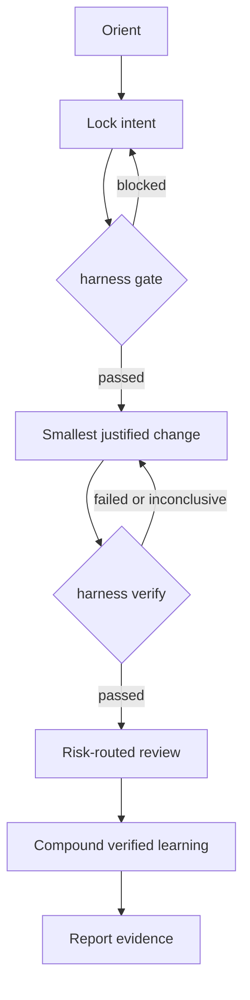
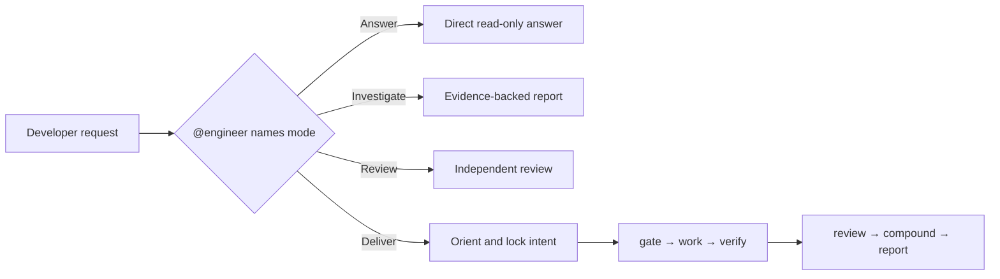
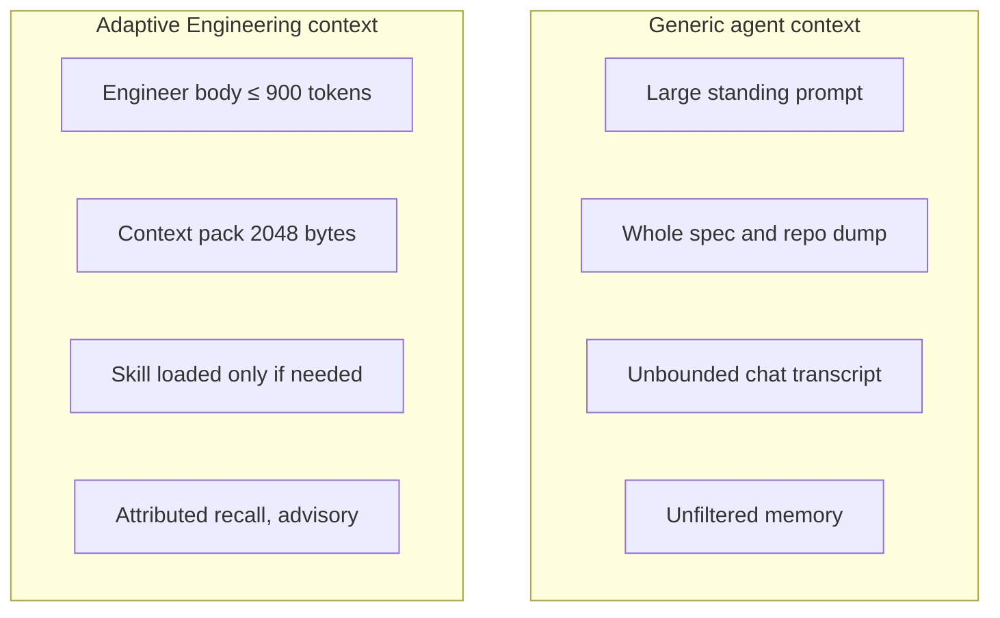
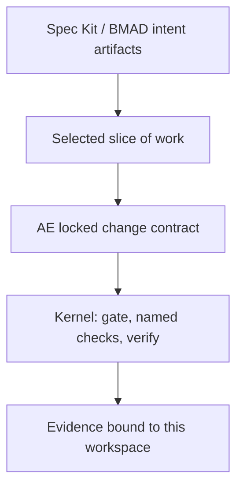

# Adaptive Engineering: team primer

This briefing is for teammates who will be asked *why* we use Adaptive Engineering, especially when other teams are adopting spec-driven development and BMAD (sometimes heard as “BMAT”).

It explains the idea, how delivery is authorized and proven, how token spend is bounded, and how a Harness plan differs from a Spec Kit or BMAD plan. The operational contract stays in the [practice model](./adaptive-engineer-harness.md).

> **Mode before action. Intent before mutation. Evidence before done. Learning after proof.**

The model may be stochastic. The delivery contract is not.

## What Adaptive Engineering is

Adaptive Engineering is an evidence-governed way to deliver AI-assisted software changes. The process expands or contracts with the task. The acceptance bar does not.

| The method adapts | The bar stays fixed |
|-------------------|---------------------|
| Answer, Investigate, Review, or Deliver | Read-only work cannot silently become mutation |
| Plan depth, reviews, specialists, human approval | Mutation needs an authorized intent contract |
| How much context, which skills, which experts | Retrieved context is advisory, attributed, and size-limited |
| Retry, revise the plan, or report a limitation | Only fresh passed verification permits “done” |

A one-line question stays light. A risky cross-cutting change gains a plan, reviews, and stronger checks. Both enter through the same accountable owner: **`@engineer`**.

Adaptive Engineering is not “write a better spec and hope the agent follows it.” It is a split of responsibility:

| Layer | Role |
|-------|------|
| **Host-first** — `@engineer` | Selects the mode, applies judgment, owns the outcome |
| **Kernel-always** — `harness` | Orients, gates, verifies, records evidence, compounds, reports. Deterministic. It does not start an LLM on the normal host path |
| **Skill-first** workflows and bounded specialists | Loaded only when relevant |
| **Agent-optional** — `harness agent` | Opt-in headless loop. Off by default. Not the product delivery runtime |

Prompt instructions guide the model. Gates, hooks, named checks, and CI remain independently executable when the model is wrong or forgetful.

## Ideology

Spec-driven methods invert an old habit: they treat the specification as the expensive artifact and the code as something an agent can generate. That is a useful correction for *intent*. It is not a delivery runtime.

Adaptive Engineering starts from a different premise: **the expensive failure is an unauthorized or unproven change**, not a missing document.

Four rules follow.

1. **Mode before action.** Name Answer, Investigate, Review, or Deliver before tools run. A question must not inherit change authority.
2. **Intent before mutation.** The allowed change is a locked contract: goal, scope, acceptance criteria, named checks, and risk. Editing first and documenting later is not delivery.
3. **Evidence before done.** “Tests passed earlier,” “the agent said it was finished,” and “the story is implemented” are not completion. Completion is a fresh verification result bound to the current plan and workspace.
4. **Learning after proof.** Only verified outcomes become reusable team memory. Unverified insights may be kept as advisory. They cannot authorize the next change or promote themselves into shared behavior.

That is why the method is adaptive without being loose. Ceremony scales. Authority and proof do not.

## How it ensures

“Ensures” here means *constrains*, not *guarantees identical code from two model runs*. The permitted change envelope, the proof requirements, and the failure states stay consistent. Deviations are visible.

The diagram is the kernel loop. Investigate and handle-gaps still sit in the nine-stage Deliver model below; they do not replace the gate or verify.



A Deliver plan is executable governance metadata, not a long-form wish list. Frontmatter names outputs and trusted checks. The body records scope, reasoning, risks, and activity.

```yaml
plan_schema: 1
status: planned
plan_lock: true
phase: 1
verification:
  required:
    - unit-tests
  criteria:
    AC1:
      - unit-tests
reviews:
  required: []
  completed: []
  critical_open: []
```

What the kernel actually enforces:

| Control | What it does |
|---------|----------------|
| **Locked plan** | Goal, criteria, constraints, and a digest. Quiet goal drift during a long chat is a plan edit, not a side effect |
| **Pre-mutation gate** | No recognized mutation without a fresh implement gate |
| **Host hooks** | When installed and `enforcement: enforce`, deny mutation without a gate, invalidate authorization when the plan digest changes, and block a “done” claim until evidence is newer than the last edit. `observe` and `warn` do not block |
| **Named checks** | Check IDs resolve through repository-owned `.github/harness/checks.yaml`. The model does not invent the validation command |
| **Fresh evidence** | `harness verify` binds the result to the plan digest, base revision, changed-file set, and workspace digest |
| **Risk-routed review** | Required review labels are recorded on the plan. They request independent perspectives; they do not prove a different human ran them |
| **Governed memory** | Deliver compounding runs after passed verification. `harness compound --insight` is advisory. `harness agent --profile autonomous` is a separate track, not the Deliver contract. Promotion into a skill, agent, or instruction is a separate human-reviewed change |

CI can repeat the same gate and verify contract independently of the chat session.

## How it delivers

The nine Deliver stages are a responsibility model, not a demand for nine documents or nine agents. Simple changes use the same contract with less detail. Larger work can enter through brainstorming, issue capture, planning, and optional plan deepening. `@engineer` routes to those workflows only when the work needs them.

| # | Stage | What it produces |
|---|-------|------------------|
| 1 | Orient | Bounded context pack |
| 2 | Establish intent | Locked plan or intent contract |
| 3 | Investigate | Evidence against the current code |
| 4 | Work | Gate pass, then the smallest scoped diff |
| 5 | Handle gaps | Fact, skill, specialist, or explicit blocker |
| 6 | Verify | Fresh evidence bound to this workspace |
| 7 | Review | Closed critical findings or named residual risk |
| 8 | Compound | Attributed learning after proof |
| 9 | Report | Auditable handoff |



| Mode | Contract | Exit |
|------|----------|------|
| **Answer** | Concise, read-only explanation | The question is answered |
| **Investigate** | Read-only, evidence-backed diagnosis | Findings, impact, confidence, and options are reported |
| **Deliver** | Accountable mutation through the full lifecycle | Fresh verification passes, required review closes, evidence is reported |
| **Review** | Independent assessment of an existing change | Findings return without assuming implementation ownership |

Any requested file mutation enters Deliver before the first edit. Answer and Investigate stay cheap because they cannot modify the product.

During Deliver, the Engineer makes the smallest evidence-justified change. Scope expansion is a plan edit. A plan edit invalidates the gate and must be re-authorized. That is what “surgical” means here: not “the model writes less,” but “the allowed envelope is explicit and a bigger envelope is visible.”

Specialists receive a narrow packet: question, acceptance criterion, evidence, constraints, expected response. They do not inherit ownership of the delivery. The Engineer remains accountable.

## How it limits token deviation

Generic agents spend tokens on *possibility*: a large standing prompt, the whole repository, the whole spec, an ever-growing transcript, every specialist, and whatever memory retrieval dumped in. Cost and quality both drift because the next turn cannot tell signal from residue.

Adaptive Engineering spends tokens on *the current authorized slice*.



Mechanisms already in the kernel and prompt library:

| Mechanism | Bound | Effect |
|-----------|-------|--------|
| Thin `@engineer` | Agent body ≤ 900 tokens (contract test) | Standing instructions stay a routing contract, not a procedure dump |
| Context pack | Hard cap of 2048 bytes | Orient tells the model to read the pack, not re-ingest full plans and solution files |
| Progressive disclosure | Skill frontmatter → body → references | Unused workflows do not occupy the prompt |
| On-demand specialists | Narrow consultation packet | A reviewer or researcher does not inherit the whole delivery context |
| Model-free orientation | Repo map, recall index, pack assembly | Mapping the repo does not cost a model call |
| Compact kernel results | Gate/verify `--json` is a small envelope | Host `@engineer` may read that result; it must not ingest unbounded command arrays or raw index JSON |
| Mode selection | Answer / Investigate skip Deliver ceremony | A question does not pay for a plan, gate, or review |
| Memory trust tiers | Advisory until promoted | Recalled text cannot authorize work or count as proof |

This is not a claim of a measured “X% cheaper than Spec Kit.” It is a claim about *variance*: the context envelope is capped, attributed, and mode-dependent, so a long chat does not quietly accumulate every file the agent once opened.

The growth scoreboard measures verified delivery behavior (verify→compound, recall→cite, promotion yield). It does not treat tokens generated or lines written as quality.

## This also produces a plan. How is that different?

This is the question other teams will ask. Spec Kit, BMAD, and Adaptive Engineering all emit planning artifacts. They are not the same object.



[Spec-Driven Development](https://github.github.com/spec-kit/concepts/sdd.html), using GitHub Spec Kit as the reference, treats specifications as the source that generates implementation. Spec Kit’s [agentic command sequence](https://github.com/github/spec-kit/blob/main/docs/reference/agentic-sdd.md) is constitution → specify → plan → tasks → implement, with optional clarify, checklist, analyze, and converge steps. Spec Kit [does not prescribe](https://github.github.com/spec-kit/concepts/spec-persistence.html) how `spec.md`, `plan.md`, and `tasks.md` are preserved or mutated after requirements change.

The [BMAD Method](https://docs.bmad-method.org/reference/workflow-map/) (Breakthrough Method for Agile AI-Driven Development; sometimes heard internally as “BMAT”) builds context across analysis, planning, solutioning, and implementation. Each phase produces documents that inform the next: briefs, PRDs, `SPEC.md`, architecture, epics, stories, then `bmad-build`. That is context engineering for *what to build and why*.

| | Spec Kit / BMAD plan | Adaptive Engineering plan |
|---|----------------------|---------------------------|
| **Job** | Capture *what* and *why*; optionally *how* | Authorize *this* mutation in *this* repository |
| **Typical artifact** | `spec.md`, `plan.md`, `tasks.md`, PRD, architecture, stories | Locked plan under `docs/plans/` with `plan_lock`, criteria, and named checks |
| **When it changes** | Team convention (flow-back, flow-forward, or living spec) | Digest changes; the gate invalidates; re-authorization is required |
| **Commands** | Often inlined as agent instructions or story steps | Check IDs only; executable argv lives in trusted `checks.yaml` |
| **“Done”** | The agent finished the tasks or story | Fresh `harness verify` bound to the current plan and workspace |
| **Tokens** | Documents accumulate as next-phase context | Only a sliced pack and on-demand skills enter the model |
| **Memory** | Prior phase docs are the next prompt | Provenance-bearing recall; unverified insights stay advisory |

They compose. Spec Kit or BMAD can produce the requirements and design. Adaptive Engineering turns the selected slice into a governed change contract. A BMAD story or a Spec Kit task list is upstream intent. It does not replace the gate, the named checks, or the evidence binding.

The published Spec Kit and BMAD workflows do not document a repository-owned pre-mutation gate, trusted argv checks, or evidence bound to the current workspace. That is the layer Adaptive Engineering adds. A custom BMAT stack can invent similar controls; until they exist and run independently of the model, they are not this contract.

## Common questions

### This also produces a plan. How is that different from SDD + BMAD?

A Spec Kit `plan.md` or a BMAD architecture/story set describes the work. A Harness plan is a change contract: it must be locked, it must map every acceptance criterion to a named check, and a digest change withdraws mutation authority. See the table above.

### Isn’t this just more ceremony?

Ceremony is mode-dependent. Answer and Investigate have none of the Deliver gate. A small Deliver change uses the same contract with a short plan. The parts that never shrink are authorization and proof, because those are the parts that fail silently in a long agent session.

### Why not paste the whole spec into the agent?

Unbounded context raises cost and raises the chance the model attends to the wrong paragraph. Adaptive Engineering keeps the spec as an upstream document and injects a 2048-byte pack plus targeted file reads. The spec can still be opened. It is not the standing prompt.

### Can we still use Spec Kit or BMAD artifacts?

Yes. Treat them as intent. Point the Harness plan at the selected slice, lock that slice, and let the kernel authorize and verify the change. Do not copy those files into product repos as a second prompt library.

### What if I only want a question answered?

Use `@engineer` in Answer mode. No plan, no gate, no edit. If the conversation turns into “please change the code,” switch to Deliver before the first edit.

### How does this limit token spend versus a generic agent?

The standing prompt is thin, unused skills stay on disk, orientation is model-free, the pack is byte-capped, and specialists get a packet rather than the whole transcript. Host `@engineer` may still read a compact gate or verify envelope. It must not paste full plans, solution files, or unbounded JSON arrays into context. See [How it limits token deviation](#how-it-limits-token-deviation).

### Who owns the outcome if specialists are involved?

`@engineer` owns the outcome. Coordinators and reviewers are bounded. They do not become a second delivery owner.

### What happens if the plan changes mid-work?

The plan digest changes. Hooks invalidate the implement gate. The Engineer must re-lock and re-pass the gate before further recognized mutation. That is how scope expansion stays visible.

### How do we know “done” is real?

`harness verify` ran the named checks against the current workspace and recorded `passed`, `failed`, or `inconclusive`, bound to the current plan digest. A prior green run does not apply after the plan or files change. CI can repeat the same contract.

### Why not just `bmad-build` or Spec Kit implement?

Those workflows are good at turning structured intent into an implementation attempt. They do not, by themselves, give this repository a pre-mutation gate, trusted argv checks, workspace-bound evidence, or a memory rule that forbids unverified lessons from becoming team behavior. If another team already produced a spec or story, start from that intent and still Deliver through the kernel.

## Where to go next

| Need | Document |
|------|----------|
| This briefing | `docs/adaptive-engineering-primer.md` |
| Operational contract | [adaptive-engineer-harness.md](./adaptive-engineer-harness.md) |
| Optional headless loop | [agent-loop.md](./agent-loop.md) |
| Install, TUI, CI | [packages/harness/README.md](../packages/harness/README.md) |
| Spec Kit SDD concept | [What is Spec-Driven Development?](https://github.github.com/spec-kit/concepts/sdd.html) |
| Spec Kit commands | [Agentic SDD](https://github.com/github/spec-kit/blob/main/docs/reference/agentic-sdd.md) |
| Spec Kit persistence | [Spec Persistence Models](https://github.github.com/spec-kit/concepts/spec-persistence.html) |
| BMAD workflow map | [Workflow Map](https://docs.bmad-method.org/reference/workflow-map/) |
