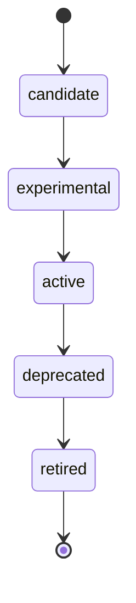

# Adaptive Engineering

You start with two parts. The Engineer decides what to do. The Harness checks the work and keeps the record.

The Engineer is the only entry. It answers a question, investigates a system, delivers a change, or reviews a result. The Harness orients the work, locks a plan, gates edits, runs the named checks, and stores the evidence. A change is done when that evidence passes.

The Engineer grows the way a working engineer does. A repeated procedure becomes a skill. A judgment that needs its own reviewer becomes an agent. A rule for one kind of file becomes an instruction. A solved problem becomes a learning. None of these are required on the first day. The Engineer acquires them when the work shows they are needed. Installing the Harness does not require the specialist agents or the domain skills that may already be in this repository.

Plans for a product repository live in `~/.harness/projects/<repo-id>/plans/`. Private solution episodes live in `~/.harness/projects/<repo-id>/docs/solutions/`. A reset of the product repository does not delete them. `harness migrate` copies existing plans, solutions, and `knowledge/solutions` into that store. Files already committed in the repository stay there until you remove them.

After `harness verify` passes, compounding records what the task taught. A detail that matters only for this task stays on the plan. A fact worth seeing again becomes a solution episode. A new skill or agent is a proposal. A person approves it before it is installed.

```bash
npm install -g harness
harness install --configure-vscode
```

Then select `@engineer` in Copilot Chat.

## How a task runs

Task modes are Answer, Investigate, Deliver, and Review. The Engineer owns the decision. The Harness owns the gate.

Deliver is host-first. The Engineer works in the editor. Kernel-always means orient, plan lock, gate, and verify run in the Harness even when no extra agent is loaded. Agent-optional means a specialist is consulted only when the task needs that judgment. Benchmark-test-only means the unattended agent loop is for a measured eval, not for normal delivery.

The runtime has four postures. Standalone is the Engineer with the Harness and no acquired specialist. Degraded is a missing check or index, reported rather than invented. Governed is a learning that a person has confirmed. Bounded delegation means a specialist receives a narrow question and does not take over the delivery.

## How capability is acquired

A capability moves through candidate, experimental, active, deprecated, and retired. Promotion needs a trigger eval, an outcome eval, and promotion evidence. Retirement leaves a tombstone so a later task can see the overlap with what replaced it.



A person can promote a learning. The governance ledger records that decision. The Engineer does not install a new skill or agent on its own.

## What a plan must contain

A delivery plan uses `plan_schema: 1`. Its verification block names checks. Its review block records what is still open.

```yaml
plan_schema: 1
verification:
  required: []
  criteria: {}
reviews:
  required: []
  completed: []
  critical_open: []
```

Named checks are argv arrays in `.github/harness/checks.yaml`. The Harness runs them without a shell. Policy exemptions and waivers are explicit. A missing check is not a pass.

Skill-first means a repeated procedure becomes a skill before it becomes another agent. The Engineer can start with no domain skill and no specialist. Those are acquired later.
