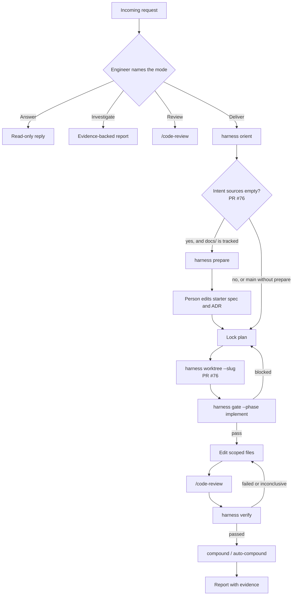
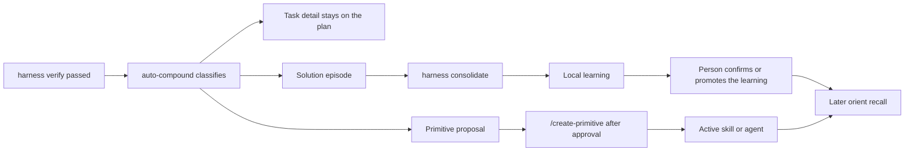
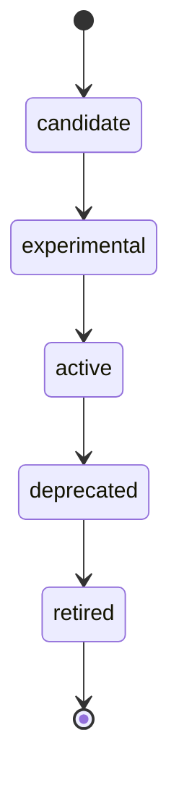

# Adaptive Engineering

You start with two parts. The Engineer decides what to do. The Harness checks the work and keeps the record.

The Engineer is the only entry. It answers a question, investigates a system, delivers a change, or reviews a result. The Harness orients the work, locks a plan, gates edits, runs the named checks, and stores the evidence. A change is done when that evidence passes.

This page explains the delivery loop. After you read it, you should be able to answer four questions: what Adaptive Engineering is; what pain it removes versus chat-code or pasting a spec into an agent; how the self-improving loop feeds the next task and what counts as done; and how it compares with spec-driven development, BDD, and coding-agent harnesses that wrap those methods without lock, isolation, or a learning loop.

Command flags, JSON envelopes, and exit codes live in [`packages/harness/README.md`](../packages/harness/README.md) and [`.github/skills/references/harness-tool-contract.md`](../.github/skills/references/harness-tool-contract.md). This page does not replace those manuals.

```bash
npm install -g harness
harness install --configure-vscode
```

Then select `@engineer` in Copilot Chat.

## What Adaptive Engineering is

Adaptive Engineering is a host-first delivery loop with a deterministic kernel.

The Engineer (`@engineer`) classifies the request as **Answer**, **Investigate**, **Deliver**, or **Review**. Answer and Investigate stay read-only. Review sends finished changes to `/code-review`. Deliver is the only mode that mutates product files.

On the Deliver path the Engineer calls orient, plan lock, gate, and verify. The kernel runs each command without starting a model. The optional `harness agent` loop is **Benchmark-test-only**. It is an opt-in add-on for a measured eval, not the product runtime.

Four records make the work inspectable:

1. **Intent.** What must be true when the work is done, written on the plan as `intent`, `success_criteria`, `expected_outputs`, and `## Intent Contract`.
2. **Scope.** Which files may change, written as `## Impacted Files`.
3. **Proof.** Which named checks must pass, written as `verification.required` and mapped from `.github/harness/checks.yaml`.
4. **Learning.** What the task taught, written only after `harness verify` returns `passed`.

The Engineer grows the way a working engineer does. A repeated procedure becomes a skill. A judgment that needs its own reviewer becomes an agent. A rule for one kind of file becomes an instruction. A solved problem becomes a learning. None of these are required on the first day. The Engineer acquires them when the work shows they are needed. Installing the Harness does not require the specialist agents or the domain skills that may already be in this repository.

## What pain it removes

Chat-code and "paste a spec into an agent" fail in the same places.

**Intent drifts.** The request in chat is not the contract the agent implements. A later turn "clarifies" the goal after files have already moved. Reviewers then argue about what was asked, not about the diff.

**Edge cases stay implicit.** A spec that lives only in a prompt does not force acceptance criteria or named checks. The agent fills gaps with guesses. CI fails on the cases nobody wrote down.

**The agent edits the wrong checkout.** Work starts on a dirty local branch, a stale clone, or the default branch of the primary tree. The change is hard to review because it is mixed with unrelated files.

**Brownfield repos have no source of truth.** Many product repos have no spec or ADR. The agent invents architecture from file names. Reviewers cannot tell a guess from a decision.

**Review and CI thrash.** Misread requirements produce a passing local story and a failing pipeline, or the reverse. Each retry spends another review cycle on the same missing invariant.

Adaptive Engineering treats those as process failures, not model failures. The kernel records the contract, blocks unplanned edits, and refuses a completion claim without fresh evidence.

## Shipping state on `main` and PR #76

This repository's Adaptive Engineering model is already on `main`: Engineer modes, plan lock, implement gate, named-check verify, and post-pass compounding.

Three kernel behaviors live on [PR #76](https://github.com/noodlemind/prompt-library/pull/76). They are not on `main` yet. This explainer names them as **Harness Adaptive Engineering (see also PR #76)**:

| Behavior | On `main` today | PR #76 |
| --- | --- | --- |
| Plan lock | `plan_lock: true` plus intent fields and `## Intent Contract` | Also writes `{ path, sha256 }` for each readable in-checkout `intent_sources` file |
| Checkout isolation | Structural index and knowledge store are keyed per worktree; there is no `harness worktree` command | `harness worktree --slug` opens a linked worktree from `origin/HEAD` |
| Brownfield starters | Orient and plan-new do not seed specs | `harness prepare` writes `docs/specs/overview.md` and `docs/adr/0000-architecture.md` when those paths are missing |

When a sentence below depends on those three behaviors, it says so. Everything else is current `main` behavior.

## How a task runs

**Task modes** are Answer, Investigate, Deliver, and Review. The Engineer owns the decision. The Harness owns the gate.

Deliver is **Host-first**. The Engineer works in the editor. **Kernel-always** means orient, plan lock, gate, and verify run in the Harness even when no extra agent is loaded. **Agent-optional** means a specialist is consulted only when the task needs that judgment. **Benchmark-test-only** means the unattended agent loop is for a measured eval, not for normal delivery.

The runtime has four postures. **Standalone** is the Engineer with the Harness and no acquired specialist. **Degraded** is a missing check or index, reported rather than invented. **Governed** is a learning that a person has confirmed. **Bounded delegation** means a specialist receives a narrow question and does not take over the delivery.


```mermaid
flowchart TD
  request[Incoming request] --> classify{Engineer names the mode}
  classify -->|Answer| answer[Read-only reply]
  classify -->|Investigate| investigate[Evidence-backed report]
  classify -->|Review| review["/code-review"]
  classify -->|Deliver| orient[harness orient]
  orient --> prepare{"Intent sources empty?<br/>PR #76"}
  prepare -->|yes, and docs/ is tracked| seed[harness prepare]
  seed --> editSpecs[Person edits starter spec and ADR]
  editSpecs --> lock[Lock plan]
  prepare -->|no, or main without prepare| lock
  lock --> worktree["harness worktree --slug<br/>PR #76"]
  worktree --> gate[harness gate --phase implement]
  gate -->|blocked| lock
  gate -->|pass| implement[Edit scoped files]
  implement --> codeReview["/code-review"]
  codeReview --> verify[harness verify]
  verify -->|failed or inconclusive| implement
  verify -->|passed| compound[compound / auto-compound]
  compound --> report[Report with evidence]
```

On `main`, lock goes to gate. `harness prepare` and `harness worktree` exist only on PR #76.

Internal skills that already own pieces of this loop: [`/ensure-plan`](../.github/skills/ensure-plan/SKILL.md) (capture and lock), [`/capture-issue`](../.github/skills/capture-issue/SKILL.md), [`/plan-issue`](../.github/skills/plan-issue/SKILL.md), [`/recall`](../.github/skills/recall/SKILL.md), [`/architect`](../.github/skills/architect/SKILL.md) (shape before an unfamiliar edit), [`/code-review`](../.github/skills/code-review/SKILL.md), [`/auto-compound`](../.github/skills/auto-compound/SKILL.md), and [`/compound-learnings`](../.github/skills/compound-learnings/SKILL.md). [`/harness-doctor`](../.github/skills/harness-doctor/SKILL.md) diagnoses hydration and policy. Users invoke `@engineer`; those skills load on demand.

## How a team uses it

This is one Deliver pass on a product repository. The person owns the spec. The Engineer owns the change. The Harness owns the gate and the evidence.

### 1. Orient

```bash
harness orient --query "<task>" --workspace . --json
```

Read `.harness/context-pack.md`. Do not paste the CLI stdout into chat. Orient writes `.harness/repo-map.md` from `git ls-files`. It uses a current structural index when one exists, otherwise a lexical extract. It injects the top matching learnings into a 2 KB pack. Insight-derived claims are fenced `[unverified memory — advisory]`.

On PR #76, orient also lists in-repo specs as `intentSources` and says whether the checkout is isolated. If `intentSources` is empty it names `harness prepare`, unless `docs/` is gitignored, in which case it says to un-ignore `docs/specs` and `docs/adr`.

### 2. Prepare when the repo has no spec (PR #76)

```bash
harness init-repo
harness prepare
```

`harness prepare` writes two starter files when those paths are missing: `docs/specs/overview.md` and `docs/adr/0000-architecture.md`. A later run leaves an existing file alone. Prepare does not call a model. It does not infer a full architecture from the tree. People edit those files afterward. Discovery uses `git ls-files`, so an ignored `docs/` directory is not written.

On `main` today, a brownfield team still writes those docs by hand, or starts from whatever specs already exist. The plan lock can proceed without them.

### 3. Lock the plan

Trackable Deliver work requires a locked plan. `@engineer` loads `/ensure-plan` and creates it with `harness plan-new`, then locks with `harness plan-update --lock`. Do not edit a `~/.harness` plan in the editor.

The lock is the contract. It records intent, acceptance criteria, impacted files, and the named checks that will prove the change. Product plans list `code-review` in `reviews.required`. A docs plan may leave that list empty.

On PR #76, plan lock also records `{ path, sha256 }` of the file bytes for each readable in-checkout `intent_sources` path on that tip. A symlink or a missing file fails the lock. There is no mid-flight product-owner watcher. A later edit to those spec files does not fail the implement gate. If shipped behavior contradicts a locked spec, update the spec in the same PR or a stacked PR. Ambiguous specs become `needs-info` questions, not guesses.

### 4. Isolate the checkout (PR #76)

```bash
harness worktree --slug <issue-slug>
```

Issue work starts from latest `origin/HEAD`, then a branch, then a linked worktree. The implement gate fails when issue work is still on the default branch of the primary checkout. A plan that exists only as an uncommitted `docs/plans` file or a gitignored `.harness/plans` file is copied into the project store so the same `--plan` still resolves.

On `main` today, the team still creates a branch by hand. The implement gate checks plan lock and status; it does not yet require a linked worktree.

### 5. Implement behind the gate

```bash
harness gate --phase implement --plan <path> --workspace . --json
```

A fresh implement gate must pass before product mutation. Hooks in VS Code (`harness install --configure-vscode`) enforce the same rule on supported edit tools. Scope is `## Impacted Files`. Before a product edit whose shape is not already the local pattern, the Engineer loads `/architect`. Before work on a skill, agent, instruction, check, reference, or solution, it loads `/create-primitive`.

### 6. Review, then verify

`/code-review` runs before `harness verify`. Fix the findings. Then:

```bash
harness verify --plan <path> --workspace . --json
```

Named checks are **argv arrays** in `.github/harness/checks.yaml`. The Harness runs them **without a shell**. Policy **exemptions** and **waivers** are explicit. A missing check is not a pass. Only outcome `passed`, bound to the current plan contract, base ref, changed-file set, and workspace contents, permits a completion claim or compound. `failed` and `inconclusive` do not.

### 7. Compound what the task taught

After a pass, `/auto-compound` classifies the learning and `harness compound` records it. A detail that matters only for this task stays on the plan. A fact worth seeing again becomes a solution episode. A new skill or agent is a proposal. A person approves it before it is installed.

Plans for a product repository live in `~/.harness/projects/<repo-id>/plans/`. `--harness-home <path>` uses that directory instead of `~/.harness` for one command. `HARNESS_HOME` does the same for every command. The flag wins. The knowledge search index for that repository lives at `index/<repo-id>/knowledge/` under the same root. Private solution episodes live in `~/.harness/projects/<repo-id>/docs/solutions/`. A reset of the product repository does not delete them. `harness migrate` copies existing plans, solutions, and `knowledge/solutions` into that store. Files already committed in the repository stay there until you remove them.

## How the self-improving loop helps teams

The loop is not "the agent gets smarter by chatting." It is a write path with one writer per store and a human on promotion.


```mermaid
flowchart LR
  verifyPass[harness verify passed] --> classify[auto-compound classifies]
  classify --> taskOnly[Task detail stays on the plan]
  classify --> episode[Solution episode]
  classify --> proposal[Primitive proposal]
  episode --> consolidate[harness consolidate]
  consolidate --> learning[Local learning]
  learning --> confirmHuman[Person confirms or promotes the learning]
  proposal --> createPrim["/create-primitive after approval"]
  createPrim --> skillOrAgent[Active skill or agent]
  confirmHuman --> nextOrient[Later orient recall]
  skillOrAgent --> nextOrient
```

What that does for throughput:

- The next similar task starts from `harness orient` or `/recall`, not from a blank chat. Ranked plans and learnings are in the context pack.
- A repeated procedure is a candidate skill, not another ad-hoc prompt. `/create-primitive` is the install path. The Engineer does not install a new skill or agent on its own.
- When the product repo uses the supplied workflow template, reviewers see the same named checks in CI (`validate-plan`, `gate`, `verify`) that the Engineer ran locally. The retry is on a failed check, not on a restated wish.

What that does for ship quality:

- Completion is evidence, not a claim. `harness verify` binds the plan digest, base ref, changed files, and workspace digest.
- Required reviews stay open until they are recorded. `harness verify` fails while a required review is missing or `critical_open` is non-empty.
- Learnings that a person has not confirmed stay advisory. Insight-derived claims are fenced. The governance ledger records retire, dispute, confirm, and **promote**.

A capability moves through **candidate**, **experimental**, **active**, **deprecated**, and **retired**. Promotion needs a **trigger eval**, an **outcome eval**, and **promotion evidence**. Retirement leaves a **tombstone** so a later task can see the **overlap** with what replaced it.


```mermaid
stateDiagram
  [*] --> candidate
  candidate --> experimental
  experimental --> active
  active --> deprecated
  deprecated --> retired
  retired --> [*]
```

A person can promote a learning. The **governance** ledger records that decision.

## Compared with adjacent approaches

Adaptive Engineering composes with specs and with behavior examples. It is not a replacement brand for either.


```mermaid
flowchart TB
  subgraph sdd [Spec-driven development alone]
    s1[Write a spec] --> s2[Implement against it]
    s2 --> s3[Review after the fact]
  end
  subgraph bdd [BDD alone]
    b1[Write scenarios] --> b2[Automate Given/When/Then]
    b2 --> b3[Passing scenarios, product questions still open]
  end
  subgraph wrap [Agent harness that wraps SDD or BDD]
    w1[Drop a spec beside the agent] --> w2[Agent edits the current tree]
    w2 --> w3[Tests if the wrapper runs them]
    w3 --> w4[No lock, no isolation, no compound]
  end
  subgraph ae [Adaptive Engineering]
    a1[Discover intent] --> a2[Lock it on the plan]
    a2 --> a3[Isolate the checkout on PR 76]
    a3 --> a4[Gate edits]
    a4 --> a5[Verify named checks]
    a5 --> a6[Compound after a pass]
  end
```

| Mechanism | Spec-driven development alone | BDD alone | Coding-agent harness that wraps SDD or BDD | Adaptive Engineering in this repo |
| --- | --- | --- | --- | --- |
| Where intent lives | A spec document | Executable scenarios | A spec or feature file the agent is told to read | Plan frontmatter plus `## Intent Contract`; on PR #76, hashed `intent_sources` at lock |
| Who updates the spec when behavior changes | Informal | Usually the same PR as the scenario | Often the agent, silently | The person. Same PR or a stacked PR. No silent rewrite from code |
| Mid-flight watcher | None unless the team builds one | None | Sometimes a chat "PO" | None. Lock is a point-in-time hash (PR #76) or a locked plan (`main`) |
| Checkout | Whatever the developer has open | Same | Whatever the agent was started in | Linked worktree from `origin/HEAD` on PR #76; branch-by-hand on `main` |
| Edit gate | Review after the fact | Test failure after the fact | Host approvals, if any | `harness gate` plus optional VS Code hooks |
| Proof | Narrative "done" | Scenario suite | Whatever tests the wrapper runs | Named checks as argv arrays, evidence-bound verify |
| Learning | Wiki, if anyone writes it | More scenarios | Session memory or a pasted retrospective | Episodes → local learnings → human-approved primitives |
| Brownfield with no source of truth | Blank page | Blank suite | Agent invents structure | `harness prepare` scaffolds two files (PR #76); it does not invent the architecture |

Use SDD when you need a durable product spec. Use BDD when you need executable examples of behavior. Use Adaptive Engineering to lock that material, isolate the work, refuse a completion claim without named checks, and keep only the learnings a person will stand behind.

**Skill-first** means a repeated procedure becomes a skill before it becomes another agent. The Engineer can start with no domain skill and no specialist. Those are acquired later.

## What this system does not do

- There is no mid-flight product-owner watcher. The lock does not re-hash specs on every keystroke. If the spec is wrong, a person updates it.
- Specs are person-owned. The kernel does not rewrite a spec from the code. If shipped behavior contradicts the spec, change the spec in the same PR or a stacked PR.
- `harness prepare` (PR #76) scaffolds two templates. It does not infer modules, types, or an architecture. `/architect` sketches boundaries only when the local pattern is missing, and it still does not invent a full system design.
- The kernel does not call a model. Routing, plan creation, indexing, and projection stay deterministic.
- `harness agent` is not the Adaptive Engineering product runtime. Host `@engineer` plus the kernel remain that.
- A missing check, index, or specialist is reported. It is not invented. That is the Degraded posture.
- Compounding after a pass is classification and recording. Promotion of a new skill or agent still needs a person.

## What a plan must contain

A delivery plan uses `plan_schema: 1`. Its verification block names checks. Its review block records what is still open.

```yaml
plan_schema: 1
verification:
  required: []
  criteria: {}
reviews:
  required: [code-review]
  completed: []
  critical_open: []
```

On PR #76 the same block also carries `intent_sources: []` until lock fills the hashes.

## Where to go next

| Question | Place |
| --- | --- |
| Install and command summary | [`packages/harness/README.md`](../packages/harness/README.md) |
| Agent-runtime command contract | [`.github/skills/references/harness-tool-contract.md`](../.github/skills/references/harness-tool-contract.md) |
| Delivery principles the Engineer names | [`.github/skills/references/delivery-principles.md`](../.github/skills/references/delivery-principles.md) |
| Capture, lock, review, compound | [`/ensure-plan`](../.github/skills/ensure-plan/SKILL.md), [`/plan-issue`](../.github/skills/plan-issue/SKILL.md), [`/code-review`](../.github/skills/code-review/SKILL.md), [`/auto-compound`](../.github/skills/auto-compound/SKILL.md) |
| New primitive after approval | [`/create-primitive`](../.github/skills/create-primitive/SKILL.md) |
| Hydration and policy health | [`/harness-doctor`](../.github/skills/harness-doctor/SKILL.md) |
| Intent hashes, worktrees, prepare | [PR #76](https://github.com/noodlemind/prompt-library/pull/76) |
