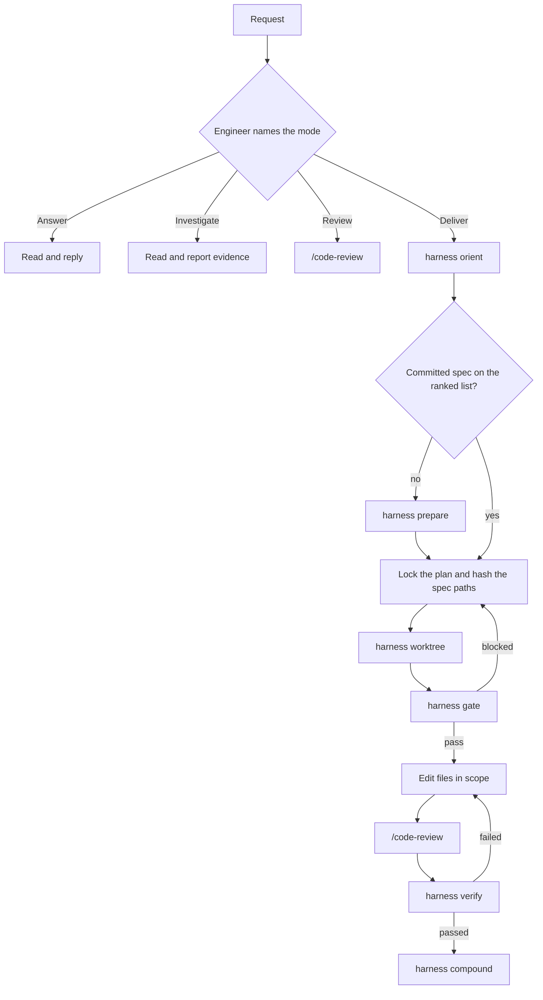
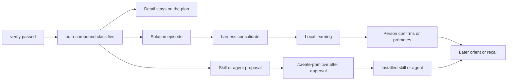
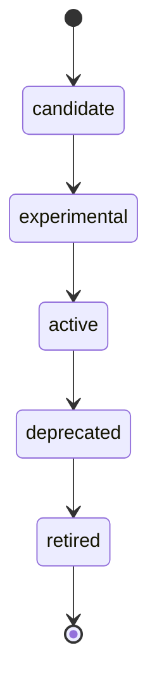
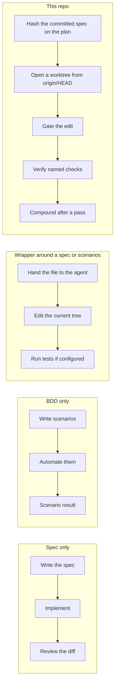

# Adaptive Engineering

You start with two parts. The Engineer decides what to do. The Harness checks the work and keeps the record.

The Engineer is the only entry. It answers a question, investigates a system, delivers a change, or reviews a result. The Harness orients the work, locks a plan, gates edits, runs the named checks, and stores the evidence. A change is done when that evidence passes.

```bash
npm install -g harness
harness install --configure-vscode
```

Then select `@engineer` in Copilot Chat.

Flags, JSON shapes, and exit codes are in the [harness README](../packages/harness/README.md) and the [tool contract](../.github/skills/references/harness-tool-contract.md).

## What breaks

The product intent is the spec file a product owner or business owner committed. The chat message asks for a change against that file.

The agent follows the latest message and leaves the committed spec unread. Reviewers then judge the diff against a different contract than the one the business wrote.

Edge cases in the spec never become acceptance criteria or named checks. CI fails on a case the spec already stated.

The agent edits a dirty tree, a stale branch, or the default branch. The spec on that checkout is not the spec on main.

A repo with no committed spec has no file for the lock to point at. The agent invents behavior from file names.

The next review repeats the same missed line from the spec.

The plan names that spec before the edit. An edit waits for a passing implement gate. A completion claim waits for the named checks.

## The Engineer and the Harness

Adaptive Engineering is that loop. The Engineer works in the editor. The Harness runs the checks.

Task modes are Answer, Investigate, Deliver, and Review. The Engineer picks the mode. Answer and Investigate only read. Review hands the diff to [`/code-review`](../.github/skills/code-review/SKILL.md). Deliver is the only mode that edits product files.

Deliver is Host-first. The Engineer calls each Harness command. Kernel-always means orient, plan lock, gate, and verify still run when no specialist is loaded. Agent-optional means the Engineer asks a specialist only for a judgment the task needs. Benchmark-test-only means `harness agent` is the unattended loop for a measured eval. Delivery stays in `@engineer`.

The runtime has four postures. Standalone is the Engineer and the Harness, with no acquired specialist. Degraded means a missing check or index is reported as missing. Governed means a person has confirmed the learning. Bounded delegation means the specialist answers one question and the Engineer keeps the decision.

Skill-first means a repeated procedure becomes a skill before it becomes another agent. The Engineer can start with no domain skill and no specialist. It acquires them when a task shows they are needed. The install does not add them for you.

## A spec already in the repo

Product owners commit the spec. Business owners commit the business intent in that file, or in a sibling file under the same directory. The chat message selects the work.

Orient, `plan-new`, and the implement gate share one ranked list of at most 12 files. `git ls-files` supplies the candidates. A file joins the list when its path is under `spec/`, `specs/`, `adr/`, `adrs/`, `decisions/`, `rfc/`, `rfcs/`, `intent/`, `intents/`, or `issues/`. A file also joins when its name ends in `.spec.md`, `.adr.md`, `.rfc.md`, or `.intent.md`. Rank counts query words that appear in the path. The file body is not scored. The gate ranks with the plan's `intent` text. A different gate prompt does not swap the list.

A SpecKit spec committed at `specs/<feature>/spec.md` is on that list because it sits under `specs/`. `plan.md`, `tasks.md`, and other files in that feature directory match the same path rule. `.specify/memory/constitution.md` is outside those paths, so the lock does not hash it. The path rule is the whole match.

The Engineer reads the listed files. Plan lock stores `{ path, sha256 }` of the file bytes on `intent_sources`. The implement gate fails until those paths are listed. The check compares paths. A later edit to the spec file does not fail the gate. When the code and the spec disagree, the product owner updates the spec in the same pull request or a stacked pull request. An ambiguous spec is status `needs-info`.

`harness prepare` writes `docs/specs/overview.md` and `docs/adr/0000-architecture.md` only when those paths are missing. A committed SpecKit `specs/<feature>/spec.md` stays as the product owner wrote it. Prepare does not fill a spec in from the code. When the ranked list is empty, orient names `harness prepare`.

[Pull request 76](https://github.com/noodlemind/prompt-library/pull/76) added this lock, `harness prepare`, and `harness worktree`. That set is Harness Adaptive Engineering. See also pull request 76. It is on main.

## How a delivery runs


```mermaid
flowchart TD
  request[Request] --> classify{Engineer names the mode}
  classify -->|Answer| answer[Read and reply]
  classify -->|Investigate| investigate[Read and report evidence]
  classify -->|Review| review["/code-review"]
  classify -->|Deliver| orient[harness orient]
  orient --> hasSpec{Committed spec on the ranked list?}
  hasSpec -->|no| prepare[harness prepare]
  prepare --> lock[Lock the plan and hash the spec paths]
  hasSpec -->|yes| lock
  lock --> worktree[harness worktree]
  worktree --> gate[harness gate]
  gate -->|blocked| lock
  gate -->|pass| edit[Edit files in scope]
  edit --> codeReview["/code-review"]
  codeReview --> verify[harness verify]
  verify -->|failed| edit
  verify -->|passed| compound[harness compound]
```

### Orient

```bash
harness orient --query "<task>" --workspace . --json
```

Read `.harness/context-pack.md`. Leave the CLI stdout out of the chat. Orient writes `.harness/repo-map.md` from `git ls-files`. A current structural index supplies the symbols. With no current index, the extract is lexical. The pack is capped at 2 KB. It includes the top matching learnings. Insight text is wrapped in the fence `[unverified memory — advisory]`.

[`/recall`](../.github/skills/recall/SKILL.md) is the same lookup when you already know the query.

Orient lists the ranked specs as `intentSources`. An empty list names `harness prepare`. If `docs/` is gitignored, the message says to un-ignore `docs/specs` and `docs/adr`.

### Prepare, when no spec is committed

```bash
harness init-repo
harness prepare
```

Prepare writes those two files with an exclusive create. A file that appears during the write is left as it is. Prepare does not call a model. A person edits the starter afterward. The file lists top-level paths observed at the moment of the write. That person writes the architecture.

Skip prepare when `specs/<feature>/spec.md` or another matching spec is already committed. Running it anyway still adds `docs/specs/overview.md` if that path is absent. It does not edit the SpecKit file.

### Lock

Trackable Deliver work needs a locked plan. The Engineer follows [`/ensure-plan`](../.github/skills/ensure-plan/SKILL.md). [`/capture-issue`](../.github/skills/capture-issue/SKILL.md) opens the issue. [`/plan-issue`](../.github/skills/plan-issue/SKILL.md) fills the phases. `harness plan-new` writes the file. `harness plan-update --lock` sets `plan_lock: true`. Update the plan with `harness plan-update`. Do not open a `~/.harness` plan in the editor.

The lock stores intent, acceptance criteria, impacted files, the checks that prove the change, and `{ path, sha256 }` for each readable in-checkout `intent_sources` file. Product plans list `code-review` under `reviews.required`. A docs plan may leave that list empty.

A symlink fails the lock. A missing file fails the lock. Nothing re-hashes the spec while you type.

### Worktree

```bash
harness worktree --slug <issue-slug>
```

Issue work starts from the latest `origin/HEAD`, then a branch, then a linked worktree. The implement gate fails when that work is still on the default branch of the primary checkout. An uncommitted `docs/plans` file, or a gitignored `.harness/plans` file, is copied into the project store so the same `--plan` still resolves. A later run copies the checkout plan over the store copy when the checkout file is newer and no plan update holds the lock. It leaves the store copy when that file is newer.

### Edit

```bash
harness gate --phase implement --plan <path> --workspace . --json
```

Wait for a pass, then edit. `harness install --configure-vscode` installs hooks that apply the same rule to supported editor tools. Stay inside `## Impacted Files`.

Load [`/architect`](../.github/skills/architect/SKILL.md) before an edit whose shape is not already the local pattern. Load [`/create-primitive`](../.github/skills/create-primitive/SKILL.md) before a skill, agent, instruction, check, reference, or solution doc. A plan label does not activate the new file. A person approves a new skill or agent before it is installed.

### Review, then verify

Run [`/code-review`](../.github/skills/code-review/SKILL.md) and fix the findings. Then run verify.

```bash
harness verify --plan <path> --workspace . --json
```

Named checks are argv arrays in `.github/harness/checks.yaml`. The Harness runs them without a shell. Policy exemptions and waivers are explicit. A missing check is not a pass. Outcome `passed` is bound to the plan digest, the base ref, the changed files, and the workspace digest. `failed` and `inconclusive` block compound. `harness verify` also fails while a required review is missing or `critical_open` is non-empty.

### Compound

[`/auto-compound`](../.github/skills/auto-compound/SKILL.md) classifies the learning after a pass. `harness compound` records it. [`/compound-learnings`](../.github/skills/compound-learnings/SKILL.md) is the manual write-up of a solved problem. A detail that matters only for this task stays on the plan. A fact worth seeing again becomes a solution episode. A new skill or agent stays a proposal until a person approves it.


```mermaid
flowchart LR
  passed[verify passed] --> classify[auto-compound classifies]
  classify --> planNote[Detail stays on the plan]
  classify --> episode[Solution episode]
  classify --> proposal[Skill or agent proposal]
  episode --> consolidate[harness consolidate]
  consolidate --> learning[Local learning]
  learning --> ledger[Person confirms or promotes]
  proposal --> createPrim["/create-primitive after approval"]
  createPrim --> installed[Installed skill or agent]
  ledger --> later[Later orient or recall]
  installed --> later
```

The next similar task starts from `harness orient` or `/recall`. The pack already ranks plans and learnings.

`/create-primitive` is how a repeated procedure becomes a skill you can load. The Engineer does not install that skill by itself.

When the product repo uses the workflow template in the harness README, CI runs `validate-plan`, `gate`, and `verify` on the plan. The retry reruns the check that failed.

A capability moves through candidate, experimental, active, deprecated, and retired. Promotion needs a trigger eval, an outcome eval, and promotion evidence. Retirement leaves a tombstone so a later task can see the overlap with what replaced it.


```mermaid
stateDiagram
  [*] --> candidate
  candidate --> experimental
  experimental --> active
  active --> deprecated
  deprecated --> retired
  retired --> [*]
```

A person can promote a learning. The governance ledger records that decision.

Plans for a product repository live in `~/.harness/projects/<repo-id>/plans/`. `--harness-home <path>` replaces `~/.harness` for one command. `HARNESS_HOME` replaces it for every command. The flag wins. The knowledge index for that repository lives at `index/<repo-id>/knowledge/` under the same root. Private solution episodes live in `~/.harness/projects/<repo-id>/docs/solutions/`. A reset of the product repository leaves them there. `harness migrate` copies existing plans, solutions, and `knowledge/solutions` into that store. Files already committed in the repository stay until you remove them.

[`/harness-doctor`](../.github/skills/harness-doctor/SKILL.md) reports hydration and policy problems. It does not edit the product.

## Next to a spec, BDD, and a wrapper

A spec states the behavior. BDD turns examples into checks. Adaptive Engineering locks the committed spec, gates the edit, and writes a learning after the checks pass.


```mermaid
flowchart LR
  subgraph specOnly [Spec only]
    s1[Write the spec] --> s2[Implement]
    s2 --> s3[Review the diff]
  end
  subgraph bddOnly [BDD only]
    b1[Write scenarios] --> b2[Automate them]
    b2 --> b3[Scenario result]
  end
  subgraph wrapped [Wrapper around a spec or scenarios]
    w1[Hand the file to the agent] --> w2[Edit the current tree]
    w2 --> w3[Run tests if configured]
  end
  subgraph here [This repo]
    a1[Hash the committed spec on the plan] --> a2[Open a worktree from origin/HEAD]
    a2 --> a3[Gate the edit]
    a3 --> a4[Verify named checks]
    a4 --> a5[Compound after a pass]
  end
```

| Question | Spec only | BDD only | Wrapper around a spec or scenarios | This repo |
| --- | --- | --- | --- | --- |
| Where intent lives | The committed spec file | The scenarios | The file the agent was told to read | The committed spec. The plan stores `intent`, `success_criteria`, `expected_outputs`, `## Intent Contract`, and `intent_sources` hashes. |
| Who updates the spec when behavior changes | No required step | Usually the same pull request as the scenario | No separate owner | The product owner, in the same pull request or a stacked pull request |
| Re-check during the edit | None | None | A chat stand-in, if the wrapper has one | None. The lock hashes the spec files once. A later spec edit does not fail the gate. |
| Which checkout | The open tree | The open tree | The tree the agent started in | `harness worktree --slug` opens a linked worktree from `origin/HEAD` |
| What blocks the edit | Later review | A failing scenario | Host approval, when the wrapper has it | `harness gate`, plus VS Code hooks after `harness install --configure-vscode` |
| What counts as done | A written claim | The scenario suite | The tests the wrapper runs | Named checks and the evidence file from `harness verify` |
| What the team keeps | A separate write-up, if the team keeps one | More scenarios | Session memory | An episode, then a local learning, then a skill or agent a person approved |
| Repo with no spec | Empty docs | An empty suite | The agent invents modules | `harness prepare` writes two starter files. A person fills them in. |

## What a plan must contain

A delivery plan uses `plan_schema: 1`. Its verification block names checks. Its review block records what is still open.

```yaml
plan_schema: 1
intent_sources: []
verification:
  required: []
  criteria: {}
reviews:
  required: [code-review]
  completed: []
  critical_open: []
```

Lock fills `intent_sources` with `{ path, sha256 }` for each matched spec file.

Delivery rules the Engineer can cite are in [delivery principles](../.github/skills/references/delivery-principles.md).
