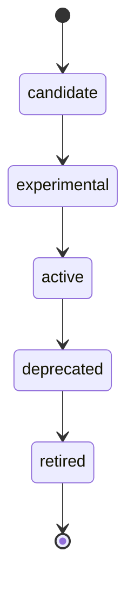

# Adaptive Engineering

You start with two parts. The Engineer decides what to do. The Harness checks the work and keeps the record.

The Engineer is the only entry. It answers a question, investigates a system, delivers a change, or reviews a result. The Harness orients the work, locks a plan, gates edits, runs the named checks, and stores the evidence. A change is done when current verification passes, required review results are collected, and Harness records completion.

The Engineer grows the way a working engineer does. A repeated procedure becomes a skill. A judgment that needs its own reviewer becomes an agent. A rule for one kind of file becomes an instruction. A solved problem becomes a learning. None of these are required on the first day. The Engineer acquires them when the work shows they are needed. Installing the Harness does not require the specialist agents or the domain skills that may already be in this repository.

Plans for a product repository live in `~/.harness/projects/<repo-id>/plans/`. `--harness-home <path>` uses that directory instead of `~/.harness` for one command. `HARNESS_HOME` does the same for every command. The flag wins. The knowledge search index for that repository lives at `index/<repo-id>/knowledge/` under the same root. Private solution episodes live in `~/.harness/projects/<repo-id>/docs/solutions/`. A reset of the product repository does not delete them. `harness migrate` copies existing plans, solutions, and `knowledge/solutions` into that store. Files already committed in the repository stay there until you remove them.

After `harness verify` passes, compounding records what the task taught. A detail that matters only for this task stays on the plan. A fact worth seeing again becomes a solution episode. A new skill or agent is a proposal. A person approves it before it is installed.

```bash
npm install -g harness
harness install --configure-vscode
```

On an existing repository that has no spec or ADR yet, seed the workspace and the starter docs:

```bash
harness init-repo
harness prepare
```

`harness prepare` writes `docs/specs/overview.md` and `docs/adr/0000-architecture.md` when those paths are missing. Edit them. A later run leaves an existing file alone. Orient lists them as `intentSources`. Plan lock hashes them. If `docs/` is gitignored, prepare writes nothing and orient says to un-ignore those paths. Prepare does not rewrite a spec from the code.

Then select `@engineer` in Copilot Chat.

## How a task runs

Task modes are Answer, Investigate, Deliver, and Review. The Engineer owns the decision. The Harness owns the gate.

Deliver is host-first. The Engineer works in the editor. Kernel-always means orient, plan lock, gate, and verify run in the Harness even when no extra agent is loaded. Orient names in-repo specs as `intentSources` and whether the checkout is isolated. The implement gate fails when those specs are missing from plan `intent_sources`, or when issue work is still on the default branch of the primary checkout. `harness worktree --slug` opens a linked worktree. A plan that exists only as an uncommitted `docs/plans` file or a gitignored `.harness/plans` file is copied into the project store. A later worktree run replaces that copy when the checkout file is newer and no plan-update holds the file, and leaves the store copy when the store file is newer. A worktree with no `origin` remote shares that store, so the same `--plan` still resolves. A checkout created with `git init --separate-git-dir` keeps its own store. `.gitignore` is not followed when it is a symlink. Orient and `plan-new` share one selection for the same text. A non-empty `intent_sources` list is frozen. The implement gate requires those paths and does not rank again. An empty list in a repo that has a spec still fails and names the selection. Plan lock records `{ path, sha256 }` of the file bytes for each readable in-checkout `intent_sources` file on that tip. A symlink or a missing file fails the lock instead of hashing something outside the checkout or saving a path with no hash. `harness prepare` publishes a missing starter with an exclusive create, so a file that appears during the write is left as it is. A later edit to those files does not fail the implement gate. If shipped behavior contradicts a locked spec, update that spec in the same PR or a stacked PR. Do not rewrite the spec from the code in silence. Ambiguous specs become `needs-info` questions, not guesses. Agent-optional means a specialist is consulted only when the task needs that judgment. Benchmark-test-only means the unattended agent loop is for a measured eval, not for normal delivery.

The runtime has four postures. Standalone is the Engineer with the Harness and no acquired specialist. Degraded is a missing check or index, reported rather than invented. Governed is a learning that a person has confirmed. Bounded delegation means a specialist receives a narrow question and does not take over the delivery.

## How capability is acquired

A capability moves through candidate, experimental, active, deprecated, and retired. Promotion needs a trigger eval, an outcome eval, and promotion evidence. Retirement leaves a tombstone so a later task can see the overlap with what replaced it.


```mermaid
stateDiagram
  [*] --> candidate
  candidate --> experimental
  experimental --> active
  active --> deprecated
  deprecated --> retired
  retired --> [*]
```

A person can promote a learning. The governance ledger records that decision. The Engineer does not install a new skill or agent on its own.

## What a plan must contain

A delivery plan uses `plan_schema: 1`. Its verification block names checks. Its review block declares required coverage and open findings. A supported short plan has the same proof obligations. Without an explicit named check it remains an unlocked draft.

```yaml
plan_schema: 1
intent_sources: []
verification:
  required: [behavior]
  criteria: {AC1: [behavior]}
reviews:
  required: [code-review]
  completed: []
  critical_open: []
```

Product plans list `code-review` in `reviews.required`. A docs plan may leave that list empty. `harness review prepare --plan <path> --base <base> --json` captures the work to review. The host invokes reviewers, then `harness review assemble --plan <path> --packet <id> --file <results.json> --json` validates and stores their results. Reviewer names are declared provenance; they do not authenticate an invocation. `harness verify` fails while collected review coverage is incomplete or critical findings remain. A bare completed string is not review evidence.

After verification, submit a publish or no-learning decision with `harness compound --plan <path> --learning-decision <file> --json`. Complete with `harness plan-update --plan <path> --status done`. Completion version 2 requires a finished decision for the current proof and binds its record identity. Missing, pending, blocked, changed, or stale learning records prevent completion. A no-learning decision creates no episode. An old completion record requires this explicit decision and a fresh completion update. The Stop hook validates the current bound completion on every attempt. Lifecycle bookkeeping does not change the work contract. Goal, criteria, scope, check mappings, policy, product bytes, and execution phase still invalidate relevant evidence.

Captures and standalone index rebuilds share a lock on the physical knowledge manifest. A capture holds it through episode publication, retrieval snapshots, index rebuilding, and any rollback. Concurrent captures cannot replace a sibling's newer index or restore a snapshot over a successful sibling publication. Dry runs acquire no lock and write nothing.

Evidence version 4 and the installed CLI and hook bundle ship together. Old proof requires re-verification; upgrade removes the old hook-side contract parser. Verification observations, review packets, learning operations, and completion records remain under `.harness/`. A lost final status write is recoverable by retrying the completion command.

Installed hooks resolve the hydrated CLI directly under `~/.copilot/.harness-bin/`. A global PATH entry is optional. Episode writers publish complete bytes atomically with exclusive creation; interruption before publication leaves the final name absent, and replay reuses an identical published episode. Review records enforce the same 1 MiB limit at write and read boundaries before changing the current coverage pointer.

`harness status --effective-policy --json` reports the CLI policy authority, rule-specific modes, positive freshness limits, trust binding, and resolver version. Installed hooks refresh that snapshot when source bytes, trust, or environment change. An unavailable or invalid authority fails closed. A command override is scoped to its invocation and is never cached as a hook policy.

Named checks are argv arrays in `.github/harness/checks.yaml`. The Harness runs them without a shell. Policy exemptions and waivers are explicit. A missing check is not a pass.

Skill-first means a repeated procedure becomes a skill before it becomes another agent. The Engineer can start with no domain skill and no specialist. Those are acquired later. Before a product edit whose shape is not already the local pattern, the Engineer loads `/architect`.
