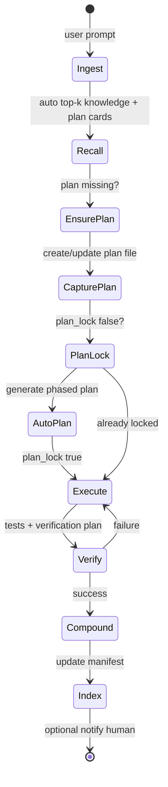

# Composer-Style Autonomous Harness — Optimization Proposal

How to restructure the Adaptive Engineer Harness the way **Cursor Composer** or **Windsurf** engineers would: **one autonomous loop**, **automatic memory**, **retrieval not ceremony**, and **human consent only when risk warrants it** — while keeping the **document-based** foundation.

Companion docs: [`composer-parity-review.md`](composer-parity-review.md), [`engineer-memory-system.md`](engineer-memory-system.md), [`engineer-vision-and-growth-loop.md`](engineer-vision-and-growth-loop.md).

---

## 0. Clarification: three user commands vs many capabilities

**User types only:** `@engineer`, `/btw`, `/code-review`.

**Engineer still uses** all hydrated skills (`/java`, `/aws`, `/terraform`, …) and agents (`@splunk-reviewer`, …) **internally** via domain routing — full detail in [`enterprise-capability-expansion.md`](enterprise-capability-expansion.md).

### 0.1 The gap you called out (answered)

The engineer does **not** “learn” Java or AWS during a chat session the way a human picks up a new language. Capability works in **two layers**:

| Layer | What it is | How the engineer gets it |
|-------|------------|---------------------------|
| **Hydrated capability** | Skills, agents, instructions on disk after **Hydrate** | Already available every turn — engineer **routes** to them by domain signals |
| **Growing capability** | New corp-specific primitives (Terraform skill, Splunk agent) | **Enterprise overlay** or `/import-conventions` / `/create-primitive` — then hydrate again |

**Session “learning”** (compounding) is separate: solved-problem facts in `knowledge/solutions/` via auto-compound — not new slash skills.

```text
                    USER (3 commands)
                    @engineer  /btw  /code-review
                           │
                           ▼
              ┌────────────────────────────┐
              │  Engineer (thin orchestrator) │
              │  • domain router (intake)     │
              │  • reads merged registries    │
              └─────────────┬──────────────┘
                            │
         ┌──────────────────┼──────────────────┐
         ▼                  ▼                  ▼
   Internal skills    Specialist agents    Knowledge recall
   /java /aws /sql     @aws-reviewer        manifest + solutions
   (hydrated)          @splunk-reviewer     (compounded facts)
                       (hydrated + allowlist)
```

### 0.2 Scenario table (your examples)

| Your question | Short answer |
|---------------|--------------|
| AWS task but engineer “only knew” Java/SQL? | **`/aws` is already in the base library.** After global hydrate, the engineer applies the AWS workflow and can delegate `@aws-reviewer` — no new skill step; routing is automatic from prompt/file signals. |
| Terraform (not in base library)? | **Not runtime learning.** Platform adds `enterprise/skills/terraform/` (or `/import-conventions`), hydrates overlay; engineer routes `.tf` / “terraform” to `/terraform`. If verify requires that skill and it is missing: **hard gap** → block until fulfill, bridge, or waiver (see Phase H). |
| Splunk expert validation? | **Specialists are agents, not skills.** Add `splunk-reviewer.agent.md` to enterprise overlay, add to `engineer.agent.md` `agents:` allowlist (**Tier 3 once**), hydrate. Then `@engineer` auto-delegates on Splunk/SPL signals. Users can always `@splunk-reviewer` directly once hydrated. |
| Enterprise terminology / style? | **Instructions** (file-pattern scoped) + **knowledge/solutions** + product `docs/agent-context.md` — not a new public slash command per term. |

### 0.3 How routing + access control work (implementation)

At **ingest** (Phase F3), engineer:

1. Merges `knowledge/capability-registry.yaml` + `enterprise/capability-registry.enterprise.yaml`.
2. Sets plan frontmatter `domains`, `specialists`, `capability_gaps` (F4).
3. Invokes **internal** domain skills when registry lists them (user never types `/aws`).
4. Delegates specialists only if (a) agent file hydrated and (b) name appears in engineer `agents:` allowlist (base + `engineer_allowlist_additions` from enterprise registry).
5. If specialist missing → run **capability preflight** (Phase H): **hard** gaps block execute until fulfilled, bridged (MCP/CLI), or Tier 3 waiver — see [`composer-gap-fulfillment-loop.md`](composer-gap-fulfillment-loop.md).

**Important:** “Three interactions” limits **what humans type**, not **what the harness can load or delegate**.

**Blocking gaps (your point):** Cursor/Windsurf would not treat a missing Splunk reviewer as “optional notify.” If verify requires that primitive, the session **fulfills the gap in the same PR**, then **hydrates enterprise overlay for the team** — not permanent researcher fallback.

---

## 1. Executive shift

| Today (compliance-first) | Target (Composer-first) |
|--------------------------|-------------------------|
| User invokes `/recall`, `/capture-issue`, `/plan-issue`… | `@engineer` runs the **whole micro-pipeline** unless blocked |
| Human approves capture, plan, approach, primitives | Human approves only **Tier 3 (hard)** decisions |
| Memory written when user remembers `/compound-learnings` | Memory **auto-compounds** on successful verify |
| Keyword manifest maintained manually | Index **auto-rebuilds** on solution write |
| Primitive creation always needs liaison sign-off | **Auto-append** skills/checks; **consent** only for new agents or policy |

**Keep:** git-auditable `docs/plans/`, global `knowledge/`, specialist subagents, capture-before-code as an **automated** invariant (not a meeting).

**Drop:** treating every pipeline step as a separate human-triggered slash command.

---

## 2. How Composer / Windsurf would restructure this repo

### 2.1 One orchestrator, many tools (not many skills the user must name)

```text
                    ┌─────────────────────┐
                    │     @engineer       │
                    │  (thin, ~4 KB)      │
                    └──────────┬──────────┘
                               │
         ┌─────────────────────┼─────────────────────┐
         ▼                     ▼                     ▼
   ┌───────────┐        ┌────────────┐       ┌─────────────┐
   │  Memory   │        │   Plan     │       │  Execute    │
   │  service  │        │   writer   │       │  + verify   │
   └───────────┘        └────────────┘       └─────────────┘
   recall/index          capture/plan          work/review
   compound               (automatic)           delegates
```

**User-facing surface:** `@engineer` + optional `/btw` + `/code-review`.  
**Internal surface:** skills become **tools the engineer invokes**, not a menu the human must learn.

### 2.2 Memory = automatic read/write (not a separate “recall step”)

Composer injects relevant context **before** the model plans. We should:

| Action | Composer pattern | Our autonomous equivalent |
|--------|------------------|---------------------------|
| Load user prefs | Frozen USER slice | `profile.md` (≤1.5 KB) auto-loaded |
| Load team facts | Rules + memories | Top-3 from `manifest.yaml` **every turn** |
| Load task state | Current task / plan | Active `docs/plans/<id>.md` **Memory Cards** only |
| Persist learnings | Background memory update | On verify pass → auto-compound + auto-index |

**Remove as user steps:** `/recall` (merge into engineer turn 0), `/index-memory` (hook after compound).

### 2.3 Capture = invariant, not a meeting

Composer does not ask “may I create a task file?” — it **creates session state**. We should:

- **Autonomously** ensure `docs/plans/<slug>-plan.md` exists before `editFiles`.
- Use `/capture-issue` **logic** inline (engineer or `ensure-plan` micro-skill), not “please run /capture-issue”.
- **Autonomously** run planning when `plan_lock: false` and work is trackable.
- **Only ask human** if capture conflicts with an existing plan, scope is ambiguous, or autonomy profile is `strict`.

### 2.4 Primitives grow on a schedule, not a ticket

| Primitive change | Autonomous default | Human consent |
|------------------|-------------------|---------------|
| Memory card append | Always | Never |
| Solution doc + manifest | After verify + tests pass | Never (unless `strict` profile) |
| New review check | Auto if pattern repeats 3× in solutions | Notify in Activity |
| New skill | Auto-draft + ship if scorecard passes | Consent if org policy or touches agents |
| New agent | Never auto | **Always consent** |
| Engineer `agents:` allowlist change | Never auto | **Always consent** |

---

## 3. Autonomous loop (single session)

This is the loop Composer users effectively get; we should make it explicit and **default-on**.



### Step-by-step (no human in the green path)

| Step | Autonomous action | Writes | Human |
|------|-------------------|--------|-------|
| **0 Ingest** | Parse intent, risk tier | — | Only if ambiguous |
| **1 Recall** | Score manifest, load ≤3 solutions, plan cards | — | — |
| **2 Ensure plan** | If no plan → run capture template | `docs/plans/…` `status:open` | If duplicate plan conflict |
| **3 Auto-plan** | If trackable + `!plan_lock` → plan-issue logic | `planned`, `plan_lock:true` | Tier 3 only |
| **4 Execute** | work-on-task / implementer | code, Activity, Implementation Notes | Tier 3 risks |
| **5 Verify** | tests, guardrails | Activity | — |
| **6 Compound** | If verify pass → solution doc | `knowledge/solutions/` | — |
| **7 Index** | Rebuild manifest entry | `manifest.yaml` | — |
| **8 Notify** | Summary + link to plan/solution | — | Async notification optional |

---

## 4. Consent tiers (replace “approve everything”)

Introduce **`.github/skills/references/autonomy-policy.md`** (companion to `human-approval-policy.md`):

### Tier 0 — Autonomous (default)

Run without asking:

- Recall, capture, plan lock (green/amber work)
- Edits within `## Impacted Files`
- Memory cards, Activity append
- Compound + index on verified success
- Delegate reviewers per `## Risk & Review Routing`
- `/tdd-fix` path for isolated bugs

### Tier 1 — Notify (log only)

Proceed and record in `## Activity`:

- Plan created autonomously
- Solution published to global knowledge
- Specialist review completed (summary)
- Scope within +1 file of plan (minor drift)

### Tier 2 — Soft consent (proceed if no response in non-interactive)

Acceptable for **balanced** profile when user is away:

- Low-risk plan amendments
- Skipping optional `/document-review`
- Using default concurrency approach when tests already green

Must log assumption; reversible.

### Tier 3 — Hard consent (block until yes)

Still require explicit human yes:

- New or substantially changed **agents**, engineer allowlist
- Schema/migration/production data
- Auth, secrets, IAM, public API breaks
- Destructive git or data operations
- Concurrency strategy choice (locks, isolation, idempotency model)
- Changes outside impacted files (broad refactor)
- Autonomy profile = `strict` → treat Tier 1 as Tier 3

**Primitive creation:**  
- **Auto:** solution, memory card, manifest, check (from repeated pattern)  
- **Consent:** new agent, instruction that weakens security, prompt wrapper that expands tools

---

## 5. What to optimize (their checklist applied to us)

### A. Context efficiency (highest ROI — partially done)

| Optimize | Action |
|----------|--------|
| Thin orchestrator | Keep `engineer.agent.md` < 5 KB; checklist inlined |
| Top-k retrieval | Enforce `context-budget.md` everywhere |
| Frozen vs retrieved | profile + checklist frozen; never full plan paste |
| Dedupe host prompts | Engineer rules not in `copilot-instructions` ✓ |

### B. Autonomous memory (high ROI — propose implement)

| Optimize | Action |
|----------|--------|
| Auto-recall on every `@engineer` turn | Inline procedure (done); deprecate user `/recall` except debug |
| Auto-capture | New skill `ensure-plan` callable by engineer without user |
| Auto-plan | Engineer runs plan-issue when `status:open` |
| Auto-compound | On `verify pass` + tests green → compound without asking |
| Auto-index | Script or skill step chained after compound |
| Semantic index v2 | TF-IDF or MCP embeddings on `knowledge/solutions/` |

### C. Restructure user experience (high ROI)

| Optimize | Action |
|----------|--------|
| **3 public commands** | `@engineer`, `/btw`, `/code-review` |
| Pipeline skills → **internal** | Mark `user-invocable: false` on capture/plan/work/recall/index for hosts that support it |
| **Autopilot prompt** | `engineer.prompt.md`: “Run full autonomous loop” |
| Profile switch | `profile.md`: `autonomy: full \| balanced \| strict` |

### D. Retrieval quality (medium — v2)

| Optimize | Action |
|----------|--------|
| Ranked manifest | Score = tag overlap + recency + repo match |
| Plan similarity | Same issue detector (title embedding or fuzzy) |
| Codebase | Rely on host `codebase` tool (Composer parity) |

### E. Governance without friction (medium)

| Optimize | Action |
|----------|--------|
| Audit trail | Activity + git commits, not chat approval |
| Risk tier in plan frontmatter | `risk: green\|amber\|red` drives consent |
| Capability preflight | **Hard** gaps block execute; fulfill → promote → hydrate (see gap-fulfillment doc) |

### F. Remove (Composer would delete ceremony)

- Six user checkpoints per issue (understand → approve → investigate → approve → …)
- “Invoke `/capture-issue`” as user instruction — engineer does it
- Mandatory `/index-memory` as user step — chained automatically
- Duplicate architecture essays in agent prompt

---

## 6. Proposed file / primitive restructure

```text
.github/
  agents/
    engineer.agent.md          # thin loop + checklist + autonomy tier check
  skills/
    engineer-autopilot/        # NEW: full autonomous loop contract (optional merge into engineer)
    ensure-plan/               # NEW: capture + dedupe (internal)
    auto-compound/             # NEW: verify-gated compound+index (internal)
    recall/                    # keep for debug; user-invocable: false
    index-memory/              # internal hook
    capture-issue/             # internal or power-user
    plan-issue/                # internal or power-user
  references/
    autonomy-policy.md         # NEW: tier 0-3
    context-budget.md
    engineer-runtime.md

knowledge/
  profile.md                   # autonomy: full|balanced|strict
  manifest.yaml                # auto-maintained
  solutions/
  capability-registry.yaml
```

**Host hydrate:** add optional `scripts/index-knowledge.mjs` (runs on compound or CI) — Composer would not rely on LLM to rebuild YAML by hand.

---

## 7. Risk model in plan frontmatter (drives autonomy)

Add to `_plan-template.md`:

```yaml
risk: green   # green | amber | red
autonomy: balanced  # optional override of profile
```

| risk | Auto-capture | Auto-plan | Auto-implement | Compound |
|------|--------------|-----------|----------------|----------|
| green | yes | yes | yes | yes |
| amber | yes | yes | yes with notify | yes |
| red | yes | plan yes, lock needs consent | block Tier 3 fields | yes after consent |

Engineer sets `risk` in Phase 1 from signals (auth, schema, prod, multi-tenant → red; typo fix → green).

---

## 8. Comparison: “excellent like Composer” criteria

| Criterion | After this proposal |
|-----------|---------------------|
| Feels like one agent session | ✓ autonomous loop |
| Memory without asking | ✓ auto recall/write |
| Fast green-path issues | ✓ no capture/plan prompts |
| Still enterprise-safe | ✓ Tier 3 + git audit |
| Cross-repo learning | ✓ auto compound + index |
| Beats Composer for regulated teams | ✓ plans + manifest + consent log |

We **do not** beat Composer on native codebase embedding until v2 index — acceptable trade for host neutrality.

---

## 9. Implementation roadmap

### Phase A — Policy (docs + references)

- [x] Add `autonomy-policy.md`
- [x] Add `profile.md` fields: `autonomy`, `notify_channel`
- [x] Update `human-approval-policy.md` → Tier 3 only; Tier 0 default autonomous
- [x] Update `composer-parity-review.md` with autonomous target
- [x] Add `enterprise-capability-expansion.md` (skills vs agents vs knowledge)

### Phase B — Engineer behavior (1 pass)

- [ ] Engineer agent: autonomous loop steps; “do not ask user to run /capture-issue”
- [ ] `ensure-plan` skill (capture + dedupe)
- [ ] `engineer-autopilot` or expand engineer SKILL with loop
- [ ] plan frontmatter `risk` + template

### Phase C — Memory automation (1 pass)

- [ ] `auto-compound` skill (gates: tests + verification plan)
- [ ] Chain index after compound in skill body
- [ ] `scripts/index-knowledge.mjs` optional deterministic indexer

### Phase D — UX shrink (1 pass)

- [ ] Mark pipeline skills `user-invocable: false` where host supports
- [ ] README: “Use @engineer; pipeline is automatic”
- [ ] Global instruction: autonomous default

### Phase E — Retrieval v2

- [ ] Semantic ranker for manifest
- [ ] MCP retrieval tool spec

### Phase F — Enterprise capability layer (skills + specialists)

**Goal:** Corp-specific skills (Terraform, internal frameworks) and agents (Splunk expert) without forking the whole library.

| ID | Deliverable | Owner |
|----|-------------|-------|
| F1 | `enterprise/README.md` + `capability-registry.enterprise.yaml` template | Platform |
| F2 | Hydrate sync: `enterprise/skills`, `enterprise/agents`, `enterprise/instructions` → `~/.copilot/enterprise/` | DevEx |
| F3 | Engineer **domain router** at intake: map signals → internal skill + `specialists[]` | Harness |
| F4 | Plan frontmatter: `domains`, `specialists`, `capability_gaps` | Harness |
| F5 | `engineer-delegation-matrix.md` + registry: document enterprise-only rows | Platform |
| F6 | Capability-gap auto-draft → `docs/capability-gaps/<slug>.md` + Activity notify | Harness |

**Splunk reviewer example (one-time setup):**

1. Platform adds `enterprise/agents/splunk-reviewer.agent.md`.
2. Adds `splunk-reviewer` to enterprise registry and `engineer.agent.md` `agents:` (Tier 3).
3. Hydrate.  
4. All future `@engineer` tasks mentioning Splunk/SPL auto-delegate `@splunk-reviewer`.

**Terraform skill example:**

1. Platform runs `/import-conventions` on corp Terraform module repo **or** adds `enterprise/skills/terraform/SKILL.md`.
2. Hydrate.
3. Engineer routes `.tf` / “terraform” signals to `/terraform` without user typing it.

### Phase G — Optional auto-skill (Hermes-style, enterprise only)

- [ ] After 3 verified similar tasks in `knowledge/solutions/`, draft `enterprise/skills/<domain>/SKILL.md` from patterns
- [ ] Tier 1 notify platform; never auto-create **agents**

### Phase H — Blocking gap fulfillment (Composer-style — **recommended with F**)

**Goal:** Missing primitive **blocks** work when required; same-session fulfill; team-wide hydrate.

| ID | Deliverable |
|----|-------------|
| H1 | `capability-preflight.md` + engineer ingest (before `plan_lock`) |
| H2 | Plan: `capability_gaps[].class: hard\|soft\|bridge`, `status: blocked-capability` |
| H3 | Internal `ensure-capability` skill (fulfill via `/create-primitive` or import) |
| H4 | Engineer: no execute while hard gap `pending` (Tier 3 waiver only) |
| H5 | Enterprise hydrate CI / version pin in registry |
| H6 | Gap queue under `enterprise/capability-gaps/` |

Detail: [`composer-gap-fulfillment-loop.md`](composer-gap-fulfillment-loop.md).

**Confirmation gate for you:** approve Phase F + H before G; F+H required if gaps must block delivery.

---

## 10. Sample user experience (target)

**User:** “Fix the orders API timeout under load.”

**Engineer (autonomous):**

1. Recalls `knowledge/solutions/.../n-plus-one-orders.md` (top match).  
2. Creates `docs/plans/2026-05-21-fix-orders-timeout-plan.md` (no ask).  
3. Locks plan with phases + impacted files (no ask — green risk).  
4. Implements + tests.  
5. Writes solution + updates manifest (no ask).  
6. **Notifies:** “Done. Plan: … Solution: … Tests: 42 passed.”

**User only sees:** notification + PR link.  
**Interruption only if:** touches `payments` schema (red) → “Approve migration approach A/B?”

---

## 11. Positioning (updated)

> **Adaptive Engineer Harness** = Composer-grade **autonomous loop** + Windsurf-grade **flow**, with **document-based audit** and **tiered consent** that enterprises can tune from `full` to `strict`.

Not a Cursor IDE replacement — a **better default engineer** inside Copilot for teams that want memory and compliance without clicking six slash commands.

---

## 12. Next decision for maintainers

Choose default autonomy profile for hydrated installs:

| Profile | Best for |
|---------|----------|
| **full** (recommended) | Product teams mimicking Composer |
| **balanced** | Mixed regulated + speed |
| **strict** | Current behavior (explicit approvals) |

Proposal: ship **`balanced`** globally, document **`full`** for autonomous loop, keep **`strict`** for liaison-heavy orgs.

---

## 13. Confirmation checklist (for reviewer sign-off)

| # | Decision | Options |
|---|----------|---------|
| 1 | Default autonomy profile | `balanced` (recommended) / `full` / `strict` |
| 2 | Enterprise overlay path | `~/.copilot/enterprise/` (recommended) / separate git repo hydrate |
| 3 | New specialist agents (Splunk) | Tier 3 once per agent + allowlist update (recommended) |
| 4 | New domain skills (Terraform) | Enterprise overlay + Tier 1 notify under `full` (recommended) |
| 5 | Phase F before autonomous loop Phase B | Yes (recommended) / parallel |
| 6 | Public commands stay 3 | Yes — internal skills/agents expand (recommended) |
| 7 | Capability model | Hydration + domain router + enterprise overlay (recommended) — **not** in-session skill learning |
| 8 | Missing specialist behavior | **Hard gap blocks** + fulfill + hydrate (recommended) / notify-only fallback |
| 9 | Hard gaps block execute | Yes until fulfill, bridge, or Tier 3 waiver (recommended) |
| 10 | Fulfillment lands in | `enterprise/` overlay PR (recommended) |
| 11 | Team-wide rollout | CI hydrate on enterprise merge (recommended) |

**Capability model (for #7):** Base library skills/agents are always available after hydrate. Enterprise adds overlay primitives; **hard** gaps must be fulfilled (or waived) before verify. Compounding adds **knowledge**, not new skills.

**Pre-implementation gap review:** [`harness-pre-implementation-review.md`](harness-pre-implementation-review.md) — contradictions, MVP order, foolproof checklist.

**After confirmation:** implement MVP per gap review (G1 reconcile → B → C → F2/F3 → H → D) on `cursor/engineer-vision-review-a13c` (or main).
