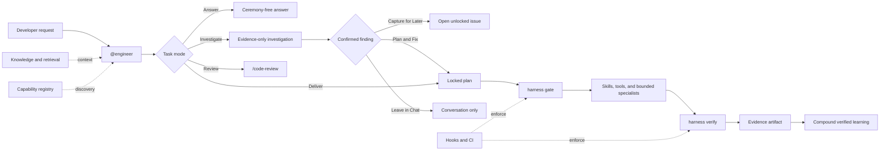

# Engineer Harness Architecture

This is the canonical architecture document for the Adaptive Engineer Harness. It describes current boundaries and behavior; it is not a second runtime checklist. The sole normative delivery lifecycle lives in [the Engineer agent](../../.github/agents/engineer.agent.md), and command semantics live in the [Harness Tool Contract](../../.github/skills/references/harness-tool-contract.md).

## System at a glance

The system keeps the accountable Engineer small and moves reusable procedure, durable state, and enforcement into independently testable layers.



The architecture has three rules:

1. The Engineer owns the outcome; skills, agents, plans, and tools support that ownership.
2. Read-only work stays lightweight; mutation crosses an explicit plan and verification boundary.
3. Capability grows from verified reuse evidence, never from loading every possible skill up front.

## Task modes

The Engineer classifies the request before acting.

| Mode | Use | Contract |
|---|---|---|
| Answer | Quick repository or general question | Answer ceremony-free: read only the minimum context and reply without a delivery plan |
| Investigate | Evidence-heavy diagnosis or research with no requested change | Inspect proportionally; report evidence, impact, confidence, and recommendations without edits |
| Deliver | Any requested file or implementation change | Enter the canonical delivery lifecycle, pass the plan gate, and produce fresh passed evidence |
| Review | Independent assessment of completed changes | Route to `/code-review` without assuming implementation ownership |

Answer and Investigate must transition to Deliver before the first requested mutation. When Investigate confirms an actionable defect, Engineer offers **Capture for Later** (an open, unlocked phase-zero issue), **Plan and Fix** (transition to Deliver), or **Leave in Chat** (no repository mutation). Merely discovering a defect never creates solution knowledge.

## Engineer accountability

`@engineer` owns the final decision and every delivery completion claim. It may load a relevant skill or delegate bounded research, implementation, or review, but it must inspect the returned evidence, reconcile disagreements, verify the integrated result, and disclose remaining risk.

Only a fresh `harness verify` outcome of `passed` permits changed work to be reported complete or compounded. `failed` and `inconclusive` remain unfinished. Read-only work reports evidence and uncertainty rather than fabricating delivery evidence.

## Single-owner contracts

### Component ownership

| Component | Single responsibility |
|---|---|
| `.github/agents/engineer.agent.md` | Task-mode boundary, sole normative delivery lifecycle, accountability, and consultation policy |
| Individual `SKILL.md` files | Reusable procedures loaded on demand |
| `.github/skills/references/harness-tool-contract.md` | CLI inputs, outputs, side effects, and exit semantics |
| `docs/plans/*.md` | Durable intent, scope, state, risk, activity, and verification contract |
| `knowledge/solutions/` and manifest/index data | Verified team knowledge and bounded recall |
| `knowledge/capability-registry.yaml` | Capability ownership, lifecycle, routing metadata, and retirement tombstones |
| Hooks, trusted checks, and CI | Enforcement independent of prompt compliance |
| This document | Runtime architecture and rationale, without another execution loop |
| `skill-driven-prompt-library.md` | Primitive boundaries and authoring standard |

The retired `engineer-autopilot` skill and `engineer-runtime.md` reference duplicated the Engineer loop. They remain only as retirement history where needed; they are not active alternate runtimes. Thin skill adapters remain because host discovery is a distinct responsibility; prompt wrappers were retired 2026-07-24 in favor of selecting the Engineer directly from the host's agent dropdown.

## Plans and enforcement

Deliver mode uses a versioned plan as both a specification and a local context pack. A plan declares intent, expected outputs, stable acceptance criteria, impacted files, named verification checks, review state, capability gaps, and append-only activity. It never supplies executable command strings.

Low-risk work still uses this schema. When one or two known product files can be changed in one session without architecture, compatibility, security, concurrency, data, infrastructure, destructive, migration, or public-contract risk, `/ensure-plan` produces a concise one-phase plan with focused named verification. New affected files, risk, architectural choices, or unclear verification escalate to normal planning. There is no micro-task schema.

The deterministic boundary is:

```text
locked plan → harness gate → scoped edits → harness verify → evidence → review/compound
```

- `harness gate --phase implement --plan <path>` checks the explicit plan, intent, state, lock, and activity before edits.
- `harness verify --plan <path>` validates schema and current-phase tasks, runs trusted argv-only checks from `.github/harness/checks.yaml`, compares the diff to `## Impacted Files`, checks reviews and hard gaps, and writes evidence.
- Verification outcomes are `passed`, `failed`, or `inconclusive`; only `passed` is terminal success.
- `PreToolUse` normalizes supported VS Code/CLI editor and terminal payloads, fails closed when a mutation target is unresolved, blocks direct mutation of `.harness/` runtime state, and requires the target to be within the gated plan. The implement gate binds a SHA-256 plan digest; editing the plan invalidates later product mutations until the gate is rerun.
- `PostToolUse` records `lastEditAt` only after a recognized governed mutation succeeds; an attempted or failed edit never creates pending verification state. It also records successful on-demand skill reads separately so primitive activation can be bound to the current host session without treating reads as edits.
- `Stop` requires fresh passed evidence after the latest successful edit, while sessions with no successful mutation exit without ceremony.
- A missing-gate block is recoverable: Engineer invokes `/ensure-plan`, passes the implement gate, and retries the original mutation.
- CI resolves exactly one plan, binds verification to the PR base SHA, and acts as the cross-host backstop.

Primitive paths (`.github/skills/`, agents, instructions, checks, the capability registry, and enterprise skills) add a stricter boundary. Before mutation, `create-primitive` must have been successfully loaded in the current host session; a `skills_used` label alone is insufficient. The plan must record the applicable classification, overlap, structure, trigger, verification, registry, and documentation decisions. Verification requires the standard primitive asset and contract checks when configured, or the repository's strongest configured local named evidence when those prompt-library surfaces are absent.

Hook and lifecycle events use schema version 2 in the local `.harness/events.jsonl`. They retain session and host identifiers plus tool, resolved targets, gate, decision, result, and duration, but never prompt content. A `skill_activation` event records only the loaded skill name and current session binding. `harness events --session <id>`, `--failures`, and `--summary` provide bounded diagnosis without introducing a trace database or dashboard.

Repository rollout policy is defined in `.github/harness/policy.yaml`:

| Mode | Recorded result | Process behavior |
|---|---|---|
| `observe` | Preserve the real result | Report without blocking |
| `warn` | Preserve the real result | Warn and emit evidence without blocking |
| `enforce` | Preserve the real result | `passed=0`, `failed=1`, `inconclusive=2` |

Policy `exemptions` and `waivers` are arrays. Exemptions describe approved path or work classes; waivers record explicit, bounded exceptions. Neither changes a failed or inconclusive result into passed evidence.

## Memory and retrieval

The harness separates durable knowledge from bounded working context. The canonical model — episodic (T1), semantic (T2), and behavioral (T3) tiers, single-writer ownership per tier, the governance ledger, and the full threat model — lives in [Memory Model](../MEMORY-MODEL.md); this section covers only what the runtime loop touches.

| Tier | Source | Use |
|---|---|---|
| Product memory | Active `docs/plans/`, optional `docs/solutions/`, and product context | Current goal, decisions, scope, and repo-private learning |
| Team memory | Hydrated `knowledge/solutions/` plus `manifest.yaml` | Verified patterns reusable across repositories |
| Consolidated learnings | `~/.harness/knowledge/<repo-id>/` — local, never-pushed learnings store; `consolidate --apply` is its sole content writer, with a governance ledger recording human retire/dispute/confirm/promote decisions | Condensed, one-claim-per-file knowledge injected into orient |
| User memory | Optional `~/.copilot/knowledge/profile.md` | Small preference and autonomy profile |

`harness orient` combines plan matching and recall into `.harness/context-pack.md`, capped at 2 KB, including the top-3 trigger-matched learnings from the T2 store. The Engineer reads only the bounded pack and retrieves full source excerpts on demand. The detailed lookup and write order is owned by [Knowledge Locations](../../.github/skills/references/knowledge-locations.md).

Current retrieval uses a pure-JavaScript BM25 index under `.harness-index/`, with manifest token overlap as fallback. The index is derived and can always be rebuilt with `harness index`. Direct repository search remains the fallback when no index is available. Semantic embeddings are deliberately deferred; adopt them only when measured recall misses justify the added dependency and operational cost.

Compounding happens only after passed verification. `/auto-compound` classifies whether the result belongs in the active plan, a solution document, a convention, or a promotion candidate; `/compound-learnings` persists an episode, `/consolidate` clusters episodes into the T2 learnings store, and `harness index` rebuilds the retrieval manifest.

## Gap classification and bounded delegation

Capability handling is proactive only for an explicit specialization or before high-risk security, data, concurrency, infrastructure, or destructive work. Otherwise, the Engineer responds to uncertainty when it appears.

| Gap | First response | Escalation |
|---|---|---|
| Missing fact or API knowledge | Inspect code and authoritative documentation | Bounded research |
| Unfamiliar language or framework | Inspect repository conventions and one relevant skill | Domain consultation |
| Specialized judgment | Consult the relevant specialist | Independent review |
| Repeatable procedure | Search installed skills and prior solutions | Promotion assessment after verified reuse |
| Missing executable capability | Use an approved existing tool | Governed integration proposal |
| Missing organizational convention | Search instructions and knowledge | Instruction or deterministic-check proposal |
| Safety-critical capability | Stop only the affected operation | Expert review or explicit recorded waiver |

Optional capability absence never blocks unrelated low-risk work. A hard gap belongs to the acceptance criterion or operation that requires it, not to the entire session.

Bounded delegation is used only when separate judgment, isolation, domain expertise, or tool authority materially improves the outcome. Every context packet contains the question, relevant goal and acceptance criterion, evidence already inspected, constraints and risks, scope boundaries, and expected response. Coordinators may use parallel batches of 3–4 specialists; the Engineer still evaluates and integrates their findings.

## Capability lifecycle

The registry is a discovery and governance inventory, not a mandatory startup checklist.

```text
candidate → experimental → active → deprecated → retired
```

| State | Meaning |
|---|---|
| `candidate` | Proposed after gap and overlap analysis; not shipped |
| `experimental` | Limited availability with an owner, version, promotion evidence, trigger evals, and outcome evals |
| `active` | Supported, documented, evaluated, and verified |
| `deprecated` | Still discoverable during a documented migration window |
| `retired` | Source removed; registry tombstone and hydrated cleanup retained |

Promotion requires a real task solved with passed evidence, repeated or strategic value, generalizability, an overlap check against existing primitives, an owner, positive and negative/confusable trigger eval coverage, outcome eval coverage, host coverage, and human-approved `/create-primitive`. One unfamiliar API or a one-off task is not promotion evidence.

Deprecation identifies the replacement and migration window. Retirement removes active source and routing, updates evals and documentation, adds hydrated cleanup to `packages/harness/retired.json`, and retains a dated registry tombstone. The `engineer-autopilot` retirement is the reference example: it was removed because its runtime overlapped the canonical Engineer lifecycle.

Usage and outcome telemetry can inform lifecycle review but never overrides quality, safety, or verification evidence.

## Runtime modes

### Standalone mode

The host has the Engineer primitives but the product repository has not adopted governed plan, policy, or CI configuration. Read-only modes remain lightweight. Deliver mode uses repository tests and labels unavailable governance rather than claiming it ran.

### Degraded mode

An optional skill, specialist, hook, or host integration is unavailable. Ordinary low-risk work continues with repository evidence, authoritative documentation, and explicit `harness gate`/`verify` commands where available. The agent discloses that native mutation or completion enforcement was unavailable; it never treats explicit CLI use as proof that a missing hook ran. Missing required verification produces `inconclusive`; a missing safety-critical capability blocks only the affected operation unless waived.

### Governed mode

The repository supplies schema-versioned plans, trusted named checks, policy, supported hooks, and required CI. Plan readiness validates unchecked planned work, complete criterion mappings, configured checks, and output/check relevance; the implement gate repeats those checks. The explicit gate controls the mutation boundary, terminal hooks keep named-check execution within `verification.required`, verification binds checks and diff scope to the plan, and compounding consumes only passed evidence.

## Distribution and host validation

The prompt library is the authoring source. `scripts/build-harness-assets.mjs` builds ignored package assets, and the `@dev-kit/harness` npm package installs versioned agents, skills, instructions, hooks, schemas, and knowledge scaffolding into global Copilot locations. Hook commands are hydrated with a deterministic absolute working directory. `install --configure-vscode` merges `chat.hookFilesLocations` for `~/.copilot/hooks` into VS Code user settings. Upgrades preserve user-authored profiles and compounded solutions and remove only harness-owned paths tracked by the lock file or retirement manifest.

`harness doctor --host vscode` checks the installed bundle, command resolution, user hook discovery, known payload recognition, ungated denial, gated allow, successful post-tool recording, unverified Stop denial, and verified Stop allow in an isolated fixture. It diagnoses the installed runtime rather than passing from package-source files alone.

Operational setup belongs in the [Install Guide](../install.md), [Harness Quickstart](../onboarding/harness-quickstart.md), and [Nexus Registry Setup](../onboarding/nexus-registry-setup.md), rather than in additional architecture proposals.

Automated evidence covers the supported surfaces:

| Surface | Evidence |
|---|---|
| GitHub Copilot in VS Code | Hydrated agents, skills, instructions, discovered user hooks, frozen Engineer budget, task-mode contracts, and executable V1–V9 doctor probes |
| GitHub Copilot CLI | Hydrated hooks plus executable read-only bypass, pre-edit, completion, gate, verify, and compound tests |
| GitHub Copilot in IntelliJ IDEA | Host-neutral sources, merged instruction contract, terminal CLI behavior, and no provider-specific model pinning |
| Portable Agent Skills hosts | Standard skill frontmatter, host-native fallbacks, and explicit degraded behavior |

Source and package tests cannot prove organization-specific IDE discovery settings. Platform owners therefore run a small post-publish interactive smoke in each enabled host; this supplements rather than replaces deterministic source, package, runtime, and evidence checks.

## Verification

For architecture or runtime changes, run:

```bash
node scripts/build-harness-assets.mjs
npm --prefix packages/harness test
```

For plan-governed delivery, the terminal gate is:

```bash
harness verify --plan <path> --base <git-ref> --enforcement enforce
```

The verification suite checks the thin Engineer contract, plan and policy schemas, hooks, trusted checks, capability inventory and lifecycle, built-asset parity, and absence of retired runtime artifacts.

## Related sources

- [Skill-Driven Prompt Library Standard](./skill-driven-prompt-library.md)
- [Memory Model](../MEMORY-MODEL.md)
- [Harness Tool Contract](../../.github/skills/references/harness-tool-contract.md)
- [Knowledge Locations](../../.github/skills/references/knowledge-locations.md)
- [Capability Registry](../../knowledge/capability-registry.yaml)
- [Install Guide](../install.md)
- [Harness Quickstart](../onboarding/harness-quickstart.md)
- [Harness Evolution Blueprint](../../knowledge/proposals/harness-evolution-blueprint.md) (approved design — phases 1–4 shipped; conditions in its Human Decision remain binding)

Historical proposals, comparative reviews, and implementation roadmaps are removed from active documentation after implementation. Their audit remains in Git and pull-request history; durable decisions are promoted to this architecture or team knowledge before completed plans are deleted.
