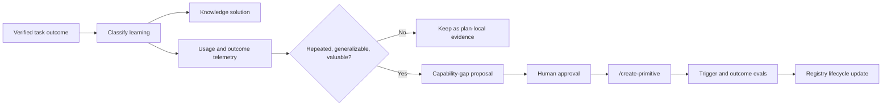

# Engineer Vision and Growth Loop

## Vision

The `@engineer` is a **real engineer persona**, not a generic chatbot:

- Starts with a **small starter kit** of skills, team knowledge, principles, and a **limited expert network**.
- **Learns** by compounding verified fixes into global knowledge and repo conventions.
- **Grows capability** by proposing new skills, agents, instructions, or checks through human-approved `/create-primitive`.
- **Expands specialist reach** by routing to more reviewers/researchers as risk and domain require—and by adding agents to the registry when gaps repeat.
- **Lives by rules**: inspect before changing, plan trackable work, verify before completion, and ask before material risk.

Irrespective of model size, **structure enforces behavior**; prompts alone do not.

## Vision → implementation map

| Vision element | Implementation | Maturity |
|----------------|----------------|----------|
| Starter skills | Pipeline + domain + utilities in `knowledge/capability-registry.yaml` | Implemented |
| Starter experts | `engineer.agents:` allowlist + `engineer-delegation-matrix.md` | Implemented |
| Rules & principles | `engineer-principles.md`, `capture-gate.md`, `copilot-instructions.md`, scoped instructions | Implemented |
| Working memory (issues) | Product `docs/plans/` + `## Memory Cards` | Implemented |
| Long-term knowledge | Global `knowledge/solutions/` + `manifest.yaml` | Implemented (needs content over time) |
| Relevant recall | `/recall`, `harness orient`, plan memory cards | Implemented |
| Plan before trackable edits | `capture-gate.md`, `harness gate` | Implemented |
| Compound learnings | `/compound-learnings` → global solutions | Implemented |
| Learn new skills | verified reuse → capability-gap proposal → `/create-primitive` → registry update | Implemented |
| Expand specialists | New agent + engineer `agents:` allowlist update (manual, approved) | Partial (documented) |
| User preferences | `knowledge/profile.md` | Implemented |
| Skill usage tracking | `knowledge/skill-usage.yaml` outcome telemetry | Implemented |
| Model-proof checklist | `engineer-session-checklist.md` | Implemented |
| Adaptive task modes | Answer and Investigate stay read-only; Deliver owns mutation and verification | Implemented |
| Semantic memory (v2) | MCP / embeddings | Planned |

## Growth loop (closed cycle)

This is the capability-growth lifecycle after a verified result. It does not
restate the Engineer delivery lifecycle, whose only normative definition is
`.github/agents/engineer.agent.md`.

Hermes-style **skill extraction** maps to: repeated successful use of a workflow → capability-gap proposal → new skill. Hermes auto-writes skills after N tool calls; we require **human approval** for governance in enterprise teams.

## Research: how others achieve the same vision

### Cursor

- **Rules** at project and user scope; always-on or glob-scoped ([Rules docs](https://cursor.com/docs/rules)).
- **Semantic index** of codebase for retrieval ([Search docs](https://cursor.com/docs/agent/tools/search)).
- **Lesson for us:** separate **portable rules** (instructions + principles) from **indexed facts** (manifest + solutions). Do not stuff everything into the engineer agent body.

### Hermes Agent

- Bounded **MEMORY.md** + **USER.md** injected at session start ([Memory guide](https://github.com/NousResearch/hermes-agent/blob/main/website/docs/user-guide/features/memory.md)).
- **Learning loop:** execute → evaluate → extract → improve; skills written from successful multi-step tasks.
- **Lesson for us:** `profile.md` + memory cards = bounded always-on context; full history stays in plan files and solutions, not in the system prompt.

### PI agent ecosystem

- **pi-memctx:** Markdown memory injected before prompts; fewer redundant tool calls ([pi-memctx](https://github.com/weauratech/pi-memctx)).
- **pi-lcm:** Lossless summarization with recoverable DAG ([pi-lcm](https://github.com/codexstar69/pi-lcm)).
- **Lesson for us:** plan sections are the DAG nodes; never summarize away `## Acceptance Criteria` or `## Verification Plan`.

### This library (deliberate choices)

| Choice | Why |
|--------|-----|
| Skills own procedures | Smaller agent prompts; progressive disclosure |
| Agents own judgment | Isolation + different tools |
| File-based memory | Works in Copilot, IntelliJ, CLI without host APIs |
| Human approval for new primitives | Prevents skill/agent sprawl from weak models |
| Capture gate as checklist | Survives smaller models better than prose tables |

## Multi-pass review log (gaps found and fixed)

### Pass 1 — Vision alignment

| Gap | Fix |
|-----|-----|
| No single vision doc | This file |
| Growth loop not named in harness | Updated `adaptive-engineer-harness.md` |
| No starter kit manifest | `knowledge/capability-registry.yaml` |

### Pass 2 — Bypass paths (capture leak)

| Gap | Fix |
|-----|-----|
| `/analyze-and-plan` locks plans without `/capture-issue` | Skill requires existing captured plan |
| `/start` routes refactor trivial to analyze-and-plan without capture | Route to `/capture-issue` for trackable work |
| No engineer prompt wrapper | Added `engineer.prompt.md` |

### Pass 3 — Memory & compounding

| Gap | Fix |
|-----|-----|
| Pipeline navigator omits `/recall` | Updated pipeline diagram and suggestions |
| `review-guardrails` ignores capture/memory | Added compliance checks |
| `/compound-learnings` index step optional in practice | Marked `/index-memory` as required in skill |

### Pass 4 — Model robustness

| Gap | Fix |
|-----|-----|
| Rules spread across long agent file | `engineer-session-checklist.md` + pointer at top of agent |
| Principles not one charter | `engineer-principles.md` |
| No skill-usage tracking | `skill-usage.yaml.template` + profile guidance |

### Pass 5 — Capability expansion

| Gap | Fix |
|-----|-----|
| Registry not updated after `/create-primitive` | Creator workflow step added |
| Engineer allowlist growth not documented | Documented in `engineer-starter-kit.md` |

### Pass 7 — Composer/Windsurf tightening

| Gap | Fix |
|-----|-----|
| 17 KB engineer prompt | Slim agent (~4 KB) with **inlined checklist** |
| “Read five references” | Task-specific skills and `context-budget.md` on demand only |
| Unbounded recall | Top-3 manifest, 1200-char memory cards |
| `copilot-instructions` engineer duplication | Engineer rules only in agent file |
| Unclear product positioning | `composer-parity-review.md` |

### Pass 8 — Remaining (v2)

- Semantic index over `knowledge/solutions/` (Composer-class retrieval).
- Host hooks for automatic memory card injection.

### Pass 9 — Adaptive-lifecycle research correction

| Gap | Fix |
|-----|-----|
| Nine steps appeared mandatory for every interaction | Classify Answer, Investigate, Deliver, or Review; apply the lifecycle only to Deliver |
| Completion hook blocked read-only turns | Enforce only a newly recorded edit and mark successfully completed edits |
| `/btw` lacked core trigger coverage | Add positive, negative, outcome, transition, and host evals |
- Cross-repo aggregation of the implemented structured harness telemetry.

### Pass 9 — Runtime contract tightening

| Theme | Fit | Change |
|-------|-----|--------|
| Bounded multi-agent teams | Strong | Delegation guidance now defaults to 3-5 active agents per workstream. |
| Spec-driven intent | Strong / partial | Plan template now has machine-readable intent, outputs, success criteria, trusted named checks, and organizational objectives. |
| Agent journaling | Partial | Plan template now includes `## Agent Journal` for uncertainty, blocked states, escalations, and strategy changes. |
| Structured monitoring | Partial | CLI JSON, session files, and `.harness/events.jsonl` now capture structural outcomes. |
| Organizational alignment | Strong / partial | Plan template now tracks `org_objectives` when known. |

## Model-robustness assertions

The structural contract tests and harness enforcement assert that trackable
edits have one explicit locked plan, changed files stay within declared scope,
consultations receive bounded context when used, and completion has a passed
post-edit evidence artifact. Compounding consumes only passed evidence. Optional
capability gaps do not block ordinary work; unresolved safety-critical gaps
block only their affected scope unless waived.

See `.github/agents/engineer.agent.md` for the runtime loop and
`.github/skills/references/engineer-session-checklist.md` for its compact mirror.

## Related docs

- `composer-parity-review.md` — would Cursor/Windsurf approve; what we fixed
- `engineer-memory-system.md` — tiers and token model
- `context-budget.md` — top-k and character caps
- `engineer-operating-model.md` — ownership boundaries and modes
- `.github/agents/engineer.agent.md` — sole normative runtime loop
- `knowledge/capability-registry.yaml` — starter kit and growth inventory
