# Knowledge Layer Threat Model

Scope: the T2 semantic memory layer (learnings) and its write path — the surface that
takes text derived from episodes and model reasoning and turns it into content an agent
or a human later reads as memory. See [`docs/MEMORY-MODEL.md`](../MEMORY-MODEL.md) for the
tier and lifecycle summary, and
[`docs/brainstorms/2026-07-26-knowledge-layer-design.md`](../brainstorms/2026-07-26-knowledge-layer-design.md)
for the full approved design this threat model mirrors (§14, residual risks).

## Data flow and trust boundaries

```mermaid
flowchart LR
    subgraph T1["T1 episodic — product repo, secret-scanned at capture"]
        EP[(solution docs)]
    end
    EP --> CAND["consolidate --candidates<br/>deterministic clusters, zero model cost"]
    CAND --> SKILL["/consolidate skill<br/>model reasoning — writes only<br/>.harness/consolidate-ops.json"]
    SKILL -- "ops JSON, untrusted proposal" --> B1{{"trust boundary<br/>ops validation"}}
    B1 --> APPLY["consolidate --apply<br/>sole writer: schema, ≤5 files, byte cap,<br/>secret scan, imperative lint"]
    APPLY --> T2[(T2 learnings store<br/>local, never pushed)]
    T2 --> ORIENT["harness orient<br/>top-3 injection, attributed"]
    ORIENT --> B2{{"trust boundary<br/>advisory fence"}}
    B2 --> READER["agent / human<br/>reads fenced text as data, not instructions"]
```

Everything left of **ops validation** is untrusted proposal text — including model output
from `/consolidate`, which writes only the reviewable `.harness/consolidate-ops.json`
proposal and never touches the T2 store directly — and cannot mutate the store directly.
Everything right of the **advisory fence** is presented to a reader as data, never as
directives. Both boundaries are enforced mechanically (`consolidate --apply`'s validator;
the fence-and-lint pipeline on every rendering surface), not by asking the model to behave.

## Canonical residual risk: declarative deception through the insight lane

The insight lane (`compound --insight` for investigation captures, `harness remember` for
human teaching) accepts an unverified declarative claim. A confidently false claim ("X
always causes Y") passes every mechanical check — schema, candidate-set membership, the
≤5-file delta cap, the byte cap, the secret scan, the imperative-content lint — by
construction, because none of those checks can evaluate whether a claim is *true*, only
whether it is well-formed and non-instructional. This is the canonical residual: no lint
layer in this design can distinguish a true unverified claim from a false one dressed the
same way.

It is bounded, not eliminated, by four independent controls:

1. **Advisory fence** — every insight-derived learning renders inside
   `[unverified memory — advisory]`; a reader is told explicitly not to treat it as
   verified.
2. **Provisional damping** — new insight/auto-derived learnings enter `status: provisional`,
   rank-damped until 3 uses or one verified confirmation; a bad claim must survive repeated
   exposure before it gains retrieval weight. `source: human` learnings (written directly
   by `harness remember`) are the one exception: a direct human statement outranks
   statistics, so they enter `status: active` immediately, with no provisional damping.
3. **Never-promotes** — insight-only learnings can never reach T2→T3 promotion
   eligibility; a declaratively deceptive claim cannot become committed behavior through
   `/create-primitive`.
4. **One-command retire** — `harness learning retire <id> --reason "..."` removes it from
   retrieval and the domain cap the moment a human notices, with no ceremony required.

## Secret scanning

`scanSecrets` (gitleaks-style, dependency-free regexes) runs at two write boundaries: T1
episode capture (`compound.mjs`) and the T2 write boundary inside `consolidate --apply`
(`knowledge/apply.mjs`, against the op's trigger + body before it is ever committed).

This is regex-grade screening — pattern matching against known secret shapes (AWS-style
keys, private-key headers, and similar) — not a guarantee. Novel formats, split secrets,
or anything that doesn't match a known pattern can pass through undetected. The real
backstop is architectural, not the scanner: the learnings store lives outside the working
tree at `~/.harness/knowledge/<repo-id>/` and is never pushed by the harness, so a missed
secret in a learning stays on the developer's machine rather than reaching a shared
remote. `knowledge.commit: repo` is the one opt-in mode that knowingly re-opens that
exposure — see [Commit mode](#commit-mode-opt-in-the-documented-exception) below.

## Purge vs. git history honesty

`harness knowledge purge <file>` and `purge --all` are cascade deletes: the working copy
of dependent learning file(s), the `consolidated.jsonl` ledger entries, and (only under
commit mode) the product-repo copies are removed, ending in one store commit that records
the purge. Human deletion always wins — purge is never mode-gated.

Purge does **not** rewrite git history. The knowledge store itself is a git repo, and
prior commits in that store still contain the purged content in its history; telemetry
likewise retains prior references to a purged id. True removal from history requires an
explicit, separate history rewrite (`git filter-repo` or equivalent) run by a human
against the knowledge store repo — the CLI does not do this automatically. Docs and
product messaging must not imply that a single purge command satisfies a hard-deletion
requirement (a legal takedown, for example); it satisfies "stop using this and stop
serving it," not "never existed."

## Commit mode (opt-in, the documented exception)

`knowledge.commit: repo` (`harness knowledge commit repo`; default `none`) is the one path
by which the harness knowingly re-opens the trust gradient described in
[`docs/MEMORY-MODEL.md`](../MEMORY-MODEL.md#trust-gradient) — *unless a team explicitly
opts into learnings commit mode, which is documented as an exception with best-effort
secret screening* (design §1/§11, the exact public trust-gradient clause). It copies
every ACTIVE learning verbatim into `<workspace>/docs/knowledge/learnings/<domain>/<slug>.md`
plus an `INDEX.md`, on every subsequent store mutation (`consolidate --apply`, `remember`,
`learning retire|dispute|confirm|promote`, `knowledge purge`, a hand edit absorbed from the
store, `consolidate --rebuild --yes`) — not on the `commit repo` toggle itself, so switching
it on does not retroactively back-fill the mirror until the next mutation touches the store.

Conditions (design §11):

- **Best-effort secret screening at mirror time.** Every learning slated for the mirror is
  re-scanned with the same `scanSecrets` regexes used at the T2 write boundary; a hit
  excludes that learning from BOTH its `.md` file and the `INDEX.md` entry list entirely —
  not just its body — and is counted and logged as skipped. This is the same regex-grade
  screening described above, not a stronger guarantee.
- **Never-ingest of foreign copies.** Nothing in the harness ever reads
  `docs/knowledge/learnings/` back into the local store. A learning committed there by
  another machine (or hand-planted) is read-only reference the moment it lands in the
  product repo, never trusted memory, until a future Phase 2 propose-then-ratify design
  exists — enforced by the absence of any reader, and the mirror's own `INDEX.md` carries a
  header line stating this explicitly for a human reader.
- **PR-flow routing.** The CLI never git-commits the product repo itself; mirrored files
  land in the working tree and ride the team's normal PR flow — branch protection is the
  routing mechanism, not the harness.
- **Deletion stays consistent with the store.** A full reset (`knowledge purge --all`,
  `consolidate --rebuild --yes`), a cascade delete (`knowledge purge <file>`), and a hand
  deletion absorbed from the store repo all clear the matching mirror files in the same
  sweep — human deletion (and reset) wins in the mirror exactly as it does in T2.

## Suggest mode (the approve-before-write control)

`knowledge.mode: suggest` is the formal approve-before-write control: every other human
authority in this design is veto-after-write (retire/dispute/confirm act on learnings that
already exist); `suggest` moves the checkpoint earlier for teams that want it. `consolidate
--apply` still validates the ops file exactly as in `on` mode, but stops with `E_MODE`
unless the caller re-runs it with `--yes` after a human has read
`.harness/consolidate-ops.json` — the review happens before anything is written, not after.
`remember` (a direct human-authored claim) and orient's injection/debt hint are unaffected
by `suggest` — the checkpoint gates only the sole writer's own auto-derived ops.

## Prompt-injection stance (current position)

Every human-facing surface that renders learning or episode text — the session-start
digest, `harness learnings [--why]`, `INDEX.md`, and the reviewable ops diff a human sees
under `knowledge.mode: suggest` (`.harness/consolidate-ops.json`, per the `/consolidate`
skill; see Suggest mode above — `--apply` writes only after the human re-runs it with
`--yes`, otherwise it rejects with `E_MODE`) — renders that text inside the same advisory
fence. The fence's job is to keep stored
text from being read as instructions by the model or the host: it is presented as data,
never as directives to follow. Content originating from an episode, an insight, or a
compromised upstream source cannot use the fence to issue commands to the agent reading it —
the fence is the injection defense itself, not a formatting convenience layered on top of
one.

Insight claims that contain URLs or shell commands do not reach the store at all:
`lintImperative` (`knowledge/apply.mjs`) rejects them outright with `E_LINT` at the
`--apply` write boundary, before a learning is ever written. This is a hard rejection at the
moment it happens, not a review queue — the `/consolidate` skill asks the model to
self-check the same rules while drafting ops, but that is guidance for avoiding the
rejection, not a second mechanical gate; `--apply` is the only place a violation is
actually enforced.

The rejection is not the end of the story, though: the writer now exists. Rejections split
into four classes, mirrored from `apply.mjs`'s own `CONTENT_FAILURE_CODES` comment:

- **Content-strike** — `E_SCHEMA`, `E_SECRET`, `E_LINT`, `E_BYTE_CAP` always strike, and
  `E_EXISTS`/`E_TARGET` strike when they fire against a genuine ON-DISK collision: a dedup
  miss (an `ADD`/`MERGE` id that already exists), a target that does not exist, or a `MERGE`
  target that is not active. Each records one failure entry per rejected episode, keyed on
  `path@sha256`, in the store's ledger.
- **Run-level** — `E_MODE`, `E_DELTA_CONTRACT`, `E_LOCKED`, `E_APPLY_FAILED` never strike:
  they say nothing about any one op's episodes. Neither does `E_DOMAIN_CAP` — cap pressure is
  a run-level resource limit, not a defect in the episodes behind it.
- **Composition** — the SAME `E_EXISTS`/`E_TARGET` codes, raised instead when a SIBLING op
  earlier in the SAME run already claimed the id/target — including a `SUPERSEDE`/`MERGE`
  reusing a target an earlier `STRENGTHEN` in this run already touched — never strike. The
  op-SET was malformed (two ops raced for the same id/target), not either op's own episodes,
  so the codepath returns a plain rejection instead of recording a failure, despite sharing an
  E_EXISTS/E_TARGET code with a real, strike-worthy on-disk variant above.
- **Promoted-target** — also `E_TARGET`, raised whenever a `STRENGTHEN`/`SUPERSEDE`/`MERGE`
  aims at a learning already promoted to a primitive: never strikes, since the offered
  episodes aren't defective, only the op's choice of target is, so a model repeatedly aiming
  at a promoted id must never accumulate toward quarantine for it.

On an episode's third recorded (content-strike) failure — an `E_LINT`-rejected insight op
included — the same append also writes a `quarantined: true` marker: the episode stops
re-triggering consolidation debt and is surfaced in the `quarantined` list returned by
`harness consolidate --status` and `harness learnings`, and checked by doctor's K2. This is
a review surface, not a publish path: quarantine only ever removes an episode from further
automatic consolidation attempts and flags it for a human to look at (edit the episode,
`harness knowledge purge` it, or otherwise resolve it) — nothing quarantined is ever
auto-applied, and there is still no separate lane that reviews and republishes quarantined
content on its own.

There is likewise no per-lane config toggle that excludes insights from retrieval
specifically — the only kill switch is the store-wide `harness knowledge
<on|suggest|off|freeze|capture-only>` mode (`suggest` gates writes behind human approval
rather than excluding a single content lane — see Suggest mode above), which gates writes
(and, in `off` mode, retrieval) for the whole store together; turning off insight-derived
learnings alone while leaving fix-derived ones active is not a capability that exists.

## Residual risks (mirrored from the approved design, §14)

1. Free-text trigger matching is the load-bearing model judgment for dedup; a dedup miss
   corrupts more permanently than a retrieval miss.
2. Attribution and fencing depend on model/host compliance — a host or model that ignores
   the fence defeats the injection defense described above.
3. The value curve is back-loaded despite init seeding; some adopters will judge the layer
   before enough telemetry exists to defend it.
4. Zero-discipline vs. human authority is managed (damping + never-promote + the
   human-engagement SLO), not resolved outright.
5. Secret scanning is regex-grade; the out-of-tree, never-pushed default is the real
   backstop; commit mode re-opens exposure knowingly.
6. Declarative-deception insights pass every lint by construction — the canonical residual,
   detailed above.
7. Local-only knowledge (this phase) means teams re-learn independently across machines
   until a future team-sync phase ships.
8. Knowledge cannot rescue weak execution — the layer compounds whatever competence
   already exists; it does not create competence.
9. T2 is flat; at cap the system merges rather than abstracts. Hierarchical schemas are a
   future direction, not this version.

## Related

- [`docs/MEMORY-MODEL.md`](../MEMORY-MODEL.md)
- [`docs/brainstorms/2026-07-26-knowledge-layer-design.md`](../brainstorms/2026-07-26-knowledge-layer-design.md)
- [`.github/skills/references/harness-tool-contract.md`](../../.github/skills/references/harness-tool-contract.md)
