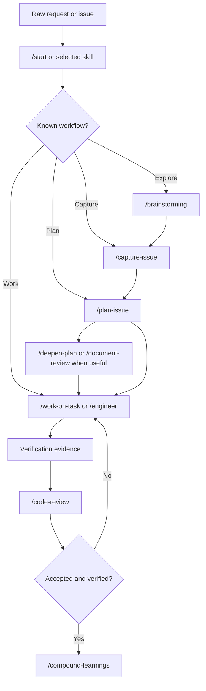

# Skill-Driven Prompt Library Standard

This repository is a source-of-truth prompt library, not a host plugin or generated package. Teams should clone the repo once and hydrate global Copilot customizations from it. The primary consumption surfaces are GitHub Copilot in VS Code and IntelliJ IDEA on Windows, with user-level global files under `%USERPROFILE%\.copilot` as the portable source of truth.

## Flow Overview

The diagram shows the recommended usage web: users enter through GitHub Copilot Chat, choose a skill or `@engineer`, and specialist agents are invoked only when review, separate judgment, or domain expertise is needed.

## Review Summary

The current library already has a strong compound-engineering base:

- A local-first pipeline: `/capture-issue` -> `/plan-issue` -> `/work-on-task` -> `/code-review` -> `/compound-learnings`
- Plan files in `docs/plans/` that preserve state, research notes, implementation notes, activity logs, and review findings
- Specialist agents with bounded responsibilities and coordinator agents for planning and review
- Skills using progressive disclosure, trigger examples, references, assets, and standalone/pipeline modes
- Bundled review checks under skill references, optional product checks under `.github/checks/`, and durable learnings under `docs/solutions/`

The main gap is presentation and governance. The repo historically explains itself as an agent collection with supporting skills. The standardized model should be the inverse: **skills are the primary reusable contract; agents, instructions, prompt wrappers, checks, plans, and solution docs support those skills.**

## External Tool Alignment

The global install and primitive boundaries mirror current agentic IDE patterns rather than inventing a host-specific plugin model:

- [VS Code Copilot custom instructions](https://code.visualstudio.com/docs/copilot/customization/custom-instructions) separates always-on instructions from file-based `.instructions.md` files. This supports global team standards plus scoped language/framework standards.
- [GitHub Copilot for JetBrains](https://docs.github.com/en/copilot/customizing-copilot/adding-custom-instructions-for-github-copilot) reliably supports a local `global-copilot-instructions.md` file, so the hydrate task compiles all instruction standards into that single IntelliJ path.
- [Cline Rules](https://docs.cline.bot/customization/cline-rules), [Cursor Rules](https://docs.cursor.com/en/context), and [Windsurf Rules](https://docs.windsurf.com/windsurf/cascade/memories) all separate global/user rules from workspace/project rules. Product repositories can add their own product-owned overlays, but prompt-library source artifacts stay global.
- [Windsurf Skills and Workflows](https://docs.windsurf.com/windsurf/cascade/memories) and [Continue prompts](https://docs.continue.dev/customize/prompts) treat repeatable task behavior and specialist review guidance as reusable procedural assets, which matches this repo's skill-first model.
- [Plandex context management](https://docs.plandex.ai/core-concepts/context-management/) keeps context associated with plans and loads only relevant context per step. This maps to `docs/plans/` acting as the local context pack for capture -> plan -> work -> review.

The practical rule is: global instructions carry broad behavior, scoped instructions carry file-pattern standards, skills carry procedures and bundled references, agents carry isolated judgment, and product repos may add product-specific context or review overlays without receiving prompt-library source copies.

## Primitive Model

| Primitive | Repository path | Purpose | Create when |
|---|---|---|---|
| Skill | `.github/skills/<name>/SKILL.md` | Reusable workflow or procedure the engineer can invoke on demand | The team repeats a process, checklist, generation pattern, review method, or delivery workflow |
| Agent | `.github/agents/*.agent.md` | Isolated role with separate judgment, tool budget, runtime profile, or accountability | Work needs a distinct reviewer, researcher, actor, coordinator, or full-cycle engineer |
| Instruction | `.github/instructions/*.instructions.md` | Scoped coding conventions activated by file pattern | A language, framework, or team convention should apply automatically to matching files |
| Prompt wrapper | `.github/prompts/*.prompt.md` | Host-facing slash-command adapter that points at a skill | A host needs explicit prompt files or extra tool routing for a skill |
| Review check | `.github/skills/code-review/references/checks/*.md` for library-managed checks; product repos may add `.github/checks/*.md` | Review criterion discovered by `/code-review` | A team wants a small, repeatable review rule without editing core agents |
| Reference | `.github/skills/**/references/*.md` or `.github/skills/**/assets/*` | Supporting material loaded only by the owning skill | A skill needs dense examples, schemas, templates, or criteria without loading them every time |
| Plan file | `docs/plans/*.md` | Local spec, state machine, context pack, and execution ledger | Work needs capture, planning, phased execution, review, and continuity |
| Solution doc | `docs/solutions/**/*.md` | Verified learning that should be reusable in future work | A completed fix reveals a durable pattern, gotcha, or prevention rule |

This library implements all standardization primitives needed for the current target: agents, skills, instructions, prompt wrappers, checks, references/assets, local plans, solution docs, and global install guidance. Checks are intentionally a prompt-library convention rather than a native Copilot customization type.

Use `/create-primitive` as the single creator workflow for new or changed primitives. It must classify the request first, state why the selected primitive is correct, and then create the smallest artifact that satisfies the need.

## Decision Rules

Default to a **skill**. Skills change how the engineer works and keep procedural knowledge discoverable without bloating every agent prompt.

Create an **agent** only when one of these boundaries is real:

- Different success criteria: security, performance, architecture, data integrity, or review calibration
- Different authority: read-only reviewer, researcher with fetch access, actor with edit access, coordinator with subagent access
- Different isolation: a subagent should evaluate independently from the implementer
- Different runtime profile: high-reasoning research/planning vs bounded implementation/review

Create an **instruction** when the rule should load automatically by file pattern and does not require a workflow.

Create a **review check** when the concern is narrow, project-specific, and can be evaluated during `/code-review`.

Keep **prompt wrappers** thin. They should route to skills and declare host tools; they should not become a second implementation of the workflow.

## Engineer-First Routing

The engineer remains the default accountable actor, but routing should be skill-driven:

1. Classify the user goal and current pipeline state.
2. Prefer a known skill or flow when the work matches one.
3. Attach scoped instructions and relevant references.
4. Build a task-scoped context pack from local files, prior plans, solution docs, and changed files.
5. Delegate to specialist agents only when separate judgment, authority, or isolation materially improves the outcome.
6. Verify with evidence before claiming completion.
7. Compound verified learnings into the smallest durable layer.

Use a specialist agent as primary only when the task is predominantly that specialty, such as a security audit, plan review, repository research pass, or PR comment resolution.

## Local-First Context Pack

This repo does not need a separate runtime context-pack format to get most of the value. The plan file is the portable context pack. Standard plans should include:

- `## Context` — problem facts, constraints, user intent, and related artifacts
- `## Acceptance Criteria` — measurable outcomes
- `## Research Notes` — local patterns, prior solution docs, external references, and open questions
- `## Impacted Files` — allowlist of expected file changes
- `## Verification Plan` — exact checks, commands, screenshots, or review gates that prove completion
- `## Risk & Review Routing` — risks and which specialist review agents or checks should run
- `## Implementation Notes` — decisions and deviations from work sessions
- `## Review Findings` — synthesized review output and resolution notes
- `## Activity` — append-only execution log

This gives every host a simple artifact to read while preserving the capture -> analyze/plan -> work -> review workflow.

`agent-context.md` is not part of the global customization contract. Use it only as repository-owned accumulated knowledge. Product-level context should be captured in product-owned files: `docs/plans/` for active work, `docs/solutions/` for verified learnings, `docs/codebase-snapshot.md` for generated architecture snapshots, `docs/agent-context.md` for accumulated product context when a team wants one, and `README.md` for stable project overview and integration points.

## Skill Contract

Every skill should make these details explicit:

- Discovery: concise `description:` with trigger keywords and negative triggers
- Role: where it fits in the local-first pipeline, or why it is standalone
- Inputs and outputs: required input, generated artifacts, and state changes
- References/assets: which files to read only when needed
- Interactive behavior: what to ask the user, and how non-interactive mode behaves
- Gates: conditions that must be true before proceeding
- Verification: evidence required before claiming success
- Error recovery: skill-specific failures plus shared patterns
- Security posture: permissions implied by the workflow and what the skill must not do

Default domain guidance should live in skills before agents. This library includes `/java`, `/python`, `/sql`, and `/aws` as reusable work procedures; their paired reviewer agents provide isolated judgment during review.

## Agent Contract

Every agent should make these details explicit:

- Mission and responsibility boundary
- Tool policy and isolation expectation
- Skills or instructions it should apply before acting
- Criteria and anti-patterns for its domain
- Output format
- What not to report
- Prompt-injection guardrails for reviewers and actors

Agents should not store long reference material. Put reusable procedures in skills and dense criteria in skill `references/`; use `.github/checks/` only for product-owned review overlays.

## Standard Workflow

## Governance

- Treat skills, agents, instructions, prompt wrappers, hooks, checks, scripts, and MCP metadata as executable governance artifacts.
- Do not pre-approve shell or network access in community or shared artifacts without local review.
- Keep permissions minimal in agent frontmatter and prompt wrappers.
- Prefer read-only specialist agents for review and research.
- Add or update at least one trigger example, review check, test scenario, or validation checklist item when changing a primitive.
- Compound patterns only after verification and user acceptance. One-off fixes belong in `docs/solutions/`; broad reusable conventions can graduate to a skill or scoped instruction. Repository-specific learnings belong in that repository's context docs.

## Team Adoption

Teams adapting this library should start by hydrating the global skills, agents, prompts, and instructions. Do not copy prompt-library artifacts into product repositories. New agents are the last resort, not the first customization point.

For the current target teams, assume Windows workstations with GitHub Copilot in VS Code and IntelliJ IDEA. Use the global Hydrate task as the supported path. See [Install and Sync Guide](../install.md).
