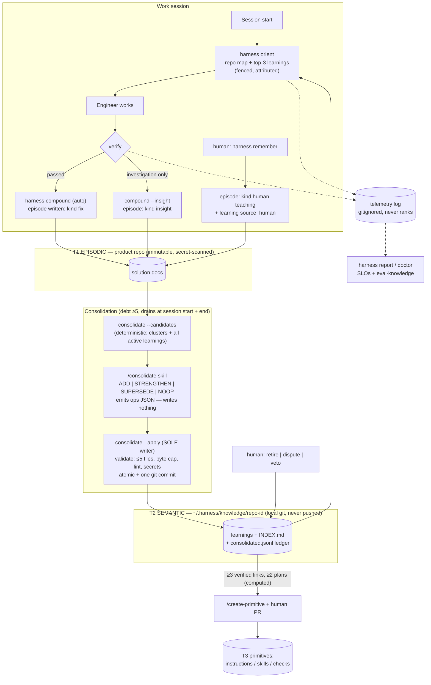
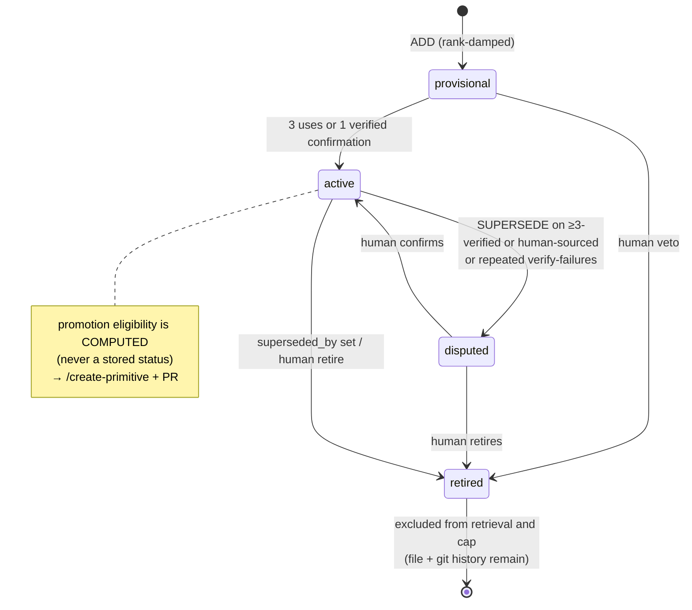
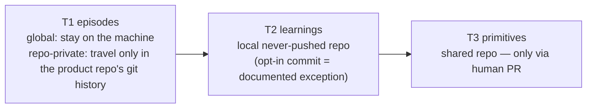

# Harness Knowledge Layer — Final Design (v1, Local)

**Status:** Approved design — pending implementation planning
**Scope:** Phase 1 (local-only). Team sync is Phase 2, deferred by design.
**Provenance:** Four research sweeps (agent-memory systems, coding-agent products, academic literature, team-sync patterns) → six isolated adversarial reviews (OpenAI, Anthropic, Google, Cursor, xAI, Pi lenses; all ship-with-changes) → reconciliation room (9 rulings) → five-chair final board (Hassabis, Karpathy, Sutskever, Amodei, Carmack lenses; unanimous approve-with-conditions, 13 conditions — all folded into this spec).

---

## 1. Mission and positioning

A curated, auditable, verification-gated memory for the Engineer Harness — every change, including forgetting, is a git commit.

- Token efficiency is a **measured benefit**, published only as a number produced by `harness eval-knowledge` on a held-out split. Never a headline claim before it is measured.
- Second pillar: distillation as attention hygiene — condensed claims fight context distraction, not just context budget.
- Constitution honored throughout: minimal dependencies (Node CLI + markdown + git; no DBs, no embeddings, no daemons), deterministic CLI does mechanical work / model skills do reasoning, zero mandatory user discipline, everything git-auditable.

**Public trust gradient (exact docs wording):** episodes are never transmitted by the harness — repo-private `docs/solutions/` travels only inside the product repo's own git history, and global episodes stay on the machine; learnings live in a local, never-pushed store; the only knowledge that reaches a shared repository through the harness is a primitive that passed a human PR — *unless a team explicitly opts into learnings commit mode, which is documented as an exception with best-effort secret screening.*

## 2. Three tiers

| Tier | Name | Location | Written by | Role |
|------|------|----------|-----------|------|
| T1 | Episodic | `docs/solutions/` (+ global solutions), plans, activity logs | `/auto-compound` (verified `kind: fix`), `compound --insight` (`kind: insight`), `harness remember` (`kind: human-teaching`) | Immutable ground truth. The **episode schema is the public stability contract.** |
| T2 | Semantic ("learnings") | `~/.harness/knowledge/<repo-id>/` — CLI-managed local git repo, **outside the working tree**, never pushed | `harness consolidate --apply` only | Condensed, one-claim-per-file knowledge. A **regenerable view** of T1 — never the asset. |
| T3 | Behavioral | `.github/` instructions / skills / checks | `/create-primitive` + human PR | Knowledge become behavior. |

**Re-derivability invariant (board condition — Sutskever):** T2 is a pure function of (T1, current model). All human teachings persist as T1 episodes (`kind: human-teaching`), so no learning exists without episode backing. `harness consolidate --rebuild` regenerates the entire T2 corpus from raw episodes with the current model — the upgrade path when stronger models arrive; classifier drift becomes a recompression opportunity, not a threat.

**Store location (board condition — Carmack):** `~/.harness/knowledge/<repo-id>/` keyed by normalized origin remote. The survive-`git clean`/re-clone and shared-across-worktrees guarantees apply to repos resolved through a remote; a repo with no remote falls back to a path-keyed store with a documented limitation (memory is per-path until a remote is added, at which point `harness doctor` offers a one-time migration). `harness doctor` verifies store presence against telemetry history and warns loudly if it vanished.

**Scoping rule:** learnings hold only what code cannot express (decisions, pitfalls, rationale, constraints). Code-derivable facts belong to the regenerated repo map / committed `docs/codebase-map.md`; the consolidation skill NOOPs map-derivable claims (guidance + BM25-overlap warning, not a hard rule).

## 3. Episode changes (v1a — ships regardless of T2)

- Solution docs gain `trigger:` and `claim:` frontmatter; orient ranks on frontmatter only. This is the eval control arm and the consolidation raw material.
- Capture-time secret/PII scan (gitleaks-style regexes, dependency-free). Documented as best-effort screening, never prevention.
- `harness knowledge purge <file|--all>` — human deletion always wins over "never deleted." Purge cascades atomically: the T1 episode, any T2 learnings citing it as sole evidence (others lose the link), the `consolidated.jsonl` ledger entries, and commit-mode copies. Git history and telemetry retain prior references (documented; true removal from history requires `git filter-repo`, and the docs say so).
- **Consolidation-state ledger lives in the knowledge repo, not in episode frontmatter (board condition — Carmack):** `consolidated.jsonl` maps `episode path + content-hash → learning id`. Episodes are never written back by consolidation; branch checkouts cannot resurrect consolidated episodes (unchanged hash → still consolidated). Idempotent by construction.
- Poison-episode quarantine (board condition — Carmack): an episode cluster that fails consolidation 3 times is quarantined in the ledger and surfaced by `harness doctor`; it stops re-triggering debt.

## 4. Learning file format

`~/.harness/knowledge/<repo-id>/learnings/<domain>/<slug>.md` — slug lowercased + NFC-normalized by `--apply` (case-insensitive-filesystem safe). ≤1,200 bytes; on overflow one retry, then split into two claims.

```yaml
schema: 1
trigger: "adding NOT NULL columns to large/hot tables"   # applicability condition; retrieval + dedup key
status: provisional        # provisional | active | disputed | retired
source: auto               # auto | human
episodes:                  # structured provenance — supports evidence-kind and distinct-plan checks
  - path: docs/solutions/perf/2026-06-orders-migration-lock.md
    sha256: "…"            # content hash at consolidation time (resurrection-proof)
    kind: fix              # fix | insight | human-teaching (copied at write; episode is immutable)
    plan: docs/plans/2026-06-orders-migration-plan.md
anchors: []                # repo paths/symbols extracted by --apply from linked episodes;
                           # the deterministic input for stale-anchor checks (unresolvable → excluded until reconfirmed)
superseded_by: null
last_confirmed: 2026-07-20 # clamped ≤ now; sanity-checked against commit date
merged_from: []            # only after an at-cap merge
origin: <repo-id>          # globally-unique id substrate for Phase 2
```

Body: claim in ≤5 lines + one canonical example.

Derived, never stored (board condition — Karpathy): id = filename; domain = directory; evidence counts = episode links × episode kind; **promotion eligibility is computed and displayed, not a status**. Full lifecycle (4 statuses) must fit on the one-page MEMORY-MODEL.md diagram.

Deliberately absent (unanimous panel cuts): confidence floats, decay math, ranking sidecar, typed `related`/`contradicts` links, `domains.yaml`, importance-weighted pressure, every-10th contrastive review, end-of-session ceremony line (the git commit message is the register). All re-addable behind telemetry; none removable once shipped.

**Hand-edit semantics (board condition — Karpathy):** any non-CLI modification detected in the knowledge repo (git status/diff) is committed by the CLI as a human edit and the learning gains `source: human` authority. Human edits are never silently superseded — and the CLI persists the edited claim as a `kind: human-teaching` episode snapshot, so `consolidate --rebuild` preserves hand edits and the re-derivability invariant holds.

## 5. Write path (ops-JSON inversion)

```text
debt check (session START and session end; count ≥5, debounced while active plan has phases)
  → /consolidate skill
      1. harness consolidate --candidates   (deterministic: BM25 episode clusters
         + full bodies of ALL active learnings when corpus ≤30KB; above that, the packet
         always includes a compact id+trigger index of EVERY active learning, so ADD
         dedup stays corpus-wide at any size)
      2. skill decides per cluster: ADD | STRENGTHEN | SUPERSEDE | NOOP
         - corpus-wide dedup; ADD records "checked against these k, none match because…"
         - updates re-read RAW episodes; never paraphrase existing learning text
      3. skill emits operations JSON — it writes NOTHING
      4. harness consolidate --apply        (SOLE writer)
         - validates: schema, candidate-set membership, ≤5 files/run (anti-collapse),
           byte cap, secret scan, imperative-content lint, slug normalization
         - applies atomically; updates consolidated.jsonl; rebuilds INDEX.md
         - one git commit listing every op
```

- Debt drains at session **start** as well as graceful session end (board condition — Carmack): killed sessions never strand consolidation.
- Lockfile single-writer; `--verify` detects partial/crashed runs; crash before `--apply` costs only tokens.
- SUPERSEDE of a learning with ≥3 verified links or `source: human` lands as `disputed` pending human confirmation — demotion gets a reviewer.
- The imperative/quarantine lint runs at ops-emission (before any diff/digest is shown to a human) **and** at `--apply` (board condition — Amodei).
- `--apply` validator ships with adversarial fixtures (schema smuggling, cap evasion, lint bypass, path escape) alongside the classifier's 30–50 golden cluster→decision fixtures and `consolidate --eval`.
- Seed consolidation is **armed at init, executed at first session start**: the CLI has no model access, ever — `harness init`/`upgrade` scans existing `docs/solutions/`, marks them as unconsolidated debt in the ledger, and prints a next-hint; the actual 🧠 consolidation runs via the session-start debt drain inside the first agent session, in suggest mode for the seed run. (General rule, stated for adopters: every model step in this design executes inside a host agent session; the CLI only detects, queues, validates, and applies.)
- `harness consolidate --rebuild`: full T2 regeneration from T1 (the model-upgrade path). Ships in Milestone 2; the re-derivability invariant it depends on — every learning backed by episodes — is enforced from Milestone 1.

## 6. Gating: veto-over-approve

- Auto-write stays (zero-discipline constitution). New learnings enter `status: provisional`, rank-damped until 3 uses or one verified confirmation.
- Session-start 3-line digest of new/changed learnings (fenced — see §8).
- One-command human authority: `harness learning retire|dispute <id> --reason`. The engineer skill MUST invoke it when a human corrects a learning in conversation. A direct human statement always outranks statistics.
- **Precedence rule (board condition — Amodei):** `source: human` learnings are never auto-retired — but accumulated verify-failure evidence still surfaces against them as an annotation in the digest and `harness learnings` output: `evidence contradicts (n failures) — confirm or retire`. No learning class is invisible to its own failure record.
- `knowledge.mode: suggest` — one-flag opt-in for approve-before-write teams (the ops JSON already produces the reviewable diff).

## 7. Retrieval

- Learnings surface **only** inside the existing ≤2KB orient pack: top-3, trigger+claim lines (~60 tokens each), displacing lower-ranked content — zero marginal context budget.
- **Default ranking decided by eval (board condition — Karpathy):** `eval-knowledge` includes a whole-index arm (inject every active trigger line; the model picks). BM25 + `last_confirmed` recency ships as default only if it beats that arm; otherwise whole-index is the default until the corpus outgrows the pack budget.
- Deterministic given identical repo state *and date*; `orient --explain` decomposes every score. (Recency is a function of today's date; documented honestly.)
- Excluded always: superseded, retired, disputed, stale-anchored (deterministic check at `harness index` over the structured `anchors:` field — no free-text parsing; anchors absent at HEAD or unresolvable → excluded until reconfirmed), quarantined imperative content.
- Insight-derived learnings render inside a labeled fence `[unverified memory — advisory]`, data-not-instructions; insight claims containing URLs or shell commands are quarantined for human review; config toggle excludes insights entirely.
- Attribution contract: the orient pack lists applied learning ids; the skill cites the id when a learning materially changes an action; verify lints cited-or-ruled-out and records in-context learning ids on failure.

## 8. Human surfaces (all fenced)

Every surface rendering learning/episode text to a human — session-start digest, suggest-mode diff, `harness learnings [domain] [--why <id>]`, INDEX.md — renders untrusted text inside the same advisory fence and only after the lint has run (board condition — Amodei: the oversight surface must not be the injection vector).

- `harness learnings` / `--why`: paged listing with provenance chain; natural home of retire/veto.
- `harness remember "<claim>" --trigger "…"`: human teaching path. Writes a `kind: human-teaching` **episode**, then materializes the learning through the standard `consolidate --apply` transaction (sole-writer invariant preserved: validation, caps, lint, ledger, one commit). The learning carries `source: human`, is exempt from insight caps, and is human-retired only.
- Kill switch: `harness knowledge off | freeze | capture-only`.
- INDEX.md regenerated on every `--apply`.
- Docs set: first-run notice; one-page MEMORY-MODEL.md (human register, lifecycle diagram included); per-turn token budget table; threat-model page (canonical residual: declarative deception through the insight lane — passes every lint by construction, bounded by fence + damping + never-promotes + one-command retire); data-flow diagram; hand-editability contract; multi-repo/monorepo position; `git clean` / store-location note.

## 9. Caps

- Injection: top-3 in the orient pack (token safety).
- Storage: 25 active per domain (merge-gate forcing function). Superseded/retired excluded from cap and retrieval. At cap: merges must re-derive from raw episodes + record `merged_from`; if no legitimate merge candidate exists, degrade to warn-and-review — never force a lossy merge. Claim-specificity tracked as a watch item.

## 10. Promotion (T2 → T3)

CLI-computed eligibility: ≥3 verified evidence links across ≥2 distinct plans (displayed by `consolidate --status` and `/harness-doctor`; never stored as a status). Promotion is never automatic: `/create-primitive` + human PR. Insight-only learnings can never promote. Promoted learnings record the promotion and retire from ranking (behavior supersedes knowledge).

## 11. Opt-in commit mode (the documented exception)

`knowledge.commit: repo` copies learnings into the product repo for teams that want them versioned together. Conditions (board — Amodei):
- Learnings committed by another machine are **read-only reference** on ingest — never trusted memory — until Phase 2 propose-then-ratify exists.
- Commits route through branch protection / PR; secret scan runs and is documented as best-effort.
- The public trust-gradient sentence carries the explicit exception.

## 12. Telemetry and evaluation

Append-only, gitignored, rotated telemetry log — **never a ranking input** (determinism preserved). Torn-tail-tolerant reader.

SLOs (metric + target + window + response):
- **Utilization** = cited ÷ surfaced ≥30% after 20 plans; <15% for 2 weeks → `harness doctor` warns "layer is noise" and offers the kill switch.
- **Human-engagement SLO (board condition — Hassabis):** retire/dispute/digest-interaction rate per N consolidations; degradation alarm — the auto-write safety case depends on the human staying in the loop, so the loop is instrumented.
- Token ledger: spend (consolidation + injected bytes) vs saved (every Nth task runs orient with and without learnings — cheap; orient is zero-model).
- Near-duplicate rate; surfaced-but-violated rate; zero-intervention fraction; delta-contract violations = 0 (git-verifiable); growth curves (episode corpus, domain count, telemetry size, 30KB candidate-path crossover) owned by `harness doctor`.

`harness eval-knowledge` (board conditions — Hassabis, Karpathy):
- **Temporally held-out split**: learnings derived from plans 1..N are scored only on plans N+1..M they never saw. No contamination, or no published number.
- **Negative-transfer harm bound**: deliberately out-of-context task set bounds the mis-application rate; published claims state net benefit (benefit − measured harm).
- Arms: no-knowledge / episode-frontmatter-only (v1a control) / whole-index / BM25 top-3.

## 13. Deferred behind telemetry (explicit unlock conditions)

| Deferred | Unlock |
|---|---|
| Contrastive batch review | contradiction/NOOP-rate anomaly |
| `aliases:` field | measured synonym misses |
| Typed links | a real consumer |
| Adaptive caps | monorepo cap-pressure data |
| Ranking beyond BM25+recency / whole-index | utilization data proving insufficiency |
| Decision-flip tracking across model swaps | observed drift beyond golden-set catches |
| Phase 2 team sync | substrate ready now (sync-safe format, out-of-tree store, `origin` + unique ids, read-only-by-default + propose-then-ratify design) |

## 14. Residual risks (acknowledged; mirrored in public docs)

1. Free-text trigger matching remains the load-bearing model judgment; a dedup miss corrupts more permanently than a retrieval miss.
2. Attribution and fencing depend on model/host compliance.
3. Value curve is back-loaded despite init seeding; some adopters judge before telemetry can defend.
4. Zero-discipline vs human authority is managed (damping + never-promote + engagement SLO), not resolved.
5. Secret scanning is regex-grade; the out-of-tree never-pushed default is the real backstop; commit mode re-opens exposure knowingly.
6. Declarative-deception insights pass every lint by construction (canonical threat-model residual).
7. Local-only knowledge means teams re-learn independently until Phase 2.
8. Knowledge cannot rescue weak execution (Answer.AI finding); the layer compounds whatever competence exists.
9. T2 is flat; at cap the system merges rather than abstracts — the long-horizon ceiling (hierarchical schemas are a future direction, not v1).

## 15. Sequencing

After PR #36 (CLI visual language) and the two in-flight features (two-lane compound `--insight`, committed `docs/codebase-map.md`), which this design consumes. All new command surfaces render through `lib/style.mjs` with `--json` parity, CATALOG/README doc sync, and contract tests, per the standing design-system rule.

## 16. Flow diagrams

### Main loop



### Learning lifecycle



### Trust gradient


