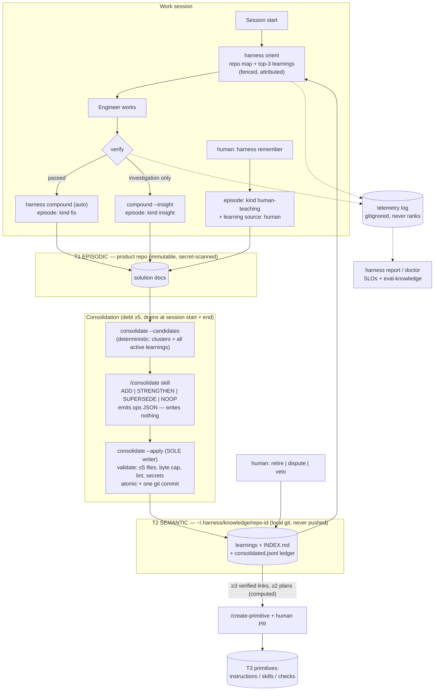
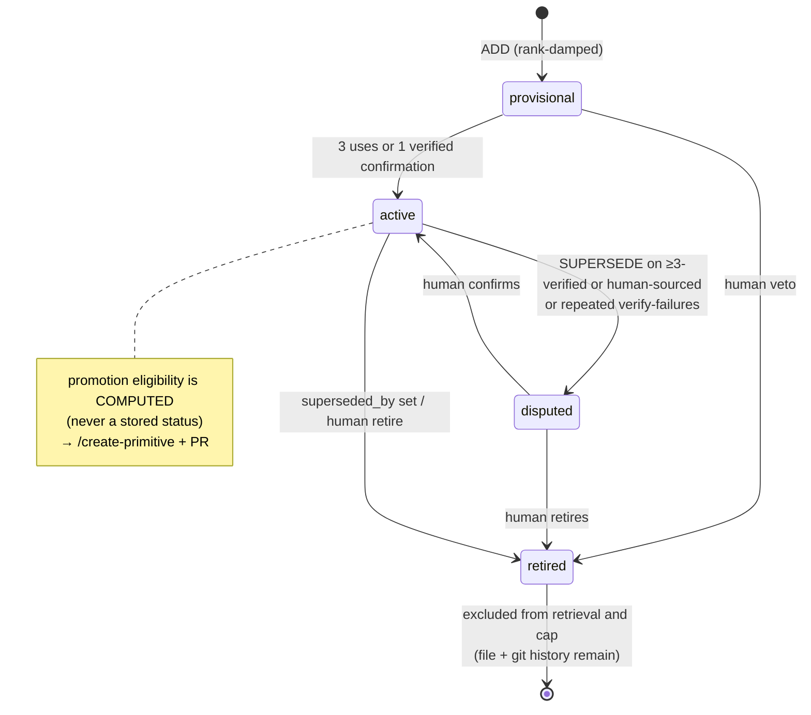
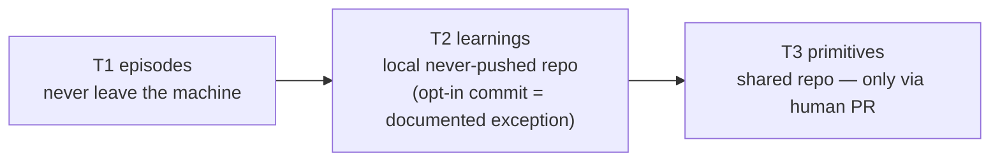

# Knowledge Layer — Flow Diagrams

## Main loop: episodes → learnings → primitives

```mermaid
flowchart TB
    subgraph SESSION["Work session"]
        A[Session start] --> B["harness orient<br/>repo map + top-3 learnings<br/>(fenced, attributed)"]
        B --> C[Engineer works]
        C --> D{verify}
        D -- passed --> E["harness compound (auto)<br/>episode: kind fix"]
        D -- investigation only --> F["compound --insight<br/>episode: kind insight"]
        H["human: harness remember"] --> I["episode: kind human-teaching<br/>+ learning source: human"]
    end

    subgraph T1["T1 EPISODIC — product repo (immutable, secret-scanned)"]
        E --> J[(solution docs)]
        F --> J
        I --> J
    end

    subgraph CONSOLIDATION["Consolidation (debt ≥5, drains at session start + end)"]
        J --> K["consolidate --candidates<br/>(deterministic: clusters + all active learnings)"]
        K --> L["/consolidate skill<br/>ADD | STRENGTHEN | SUPERSEDE | NOOP<br/>emits ops JSON — writes nothing"]
        L --> M["consolidate --apply (SOLE writer)<br/>validate: ≤5 files, byte cap, lint, secrets<br/>atomic + one git commit"]
    end

    subgraph T2["T2 SEMANTIC — ~/.harness/knowledge/repo-id (local git, never pushed)"]
        M --> N[(learnings + INDEX.md<br/>+ consolidated.jsonl ledger)]
    end

    N --> B
    N -- "≥3 verified links, ≥2 plans (computed)" --> O["/create-primitive + human PR"]
    O --> P[(T3 primitives:<br/>instructions / skills / checks)]

    Q["human: retire | dispute | veto"] --> N
    R[(telemetry log<br/>gitignored, never ranks)] -.-> S["harness report / doctor<br/>SLOs + eval-knowledge"]
    B -.-> R
    D -.-> R
```

## Learning lifecycle

```mermaid
stateDiagram-v2
    [*] --> provisional : ADD (rank-damped)
    provisional --> active : 3 uses or 1 verified confirmation
    provisional --> retired : human veto
    active --> disputed : SUPERSEDE on ≥3-verified or human-sourced<br/>or repeated verify-failures
    disputed --> active : human confirms
    disputed --> retired : human retires
    active --> retired : superseded_by set / human retire
    retired --> [*] : excluded from retrieval and cap<br/>(file + git history remain)

    note right of active
        promotion eligibility is COMPUTED
        (never a stored status)
        → /create-primitive + PR
    end note
```

## Trust gradient

```mermaid
flowchart LR
    A["T1 episodes<br/>never leave the machine"] --> B["T2 learnings<br/>local never-pushed repo<br/>(opt-in commit = documented exception)"]
    B --> C["T3 primitives<br/>shared repo — only via human PR"]
```
