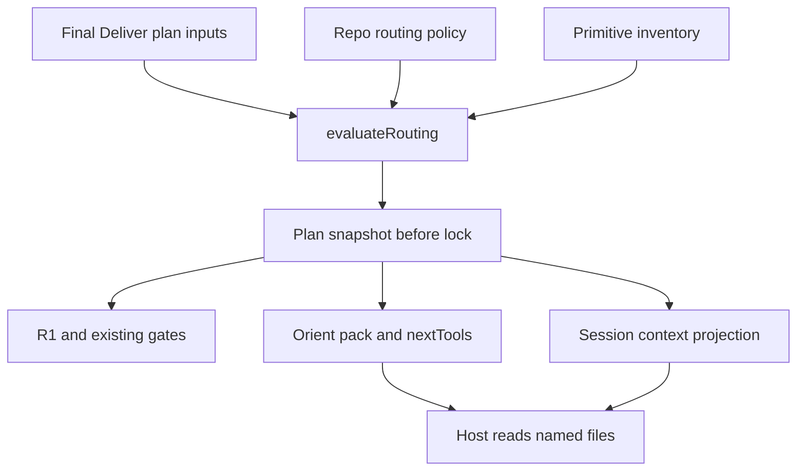

# Adaptive Engineering: Delivery Routing

**Owner:** Krish / noodlemind

**Research baseline:** `2833c4a5f90c58e97887025b7599e612089c788b`

**Created:** 2026-09-18 · **Revised:** 2026-09-19

**Status:** Ready for Human Decision; Phase 0 documentation only

Keep host-first `@engineer` and kernel-always `harness`. Add a deterministic binder inside the existing planning path and invoke the existing index builders. The kernel **names a file to read**; it does not invoke a Skill tool or spawn a specialist.

Companions: [implementation plan](../../docs/plans/2026-09-18-feat-delivery-routing-plan.md) and [research/repository review](delivery-routing-expert-review.md). Spec Kit and EarlyCheck are out of scope. The Human Decision at the end of this file is the approval authority; a locked plan or merged documentation PR is not approval to implement.

## Problem and evidence

Authorization and proof already follow lock → gate → named checks → fresh verify. Procedure selection is still largely a prompt responsibility. The owner's recurring reminders are the demand signal: load the domain skill, read scoped instructions, consult a reviewer, and build indexes.

| Surface at the inspected baseline | What the code does | Missing behavior |
|---|---|---|
| `skills_used`, `specialists`, `domains`, `reviews.required` | Metadata and existing governance/review checks | No deterministic binding of relevant procedures |
| `plan-new` | Writes a locked skeleton; auto-adds a primitive cite | No pre-lock delivery-rule evaluation; cite is not evidence of a read |
| `orient` | Generic gate/impacted-file next steps | No Java/Python/etc. read pointers |
| `load-context.mjs` | Flat frontmatter scan and plan/pack pointers | No nested routing snapshot projection |
| `init-repo` | Seeds files, prints an index command | Does not invoke both index planes |
| Context pack | Emits goal/memory before Gate, truncates from end | Routing after Gate needs reserved bytes to survive |

The owner traces and supplied panel are not a measured proof of efficacy. Phase 1's falsifiable claims are deterministic binding/projection and actual index invocation. Observing whether the host follows a pointer is a separate evaluation.

## Contract and ownership



Inputs are normalized Impacted Files, risk, domains, primitive classification, and the pre-lock plan state. Mode selection remains the intake router. Routing applies to Deliver, including the existing optional deliver profile; autonomous/bench is exempt. Answer, Investigate, and Review keep their existing discovery behavior.

| Artifact | Writer | Readers | Constraint |
|---|---|---|---|
| `.github/harness/routing.yaml` | Repository owner | Evaluator/doctor during preparation | Strict names + globs + conditions; pinned with policy |
| Plan frontmatter `routing:` | Shared pre-lock preparation used by plan creation/relock | Gate, orient, hook | Snapshot of selected names; no third state file |
| `.harness/context-pack.md` `## Routing` | `buildContextPack` from snapshot | Host Engineer | Immediately after Gate; at most six complete path lines |
| `nextTools` | `orient` from snapshot | Host Engineer | Concrete read pointers, including relevant impacted source |
| Hook `additionalContext` | `load-context.mjs` projection | Copilot session | Bounded, conditional on Deliver, no recomputation |

`skills_used` is the actual-read/cite log. `routing.skills.required` is a binding. New domain cites start empty, and routing never fills them. Existing real planning-time reads can remain recorded. Phase 1 does not populate `reviews.required`; specialist names identify files to read, not work to dispatch.

Names are frozen by the plan digest. Primitive bytes are not frozen by a names-only snapshot: upgrades may change an installed skill. Resolve the selected names safely on each projection, disclose unavailable required targets, and never replace them by re-matching the current policy. Stronger primitive-content pinning is outside this phase.

## Policy and snapshot

Canonical source: `.github/harness/routing.yaml`. A bundled copy is an initialization seed, not a runtime fallback. `init-repo` copies it only when the repository has no policy; an existing repository policy wins. No user policy overlay in Phase 1.

The supplied seed used instruction filenames, which conflict with its own ID regex. The proposed correction uses **instruction stems** and resolves suffixes through inventory. This is a documented clarification for approval, not an already-shipped format.

```yaml
version: 1
skills:
  - globs: ["**/*.java"]
    skill: java
  - globs: ["**/*.py"]
    skill: python
  - globs: ["**/*.{sql,pgsql}"]
    skill: sql
  - globs: ["**/cdk/**", "**/*stack.ts"]
    skill: aws
  - when: { primitive: true }
    skill: create-primitive
  - when: { plan_lock: false }
    skill: ensure-plan
instructions:
  - globs: ["**/*.java"]
    instruction: java
  - globs: ["**/*.py"]
    instruction: python
  - globs: ["**/*.{ts,tsx}"]
    instruction: typescript
  - globs: ["**/*.{sql,pgsql}"]
    instruction: postgresql
specialists:
  - when: { globs: ["**/*.java"] }
    agent: java-reviewer
  - when: { globs: ["**/*.py"] }
    agent: python-reviewer
  - when: { globs: ["**/*.{sql,pgsql}"] }
    agent: sql-reviewer
  - when: { risk: [amber, red], domains: [security] }
    agent: security-sentinel
  - when: { risk: [amber, red], domains: [performance] }
    agent: performance-oracle
```

IDs match `^[a-z][a-z0-9-]{0,63}$`. A type-specific inventory lookup yields `skills/java/SKILL.md`, `instructions/java.instructions.md`, or `agents/java-reviewer.agent.md`; input never supplies those paths. Reuse shipped/installed/registered primitive provenance, honor existing root/ownership precedence, and reject ambiguous or ineligible entries. Repository-source lookup in this library must use the same canonical kind/name rules. Validate the final realpath under the expected kind root, including symlink ancestors, and emit paths as inert data.

For shipped/repository instructions, the routing ID is the canonical filename stem, not the human-facing frontmatter `name`: the current Java file is named `Java Conventions` internally. Preserve that display metadata. Do not apply the local-registration validator's name-equals-stem requirement unmodified to shipped instructions or rename them to make routing pass. Registered local entries still need valid current registration/provenance. Include a real shipped-instruction fixture.

Phase 1 policy grammar is closed: top-level `version`, `skills`, `instructions`, `specialists`; each rule has its corresponding target key plus `globs` and/or `when`; `when` permits only `globs`, `risk`, `domains`, `primitive`, `plan_lock`. Require at least one predicate. Reject unknown or duplicate keys, invalid types, versions, IDs, and unsupported glob syntax. Validate the whole policy and its IDs before matching, including rules that would not match this plan. No argv, shell strings, embedded procedure text, or executable conditions.

Supported matching is anchored to normalized repository-relative paths; `**` crosses directories, `*` does not, `?` matches one nonseparator character, and finite brace alternatives support the seed. Root-level `Example.java` must match `**/*.java`. No extglob, negation, traversal, or unbounded brace expansion. Conditions within a rule are AND; list values/globs are ANY; rules accumulate with deterministic deduplication. A top-level glob and `when.globs`, if both supplied, must both hold. Empty predicate lists are invalid. Do not use task prose as a classifier.

Match intended exact paths even if the file does not exist yet. A directory allowance such as `src/**` is not a concrete Java target: planning must identify intended files before a domain-specific bind. The pre-lock `plan_lock: false` rule means a new non-language plan can still bind `ensure-plan`; **no glob match is not the same as no rule match**.

Example for a fresh Java plan under the full seed:

```yaml
routing:
  version: 1
  skills:
    required: [ensure-plan, java]
    optional: []
  instructions: [java]
  specialists:
    required: [java-reviewer]
    consult_if: []
  skipped: false
```

All seed matches are required in Phase 1; optional/consult-if arrays are reserved and empty. Do not invent additional optional-rule semantics. A skipped result retains the same shape with empty arrays, `skipped: true`, and a nonempty `reason`. Standard reasons include missing policy, no matching rule, and exempt execution context. An explicit plan waiver may use a human-readable reason; parser/ID/trust failures are not waivers.

## Reconciliation decisions

These conditions turn the conclusion into a buildable plan. **D1 needs an explicit owner choice; D2–D8 are proposed implementation clarifications included in approval.**

| ID | Finding | Recommended decision |
|---|---|---|
| D1 | The gate has no historic lock provenance; ensure-plan can currently set the lock directly | Adopt writer-enforced enrollment for Phase 1, with the limitation below; use existing-command `plan-new --from` for relock |
| D2 | Instruction filenames violate the proposed ID regex | Store instruction stems; append suffixes only during inventory resolution |
| D3 | `when: plan_lock: false` matches without language globs | Define no-match as no rule match; expect ensure-plan alongside Java on a fresh plan |
| D4 | Existing PR1 requires actual `create-primitive` read evidence | Retain PR1, remove manufactured cites, record genuine planning-time reads separately; no new domain cite enforcement |
| D5 | Current pack can truncate before Gate | Reserve bytes for Gate/Routing and cap preceding excerpts; retain the six-line/2048-byte limits |
| D6 | SessionStart precedes per-request mode selection | Treat routing as conditional Deliver context; do not infer host mode from optional-agent profile defaults |
| D7 | Adding a pinned path changes trust digests even if the file is absent | Disclose and test one-time trust invalidation; never auto-approve or downgrade invalid policy to missing |
| D8 | Direct index calls need current command setup; new seed is not packaged today | Preserve HEAD/home/extractor setup; package the seed; isolate fixture state and configure a named check before the no-init demo |

### D1 — R1 adoption and existing-plan re-lock

**Recommended:** enforce presence/validity in a shared routing-aware creation/relock boundary. Gate R1 validates snapshots when present; absent snapshots on existing locked plans receive legacy/degraded disclosure without a new failure. Any known changed gated plan still invalidates its gate through the existing digest contract. Schema v1 remains unchanged.

This is a deliberately limited guarantee: an old unrouted plan and a new plan manually written to bypass that boundary are indistinguishable using the current stored metadata. Do not call this universal detection of every new manual lock. A stricter alternative needs an approved provenance/adoption design; it cannot be implemented by guessing from dates, file mtimes, plan titles, or policy-file existence. No third sidecar is approved.

`ensure-plan` must call the same preparation writer after final scope/risk/domains are settled. Recommended entry: **`plan-new --from <path>` on the existing command**, rather than another routing verb in the Deliver flow. The operation reads an explicitly unlocked plan, preserves all nonrouting content and real cites, evaluates routing with `plan_lock: false`, validates readiness, builds only missing indexes at the existing plan-new call site, then writes the locked result only if the source digest still matches. Refuse a currently locked/gated plan; explicit unlock/replan invalidates authorization first. This mode is mutually exclusive with new-skeleton input flags, retains shared workspace/output/dry-run options, and never writes/builds indexes in stdout-only mode. `harness route --plan` remains read-only debug.

This proposed relock option is an addition to the supplied file-level sketch, not an existing capability. Approval should either accept this narrow entry or specify another shared writer that `ensure-plan` can actually invoke. Do not write another prompt asking the model to assemble a routing snapshot by hand.

### R1 state behavior

| State | Phase 1 outcome |
|---|---|
| Routing-aware new/relock operation, policy exists, at least one rule matches | Snapshot required before lock; explicit `skipped: true` needs a reason |
| Missing policy or valid policy with no rule match | Disclosed skipped snapshot; R1 does not fail |
| Invalid policy, unknown/wrong-kind ID, unsafe or ambiguous target | Fail closed; no lock/write; doctor identifies the problem |
| Untrusted/stale/revoked repository policy | No policy activation or silent fallback; actionable trust disclosure, require normal trust review before routing-aware lock |
| Legacy locked plan without routing | Existing schema/gate behavior remains; no new R1 failure |
| Present malformed snapshot | Fail R1; do not grandfather malformed routing |
| Empty domain `skills_used` | Not an R1 failure; existing primitive PR1 is separate |
| Answer/Investigate/Review or autonomous/bench | No Deliver requirement; no automatic routing/index setup introduced by those flows |
| Live policy edited after lock | Gate/pack/hook use snapshot selections, not live matching; trust staleness remains a separate policy concern |

## Projection and host contract

`## Routing` immediately follows `## Gate (preview)`. Reserve space for both before rendering variable-length goal, memory, and plan excerpts. Show at most six complete path lines, with required skills first, then instructions and specialist definitions. When there are more paths than fit, reserve one of the six lines for a pointer to the same plan's full snapshot; never truncate a path midway or imply the first six are the entire contract. Keep complete selected read pointers in structured `nextTools`; apply existing output limits with explicit overflow disclosure.

The Java demo must include a read pointer to the resolved `java/SKILL.md` and one intended `.java` target. Do not place skill bodies, routing tables, shell arguments, or specialist spawn calls in the pack or standing Engineer prompt.

The hook is a reader with a 10-second repo configuration budget. Its flat parser cannot parse the nested snapshot. Reuse a packaged parser/resolver or consume a pack only when it is bound to the selected current plan/digest; a stale pack must not direct a new session. Projection is deterministic and deduplicated, and does not append to the plan or re-run evaluation/indexing on resume.

Host mode and the optional `agent.profile` setting are different: that setting defaults to autonomous and must not exempt normal host Deliver work. Thread the optional caller's already-resolved profile through `agent-cmd.mjs` → `agent-loop.mjs` → orient, solely to preserve the exemption while keeping its existing deliver profile eligible. Where SessionStart cannot know the request mode, label routing pointers as conditional on choosing Deliver, with no instruction to load them in read-only modes. Test that boundary explicitly.

Current VS Code documentation shows a SessionStart `hookSpecificOutput` object containing `hookEventName` and `additionalContext`. The repo currently emits top-level `additionalContext`. Verify the intended supported host version and provide a valid envelope without claiming local JSON fixtures prove host consumption. [VS Code hooks](https://code.visualstudio.com/docs/agent-customization/hooks)

## Index invocation

`ensureIndexes` is a thin orchestrator over `runIndexKnowledge` and `buildStructuralIndex`. It does not spawn a CLI process or create another index plane. Reuse the existing index command's knowledge HEAD metadata, configured paths/home, grammar validation, and structural extractor setup; await the asynchronous structural builder.

| Automatic call site | Policy | Action |
|---|---|---|
| `init-repo` | `missing-or-stale` | Build each plane when `indexed === false` or `stale` |
| `plan-new`, before plan write | `missing` | Build only a plane with `indexed === false` |
| `orient` and SessionStart | Disclosure only | Report both planes; no build |

There are exactly two automatic invocation sites; explicit existing index commands remain. Use per-plane attempt/results so one failure does not suppress the other attempt. Empty knowledge is a successful indexed corpus. Builder failure is disclosed degradation and does not fail an otherwise-valid init or plan write; invalid plan/routing/check configuration and existing migration conflicts retain their normal failures.

Validate inputs, routing, named checks, and target-path conflicts before index side effects. A new plan write waits for both selected attempts. Dry-run reports would-index without writes anywhere. Stdout-only plan generation also stays nonmutating. An existing stale plane is disclosed at plan-new and preserved; orient never becomes a rebuild loop.

The no-init demo means a committed Git workspace with an executable named check already configured and no indexes, not an arbitrary directory with no governance setup. `init-repo` itself currently seeds an empty check map. Do not invent a smoke check or silently initialize unrelated policy to satisfy a demo.

Replace AC61's assertion about printing an instruction with behavioral proof that init invokes both builders. The successful next hint is `harness index --status`; on builder failure report the specific recoverable plane and failure.

## Delivery sequence and release evidence

| Phase | Deliverable | Exit |
|---|---|---|
| 0 | This proposal, companion review, planned locked plan, candidate registry entry | Human Decision recorded; no kernel code before approval |
| 1a | Strict policy/evaluator, inventory resolution, create/relock writer, R1, doctor/trust/debug surface | Java is bound before lock; compatibility and invalid-input tests pass |
| 1b | Reserved pack section, nextTools, snapshot-only hook | Java skill/source pointers appear without manual instruction; budget/host tests pass |
| 1c | Thin index helper at two sites, AC61 rewrite, packaged seed/hooks | No-init demo proves both planes are built before plan write |
| 2, deferred | Observable cites, `route --cite`, R2 warning, TUI card | Read attribution evaluated before any stronger enforcement |
| 3, deferred | Fill `reviews.required`, name reviewers after verify | Host performs specialist work; no kernel spawning |

Ship 1a–1c together after approval unless the owner explicitly changes the release slice. They remain separate work packages so their cost and integration risk are visible.

Falsifiable acceptance:

1. Create and lock a plan containing an intended Java path; orient names the real Java skill and target source in `nextTools`, without the user saying to load Java. The snapshot remains stable after live policy changes.
2. Create a plan in an isolated, never-initialized fixture with a valid check; assert both `indexStatus` planes are indexed **at the plan-write boundary**, then prove the plan exists. Final-state existence alone is insufficient ordering evidence.

The [plan](../../docs/plans/2026-09-18-feat-delivery-routing-plan.md#acceptance-criteria) supplies 24 unchecked criteria, exact file scope, negative cases, and mappings to the three existing named checks. Required future review lenses are architecture, simplicity, and security. Phase 0 checks validate planning artifacts only.

## Binding constraints

1. Paths only in pack/hook; Routing directly after Gate; reserved 2048-byte budget and at most six path lines.
2. No routing tables or new lifecycle step in `engineer.agent.md`; preserve its 600–900 estimated-token band.
3. Snapshot written before lock; no `.harness/route.json`; consumers never re-match live rules.
4. Domain cites start empty; no new domain cite enforcement in Phase 1; preserve honest existing PR1 behavior.
5. Kernel names files; no Skill-tool force API dependency, model classifier, or specialist spawn.
6. Strict names/globs/conditions, contained inventory lookup, unknown IDs fail closed, policy pinned in trust.
7. Replace the primitive-selection special case with a policy rule; never manufacture its actual-read record.
8. Do not add routing to schema v1 required fields or fail legacy plans solely for its absence.
9. Deliver-only; autonomous/bench and read-only modes retain their contracts.
10. No new user entry, `/route` skill, restored `/start`/`work-on-task`, pool, or `/create-primitive` implementation handoff.
11. `evaluateRouting` owns decisions; `harness route` is diagnostics only, excluded from TUI and Deliver prompts.
12. Two automatic index invocation sites; empty corpus succeeds; no stale rebuild on plan-new/orient; AC61 proves invocation.

## Scope and rollout

Phase 0 changes exactly `knowledge/proposals/delivery-routing.md`, `knowledge/proposals/delivery-routing-expert-review.md`, `docs/plans/2026-09-18-feat-delivery-routing-plan.md`, and the `delivery-routing` candidate entry in `knowledge/capability-registry.yaml`.

Phase 1 scope is enumerated in the plan. Compared with the supplied sketch, necessary integration paths include the command registry, doctor, asset-build script, inventory adapter, existing CLI/tool documentation, and two existing optional-agent callers solely for passing profile context. Autonomous loop behavior is unchanged. Generated assets are derived. No runtime file is changed in this PR. Do not repair the live dual-track plan as incidental work.

Roll out with routing-aware plan creation/relock and explicit degraded legacy disclosure. Adding the pinned policy path will stale existing trust records, including those without policy; use the existing human trust review, never auto-approve. Disabling routing for new work means removing policy through the normal review process; already locked snapshots remain the contract until explicit unlock/replan. Rolling back code uses the prior release; do not rewrite historical plans to simulate an unshipped schema migration.

## Human Decision

- **Decision:** _(Approved / Needs changes / Rejected)_
- **Reviewer:**
- **Date:**
- **D1 enrollment choice:** _(Recommended writer-enforced enrollment / Require stronger gate-observable provenance)_
- **D1 existing-plan relock entry:** _(Accept plan-new --from as described / Specify alternative)_
- **Conditions or required edits:**

**Approved:** implement Phase 1a–1c under the binding constraints, including the selected D1 enrollment guarantee and writer entry. Read this approval together with the existing plan; do not invoke `/create-primitive` to create a workflow.

**Needs changes:** update this proposal and plan, then re-present.

**Rejected:** stop this capability expansion.

**Blank:** documentation and review only; no `route.mjs`, `ensure-indexes.mjs`, or other Phase 1 kernel changes.
